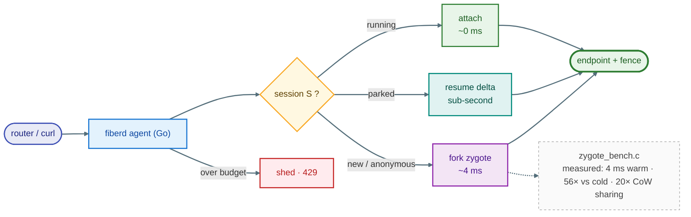
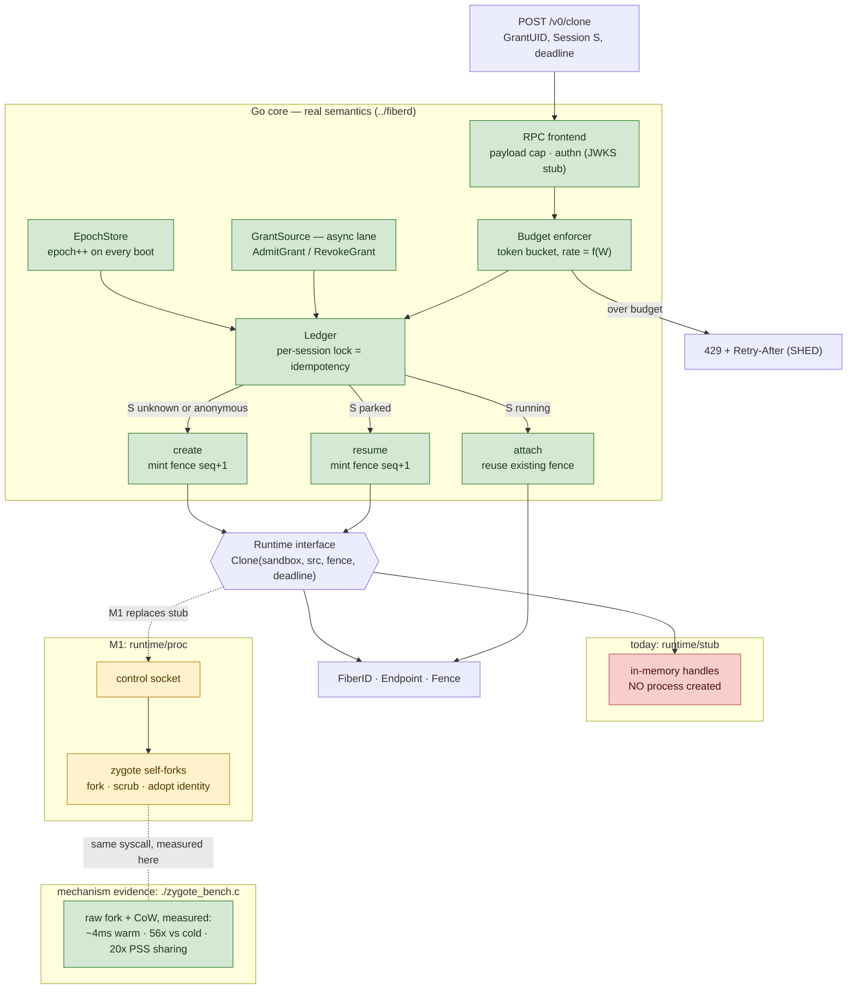

# fiberd PoC

Two pieces, deliberately split along the design's own seam:

- `zygote_bench.c` — the **mechanism**: real `fork()` CoW cloning, measured.
- `../fiberd/` — the **semantics**: the agent's warm-path contract as the real
project skeleton in Go (`core/` never forks; `adapter/` and `runtime/` are
the seams; fibers as the "cheap tier" from the RuntimeClass table).
Stdlib-only, builds anywhere.


## Architecture


## Design diagram



## Measured results (1-CPU sandbox, Aug 2026)


| Measurement                                    | Result                       | Design claim validated                  |
| ---------------------------------------------- | ---------------------------- | --------------------------------------- |
| Warm clone: fork from 128MB zygote + dirty 4MB | ~4 ms                        | (a) ms-scale activation                 |
| Cold start: full init per instance             | ~225 ms                      | clone-not-create is the only path (56x) |
| 50-way pure-fork storm, p99                    | 33 ms                        | fork survives concurrency               |
| Storm throughput W=1MB vs W=4MB                | ~110/s vs ~32/s              | thrash budget is genuinely f(W)         |
| 51 procs x 128MB heap, total PSS               | 180-330 MB (vs 6.5 GB naive) | CoW density basis for ~1000/node        |


## Semantic proofs (exercised live in the throwaway prototype)

The Go core reproduces the attach, shed, and epoch rows today (see Run it);
the park/resume, signed-grant, and audit rows are its next-step items.


| Demo                            | Output observed                                          | Design invariant                                  |
| ------------------------------- | -------------------------------------------------------- | ------------------------------------------------- |
| Grant HMAC verified before boot | boot refuses on bad sig                                  | (d) accounting precedes activation; offline proof |
| `Clone(S)` twice                | 2nd returns `path: attach`, same endpoint/fence          | idempotency on the request path                   |
| hit x4, Park, `Clone(S)`        | `path: resume`, count continues 4 -> 5, new pid, new seq | identity != incarnation; continuity contract      |
| `{"image": "evil"}` on Clone    | `REJECTED: un-admitted fields`                           | admission completeness (structural, not policy)   |
| 12-clone burst at 5/s limit     | accepted=5 shed=7, `code: SHED`                          | thrash budget backpressure                        |
| agent restart                   | epoch 1 -> 2 in status                                   | fence rotation = revocation, node-local           |
| `state/audit.jsonl`             | one record per op with fence                             | audit spool, async-shippable                      |


## What is real vs faked (be honest before anyone asks)


| Component               | Here                                                                                | In the real project                                                       |
| ----------------------- | ----------------------------------------------------------------------------------- | ------------------------------------------------------------------------- |
| Clone mechanism         | prestarted process pool (Ray-style) in the agent; true CoW fork only in the C bench | CRI CloneFiber against zygote checkpoint (containerd >= 2.0 restore path) |
| Isolation               | none — plain processes                                                              | RuntimeClass tiers; leaf cgroups + oom.group                              |
| Park delta              | worker serializes its own state                                                     | CRIU incremental / snapshot layer diff                                    |
| Grant source            | local signed JSON                                                                   | k8s adapter (watch) or platform adapter (signed)                          |
| Identity                | none                                                                                | grant capability -> KEP-gamma delegation                                  |
| Pressure ladder         | HTTP-triggered demo ordering                                                        | PSI-driven, racing kubelet eviction (measure!)                            |
| Orphan adoption on boot | missing (running fibers lost on restart)                                            | ledger reconcile from CRI ListFibers                                      |


## Run it

Mechanism bench (C — optional, independent of the Go core; it measures raw
fork/CoW, which the Go core's stub runtime does not yet perform):

```bash
    gcc -O2 -o zb zygote_bench.c
    ./zb warm 50 128 4 && ./zb cold 8 128
```

Linux only for evidence: Darwin's fork() is ~10x slower (the warm/cold
ratio collapses to ~2.5x) and /proc is absent, so the PSS density row goes
unmeasured. On a Mac, run it inside a Linux container for real numbers:

Go core (requires Go 1.26+):

```bash
    cd ../fiberd
    go build -o fiberd ./cmd/fiberd
    export FIBERD_STATE=$(mktemp -d)        # export ONCE — reuse across restarts,
                                            # or the epoch demo always shows 1
    FIBERD_BASE_RATE=5 ./fiberd &           # 5 clones/sec so the shed demo can trip
    until curl -sf localhost:8484/healthz >/dev/null; do sleep 0.2; done
    # warm path — anonymous fiber:
    curl -s -X POST localhost:8484/v0/clone -d '{"GrantUID":"demo"}'
    # named session twice — 2nd call returns Resumed:true, same Endpoint (attach):
    curl -s -X POST localhost:8484/v0/clone -d '{"GrantUID":"demo","Session":"S1"}'
    curl -s -X POST localhost:8484/v0/clone -d '{"GrantUID":"demo","Session":"S1"}'
    # over-budget burst → mostly 429 + Retry-After (SHED) once the 5-token burst drains:
    for i in $(seq 1 30); do curl -s -o /dev/null -w '%{http_code}\n' \
      -X POST localhost:8484/v0/clone -d '{"GrantUID":"demo"}'; done | sort | uniq -c

    kill %1 && ./fiberd &                   # same FIBERD_STATE → epoch 1 -> 2
    until curl -sf localhost:8484/healthz >/dev/null; do sleep 0.2; done
    curl -s localhost:8484/healthz          # fence rotation = revocation, node-local
```

Notes: `000` from curl means the loop outran server startup — always poll
/healthz first. A sequential curl loop cannot outrun the default 200/s
budget; that's why the shed demo pins FIBERD_BASE_RATE=5.
Auth is a stub (`JWKSVerifier` accepts everything) — localhost only.