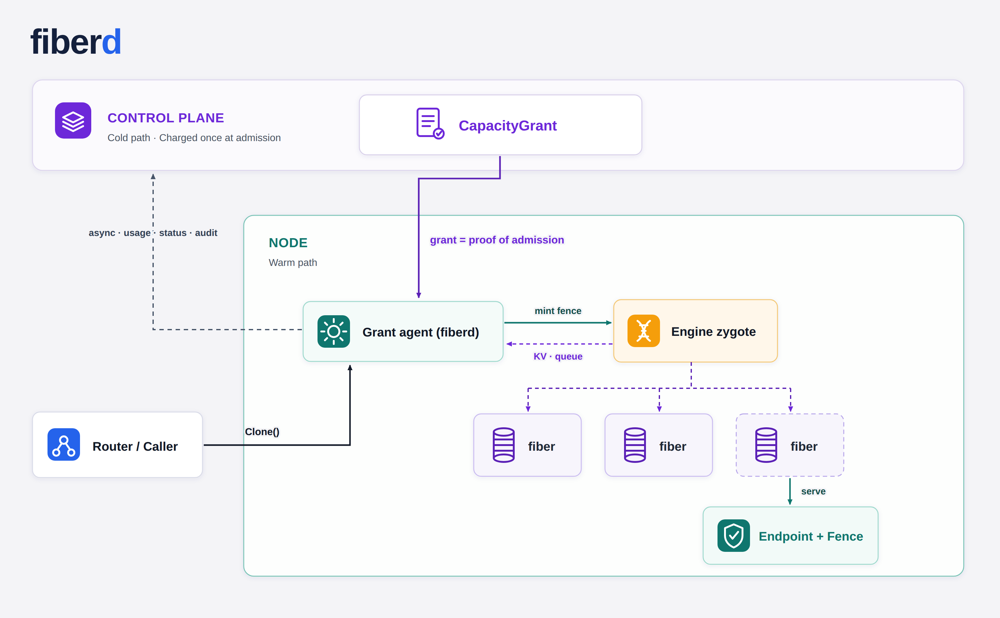

# fiberd

**A node-level execution fabric for serverless, agent, and inference platforms: charge capacity once as a block, mint instances locally in milliseconds, survive control-plane outages by construction.**

> Instances that cost nothing to create but still count.



## The problem

Serverless container instances must be **cheap** (thousands per host), **fast** (created inside the request path), and **billable** (attributed to a tenant with a hard ceiling). Per-instance control-plane records (a Kubernetes Pod is the sharpest example) deliver *billable* and can be made *fast*, but never *cheap* - a single record fuses scheduling, accounting, isolation, identity, lifecycle, ecosystem contract, and network identity, and pays the cost of all of them per instance.

## The inversion

fiberd splits those roles. The control plane's involvement ends at **issuing capacity as a block**; the node **exercises** it by minting instances locally, with no control-plane read, write, or lease on the warm path. Scheduling, accounting, and the ecosystem contract stay on a block-level object the control plane owns; isolation, identity, lifecycle, and network identity are delivered per instance by the node.

Two proven precedents shape the design: an IP router is delegated a prefix once and hosts mint addresses from it with no allocator involvement; Android keeps one warm zygote and forks every app copy-on-write. fiberd applies both moves to container instances.

## How it works

| Component | What it is |
| --- | --- |
| **CapacityGrant** | An authenticated artifact the control plane issues once per block of capacity (template reference, `fibers: {max, warm}`, policy, expiry). Billing charges it exactly once, at issue. |
| **Grant agent** (`fiberd`) | One daemon per node, the sole runtime client. Holds the ledger, budget, fences, audit spool, and pressure ladder. |
| **Fibers** | Node-minted instances inside a grant: copy-on-write clones of a checkpointed engine zygote, addressed by an endpoint, scoped by a fence, held by a lease. |

The warm-path contract is one verb with three costs:

```
Clone(grant, deadline)              -> anonymous fiber          (fungible worker)
Clone(grant, deadline, session: S)  -> attach | resume | create (idempotent: "my worker")
Park(fiberID, sync)                 -> checkpoint delta, keep name
Release(fiberID, discard)           -> destroy state, free name
```

## Key properties

- **Node-local activation** - millisecond clones; no control-plane call on the warm path.
- **Outage tolerance by construction** - a control-plane outage freezes new supply but never breaks binds against supply already on the node.
- **Accounting precedes activation** - the block is charged once; the node's authenticated copy of the grant is the proof at activation time.
- **CPU cloned, GPU multiplexed** - fibers are copy-on-write forks of a warm zygote; on GPU, one engine owns device state and fibers hold slices of its KV cache.
- **One core, two homes** - the identical agent and semantics run standalone and under Kubernetes; only thin adapters differ.

## Documentation

- [docs/overview.md](docs/overview.md) - start here: the thesis, the problem, and a reading guide into the rest of the docs.
- [docs/quickstart.md](docs/quickstart.md) - build and exercise the prototype locally.
- [docs/status.md](docs/status.md) - implementation status, measured results, and semantic proofs.

## Status and roadmap

- **v0 (exists)** - the agent and process-tier semantics; the C bench measures the raw `fork()`/CoW mechanism. Runs on any Linux host with no platform changes.
- **v1** - checkpoint tier on containerd >= 2.0, real JWKS/ed25519 verification, audit shipping, and the two-input pressure ladder.
- **v2** - multi-node NVLink fabric tier, portable delta store for cross-domain mobility, and per-fiber identity delegation.

See [docs/status.md](docs/status.md) for what is implemented today versus specified.

## License

See [LICENSE](LICENSE).
