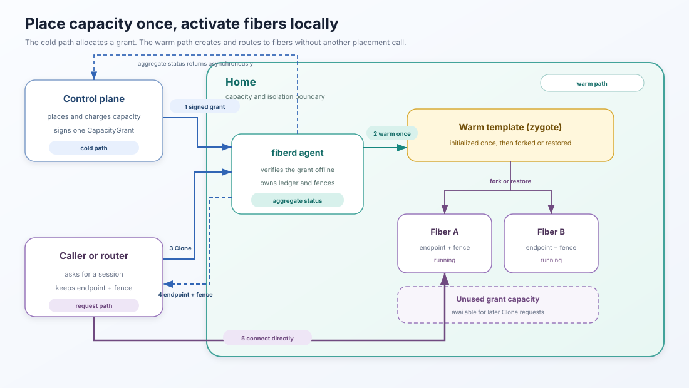

# fiberd

**A capability-grant protocol for fast, local instance activation.**

fiberd lets a control plane allocate and charge a block of capacity once, then lets the receiving
environment create instances from that block without another control-plane call. These instances
are called **fibers**.

The cold path handles placement, admission, quota, and billing, while the warm path creates, attaches, 
parks, and releases individual fibers. Capacity already present in a home remains usable during a 
control-plane outage.



## Why fiberd?

Serverless and agent platforms need instances that are:

* **fast** enough to create on the request path.
* **dense** enough to run in large numbers.
* **accountable** to a tenant and a hard capacity ceiling.

fiberd combines block-level capacity delegation with warm-template cloning. The control plane 
delegates capacity to a home, much like assigning an IP prefix to a router. The home keeps the 
workload template initialized and creates fibers through the backend's clone or restore 
mechanism. The protocol adds the controls needed to use this model across execution environments:

1. **Signed capacity grants** carry authorization with the work and are verified offline.
2. **Explicit miss semantics** distinguish local backpressure (`SHED`) from capacity that may
    be provisioned elsewhere (`DEFERRED_FALLBACK`).
3. **Working-set accounting** uses the memory a fiber dirties (`W`) to bound private memory and 
checkpoint mobility.

## How it works

The control plane issues a signed `CapacityGrant`. It identifies the admitted template and 
defines the capacity limit, working-set budget, runtime tier, policy, and expiry. The 
receiving **home** verifies the grant, warms the template, and runs one fiberd agent. 
A home can be a standalone host, a Kubernetes grant Pod, or a Slurm allocation.

Callers use four operations:

```
Clone(grant, deadline)              -> anonymous fiber          (fungible worker)
Clone(grant, deadline, session: S)  -> attach | resume | create (idempotent: "my worker")
Park(fiberID, sync)                 -> checkpoint delta, keep name
Release(fiberID)                    -> destroy state, free name
```

`Clone` returns the endpoint and fence for the selected fiber. The fence identifies that 
incarnation, while the grant lease limits how long the home holds the capacity. The control 
plane receives aggregate grant status rather than a record for every fiber.

## Quick start

Go 1.26 or newer is required.

```bash
make build
make test
make conform-stub
```

`make conform-stub` runs the executable protocol contract against the in-memory runtime and
works on macOS and Linux. To exercise real forks, cgroup v2, and CRIU inside the Linux
development container:

```bash
make conform-proc
```

See the [quickstart](docs/quickstart.md) for a signed-grant walkthrough, JSON and gRPC examples,
and all available backend targets.

## Backends and homes

The core is independent of both the sandbox mechanism and the environment
that owns the grant.

| Type | Implementations |
| --- | --- |
| **Backend** | `proc` (fork + CRIU), `runc`, gVisor, Hyperlight |
| **Built-in home** | standalone with an optional file-backed grant lane |
| **Environment examples** | Kubernetes, Slurm |
| **Consumer examples** | Knative activator, Kata-shaped containerd shim, Agent Substrate herder |

Each backend and integration target advertises its capabilities and uses the
same conformance contract. Linux is required for real fibers. The stub runtime
supports development and protocol tests on macOS.

## Examples

- [Kubernetes](examples/kubernetes/README.md): a `CapacityGrant` CRD,
  issuer controller, and grant Pod with fiberd as PID 1.
- [Slurm](examples/slurm/README.md): fiberd inside an allocation, bounded by
  the allocation's cgroup and CPUs.
- [Knative](examples/knative/README.md): scale-from-zero through a fiberd
  activator over Hyperlight.
- [Kata-shaped shim](examples/kata/README.md): a containerd runtime-v2 shim
  whose containers are fibers.
- [Agent Substrate](examples/substrate/README.md): actors created, suspended,
  and resumed as fibers.

## Documentation

- **Run it:** [Quickstart](docs/quickstart.md)
- **Understand what runs:** [Runtime model](docs/runtime-model.md)
- **Plan CPU and memory:** [Resource model](docs/resources.md)
- **Plan connectivity:** [Networking](docs/networking.md)
- **Understand trust boundaries:** [Identity](docs/identity.md)
- **Operate on Kubernetes:** [Kubernetes operations](docs/operating-kubernetes.md)
- **Understand the design:** [Architecture](docs/architecture.md)
- **Implement the wire contract:** [Protocol](docs/protocol.md)
- **Review measured results and methodology:** [Benchmarks](docs/benchmarks.md)

## Contributing

- Run `make test` and `make lint`.
- Run `make proto` after changing `api/**/*.proto`.
- Backend changes must pass the corresponding `conform-*` target.
- New homes and integrations should keep `pkg/core` unchanged and pass the
  conformance suite.

## License

[Apache-2.0](LICENSE).
