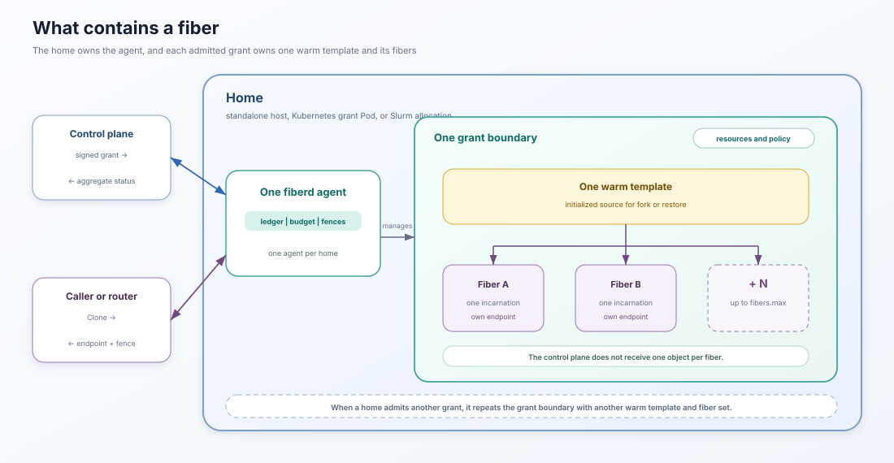

# Architecture

This page describes how the current fiberd implementation is assembled. It focuses on package boundaries, state transitions, persistence, and runtime extension points. For the operator-facing model, start with [Runtime model](runtime-model.md), [Resources and limits](resources.md), [Networking](networking.md), and [Identity](identity.md). For exact request and response behavior, see the [Protocol reference](protocol.md).

## Component boundaries

fiberd keeps scheduling policy in a small core and injects the environment-specific parts around it.

- `cmd/fiberd` parses configuration and starts the reference agent.
- `pkg/agent` assembles the home, runtime, verifier, ledger, audit spool, pressure controller, and network servers.
- `pkg/core` owns grant admission, session resolution, fences, budgets, pressure reactions, snapshots, and the runtime interfaces.
- `pkg/rpc` exposes the core through gRPC and the optional JSON gateway.
- `pkg/grant` verifies and converts signed CapacityGrants.
- `pkg/runtime/host` implements the host runtime over a selected backend.
- `pkg/backend` defines the backend boundary. The `proc`, `runc`, `gvisor`, and `hyperlight` packages implement it.
- `pkg/home` supplies control-plane health, scope claims, grants, and optional fabric channels. The reference binary currently includes standalone and file-lane homes.
- `pkg/artifact` manages templates, checkpoints, deltas, registry exchange, and platform-parity metadata.
- `pkg/sys` contains Linux integrations such as cgroups and CRIU.

The core does not import Kubernetes APIs, container runtimes, or a particular control plane. Those concerns enter through the home, verifier, runtime, and artifact interfaces.

## Startup and reconciliation

The reference agent starts in the following order:

1. It creates the selected home and asks it for the cgroup root, health source, scope claims, and optional fabric provider.
2. It creates the runtime and backend.
3. It opens the persistent epoch. Opening the epoch advances it, which invalidates fences from the previous process.
4. It creates an empty ledger, opens the local audit spool, and loads the last ledger snapshot.
5. Reconciliation re-admits unexpired grants, restores parked-session metadata, removes unusable entries, and asks the runtime to terminate orphaned running fibers from the old epoch.
6. It starts the W sampler, lease reaper, pressure loop when supported, home grant lane, admin server, and public RPC servers.

Running fibers are not recovered after an agent restart. Parked named sessions can remain resumable when their delta and parent checkpoint are still available.

## Admission and the warm path

A home can deliver a CapacityGrant before traffic arrives. Admission checks the required tier, lease, and device requirements, provisions any grant-scoped fabric channel, and prepares the grant's warm template. Concurrent admissions for the same grant are coalesced.

A valid Clone request can also self-admit an unknown grant. The signed grant travels with the request, so the verifier can authenticate it locally and the agent can prepare its template without a synchronous control-plane call. Pre-admission avoids that setup on the first request.

After verification, the core asks the ledger to resolve the session and reserve
any required fiber slot. Budget and pressure checks run before new runtime
work. A successful runtime call commits the reservation, records the action,
and returns the endpoint. A failure releases the reservation. The
[protocol reference](protocol.md) defines the wire-visible actions and
outcomes.

## Ledger, sessions, and fences

The in-memory ledger is the authority for admitted grants, running fibers,
parked named sessions, per-grant sequence counters, and status. Ledger
mutations are serialized around session resolution. A reservation is committed
only after the runtime succeeds, so concurrent requests for the same name
cannot create two active incarnations. Fence structure and session behavior
are defined in the [protocol reference](protocol.md#fences-and-epochs) and
their trust meaning is covered in [Identity](identity.md).

## Runtime and backend seam

`pkg/core.Runtime` is the core's required execution boundary. A runtime must prepare templates, clone or restore fibers, park and release fibers, report stats and exits, reconcile discovered work, and advertise its tier.

The host runtime uses a narrower backend interface for mechanism-specific operations. Backends can additionally implement optional capabilities:

- endpoint scheme reporting.
- fixed-overhead and W measurement.
- device usage and pressure reporting.
- runtime-selected create and resume deadlines.
- self-checkpointing or external checkpoint support.
- delta encoding and platform facts.
- grant pruning and fabric attachment.

The optional interfaces keep the core independent of whether a fiber is a process, container, sandbox, or micro-VM. A backend must not claim a stronger tier or endpoint form than it implements. Current backend behavior and limitations are summarized in [Runtime model](runtime-model.md).

## Home seam

A home represents the environment that supplies capacity. It has four responsibilities:

- report whether the asynchronous grant lane is healthy.
- deliver grants to the agent.
- identify the scope in which the agent is running.
- optionally allocate a grant-scoped fabric channel.

The standalone home uses local configuration. The file-lane home accepts
grants from a directory-backed lane. The repository also contains a reference
Kubernetes home and controller under `examples/kubernetes`. They demonstrate
the seam but are not core fiberd or a production operator.

The core uses the home's control-plane health when it selects a capacity miss.
The wire outcomes and caller behavior are defined in the [protocol reference](protocol.md#outcomes).

## Checkpoints and session mobility

Parking asks the runtime to capture a fiber's mutable state and returns a delta reference. The 
ledger retains that reference only for a named session. The runtime can publish the delta 
so another home can discover and claim it.

The artifact layer separates a reusable parent checkpoint from session-specific delta state:

- the parent is keyed by template and platform information.
- the delta carries the parked session's mutable state.
- platform facts prevent restore on an incompatible host.
- ownership claims prevent two homes from resuming the same published delta.
- optional parity data can protect registry chunks.

Mobility is conditional. If no delta finder is configured, the session stays local. If a discovered delta exceeds `w_budget_bytes` or the target platform is incompatible, the miss points to the home that currently holds the state. If the shared store is unavailable, the current implementation can create a fresh session instead of waiting for it.

## Persistence and failure handling

The snapshot store writes admitted grants and parked-session metadata after state transitions. Running fibers are intentionally not restored from the snapshot.

The runtime reports asynchronous exits such as normal exit, signal, or OOM. The agent removes the fiber from the ledger, frees its slot, forgets any running named session, and records the exit. An exit that arrives before Clone commits is held briefly and settled after the commit so the slot is not leaked.

The lease reaper periodically yields expired grants. Yielding revokes the grant, releases its running fibers, and retains parked deltas. A later delivery can admit the grant again.

## Pressure controller

When the runtime exposes pressure data, `PressureController` polls each
admitted grant and can combine memory and device sources through
`MaxPressure`. It maintains the shedding state consulted by Clone and invokes
the agent's Park, Release, and Yield operations for reclamation. The
W-dependent rate budget is a separate token bucket whose current curve is a
placeholder. See [Resources and limits](resources.md) for watermarks, victim
selection, and operator-visible behavior.

## Audit path

Every state-changing operation emits an audit record with the fence and, when available, session, fiber, scope, and fabric details. The spool abstraction supports best-effort and synchronous durability modes.

The reference agent opens the spool without a remote shipper. In that configuration, records are persisted locally and synchronous durability can only wait for local `fsync`. A deployment that promises remote durability must inject and operate a remote shipper.

## Device and fabric seams

A home may allocate a grant-scoped fabric channel before the template is prepared. A device-capable runtime then verifies that the prepared template offers the requested device class and reports device usage or pressure through optional interfaces.

The repository's device engine is a simulation used to exercise accounting and pressure behavior. It is not a production CUDA, GPU, DRA, or RDMA integration. The `FABRIC` runtime tier is reserved and is not implemented.

## Security boundaries

The implementation separates several boundaries that should not be conflated:

- signed grants authorize capacity and bind the request to a home audience.
- fences order fiber incarnations and become invalid when the epoch changes.
- home scope claims describe where the agent is running.
- backend isolation determines the OS boundary around a fiber.
- workload credentials and network identity remain deployment concerns unless a backend or sidecar provides them.

The detailed identity model is in [Identity](identity.md), networking behavior is in [Networking](networking.md), and resource containment is in [Resources and limits](resources.md).
