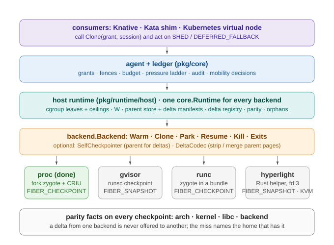
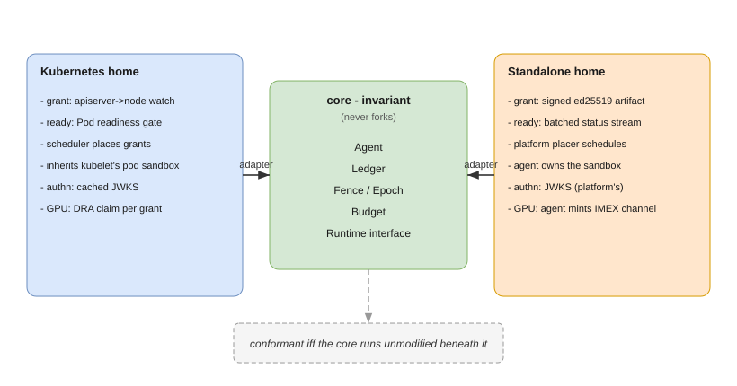
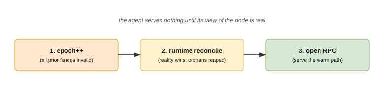

# fiberd Architecture

This is the design reference for fiberd. It describes the intended system: how capacity is issued and exercised, the instance contract, the CPU and GPU execution models, the two deployment homes, and the cross-cutting mechanisms that make the whole thing safe.

For plain-language definitions of individual terms, see [concepts.md](concepts.md). For a high-level introduction, see [overview.md](overview.md).

---

## 1. The problem and the inversion

Serverless container instances must simultaneously be **cheap** (thousands per host), **fast** (created inside the request path), and **billable** (attributed to a tenant with a hard ceiling). A per-instance control-plane record delivers *billable* and can be made *fast*, but never *cheap*, because it fuses seven roles into one object and pays the cost of all of them per instance:

| # | Role | Delivered by |
|---|---|---|
| 1 | Scheduling unit | block-level object (control plane) |
| 2 | Accounting unit | block-level object (control plane) |
| 3 | Isolation / failure domain | node, per instance |
| 4 | Workload identity | node, per instance |
| 5 | Lifecycle | node, per instance |
| 6 | Ecosystem contract | block-level object (control plane) |
| 7 | Network identity | node, per instance |

fiberd splits the roles. The control plane's involvement ends at **issuing capacity as a block**; the node **exercises** that capacity by minting instances locally. Roles 1, 2, and 6 stay on a block-level object the control plane owns; roles 3, 4, 5, and 7 are delivered per instance by the node.


Two precedents make this concrete: an IP router is delegated a prefix once and hosts mint addresses from it with no allocator involvement; Android keeps one warm zygote and forks every app copy-on-write. fiberd applies both moves to container instances.

## 2. The three components

### CapacityGrant

An authenticated artifact the control plane issues once per block of capacity. It carries a template reference, `fibers: {max, warm}`, session and durability policy, a per-fiber device budget, and an expiry. Billing charges the block at issue, exactly once. It carries **no per-instance state**. Its authenticated arrival is the proof that admission and quota already happened — nothing is re-checked on the warm path.

### Grant agent

One daemon per node, the sole runtime client for the fiber class. Its subcomponents:

- **RPC frontend** — authentication and admission-completeness enforcement.
- **Budget enforcer** — the thrash budget (maximum sustainable activation rate as a function of working-set size) and backpressure.
- **Ledger** — the node-authoritative record of sessions, leases, fences, and fabric channels.
- **Pressure controller** — two inputs, one ladder (kernel PSI on the grant slice and ledger-derived device pressure), responding shed -> park -> yield.
- **Zygote manager** — build, scrub on clone and reuse, and `maxAge` drain-and-swap.
- **Checkpoint store** — parked deltas with TTL garbage collection.
- **Audit spool** — at-least-once, sequence-numbered, shipped asynchronously.
- **Runtime client** — the seam to the CRI-conformant runtime.

### Fibers

Node-minted instances inside a grant: copy-on-write clones of a checkpointed engine zygote (one fully initialized template instance per grant per node). A fiber is addressed by the endpoint returned at clone time, scoped by its fence, held by a lease, and known to exactly two parties: the agent's ledger and the caller.

### Grant lifecycle

```
issued  ->  ready  ->  serving  ->  expiring
```

Delivery of the grant is **not** readiness: the agent builds the zygote, checkpoints it, and only then reports `ready`. Readiness is a state the agent *publishes*, never a call anyone *makes*, and routing happens against ready grants only.

## 3. The contract

Four verbs are the entire instance-management surface:

```
Clone(grant, deadline)              -> anonymous fiber          (fungible worker)
Clone(grant, deadline, session: S)  -> attach | resume | create (idempotent: "my worker")
Park(fiberID, sync)                 -> checkpoint delta, keep name
Release(fiberID)                    -> destroy state, free name
```

### One verb, three costs

`Clone(S)` resolves against the node ledger and takes one of three paths:


- **S running** -> return the existing endpoint and fence (**attach**, ~free).
- **S parked** -> restore its delta (**resume**, sub-second).
- **S unknown** (or anonymous) -> fork the zygote and bind the name (**create**, milliseconds).

Retries cannot create duplicate sessions: the agent serializes per session name, holding a per-session lock across the resolution and the runtime work.

### Admission completeness (invariant)

Every executable property of a fiber — image, command, args, env, mounts, security context, resource shape — is fixed by the template referenced in the grant and validated when the control plane issued it. `Clone` accepts exactly a grant reference, a deadline, an optional session ID, and an opaque size-capped payload delivered as data, never interpreted as configuration. The data plane selects capacity; it never shapes workloads. Nothing expressible at clone time was not already admitted.

### Miss semantics

Two distinct outcomes, deliberately never conflated:

| Code | When | Caller action |
|---|---|---|
| **SHED** (429 + Retry-After) | Over the thrash budget, or out of capacity with the control plane unreachable | Back off and retry; never queue on a dead control plane |
| **DEFERRED_FALLBACK** | Out of capacity with the control plane healthy | Fall back to the platform's ordinary provisioning path |

A `Clone` racing ahead of a grant's `ready` state resolves under the same two codes — "zygote not yet built" is indistinguishable from "capacity not yet on this node" from the caller's seat.

### Sessions

A session *name* is caller-supplied identity that survives incarnations; the *fence* is minted per incarnation and credentials die with it — continuity of a session never implies continuity of its secrets. A parked session's *delta* is its divergence from the zygote (pages dirtied since fork), so park cost is approximately the working set — the same quantity the thrash budget prices. Fresh fibers get a reset contract (restored-to-template); resumed fibers get a continuity contract (state as parked, devices renegotiated).

## 4. CPU vs GPU

The split in one sentence: **the CPU side is cloned; the GPU side is multiplexed.** `fork()` does not cross the PCIe boundary — device memory has no copy-on-write and driver contexts do not survive a fork — so each side gets the primitive that is actually cheap there, and the two meet over local IPC.


### CPU: clone-not-create

A fiber is a copy-on-write `fork()` of the warm zygote. The expensive initialization is paid once by the zygote; each fiber pays only for the working set it dirties.


Because unmodified pages stay shared, density scales with the sum of working sets, not with instance count times image size. Activation latency scales with the working set W the fiber dirties, which is exactly what the thrash budget prices.

### GPU: engine-multiplexed

The engine zygote is the only process that touches device state; fibers are CPU-side clients over local IPC — how vLLM-class servers already multiplex. A fiber's device footprint is its slice of the engine's KV cache, not a context: no per-fiber context creation, no per-fiber VRAM overhead, no partition-count ceiling. A fiber crash cannot poison a device context; an engine crash drops service for the grant's fibers — the same blast radius a shared inference server has today — and parked state survives it.

Device pressure is a ledger comparison, not a kernel signal: the kernel's pressure interface (PSI) has no device class, so the engine reports KV occupancy and queue depth over the IPC channel, and the agent evaluates watermarks against the declared per-fiber budget.

### The runtime tier ladder

The agent drives any CRI-conformant runtime through fiber verbs carrying fence, lease, and clone provenance in-protocol. Capability is advertised, and grants are placed against the advertised tier — the tier decides which guarantees the platform can sell:

| Tier | Runtime must have | Enables |
|---|---|---|
| **FIBER_BASIC** | create in an existing warm sandbox | correct semantics, pod-class latency |
| **FIBER_WARM** | zygote fork / snapshot clone (CoW) | millisecond activation + density |
| **FIBER_CHECKPOINT** | per-fiber delta checkpoint + restore | Park/resume — the session model |
| **FIBER_SNAPSHOT** | snapshot-restore of a whole sandbox or micro-VM per fiber | park/resume with a kernel or hypervisor boundary per fiber |
| **FIBER_FABRIC** | multi-node NVLink + IMEX-scoped fabric memory | fabric-tier park + cross-node resume at NVLink bandwidth |

`Clone(S)` on a parked session against a sub-CHECKPOINT runtime fails loudly; it never silently forks a fresh, amnesiac instance.

### One host runtime, many backends

The tier a home advertises comes from the sandbox mechanism it runs, but the mechanism is the only thing that varies. One host runtime implements the runtime contract for every mechanism: it carves a cgroup leaf per fiber and prices W from it, keeps the parent checkpoint store and the delta manifests, publishes and claims sessions through the delta registry, gates on platform parity and adopts orphans after a restart. A backend implements a small interface underneath it: warm a template instance, clone a fiber from it into a given cgroup, checkpoint a fiber to a directory, restore one, kill, report exits. Two optional interfaces let a backend contribute a self-checkpoint as the parent for deltas and a codec that strips and merges parent pages in its own image format. The backend's name travels with every checkpoint as a parity fact, so a delta from one mechanism is never offered to another.



Consumers sit above all of this and only ever call `Clone`: a Knative activator routing a scale-from-zero, a Kata shim creating a sandbox, a Kubernetes virtual node admitting a gated Pod. The function's code runs inside whatever sandbox the backend provides; fiberd is the layer beneath the sandbox that owns its capacity and its parked state.

## 5. Homes implement the protocol

The core is home-invariant. A **home** is any environment that holds a grant and runs fibers under it; the identical agent and semantics run in every home, and a home is conformant if and only if the `grant-conform` suite passes against it with the core unmodified. Three homes are specified: standalone, Kubernetes, and Slurm.



Each home adapts only: how the signed grant arrives, how readiness is published, who schedules, who owns the cgroup subtree, how callers authenticate, and how fabric channels are provisioned. In every home the grant is the same signed JWT, verified offline against the issuer's cached JWKS.

| Aspect | Standalone | Kubernetes | Slurm |
|---|---|---|---|
| Grant delivery | JWT file or carried in the first `Clone`; issuer polled for liveness | JWT projected into the grant Pod from the `CapacityGrant` CRD by the issuer controller | JWT passed to the allocation; prolog verifies it and starts the agent |
| Readiness | batched `Watch` status stream | Pod readiness gate `fiberd.io/zygote-ready`, set by the agent after the zygote is warm | allocation state plus the `Watch` stream |
| Scheduling | the platform's placer treats the grant as the unit | the scheduler places the grant Pod | the Slurm scheduler places the allocation |
| Cgroup ownership | the agent owns a delegated cgroup v2 subtree | the Pod's own cgroup, delegated to the agent running as PID 1 | the allocation's cgroup |
| Caller authentication | grant JWT in the request, verified against the issuer's JWKS | same; the issuer is the cluster's controller (or the API server's SA issuer where acceptable) | same |
| GPU / fabric | static domain fixed at provisioning | one DRA claim per grant | allocation-scoped GRES |

## 6. Cross-cutting model

### Fencing is revocation

A **fence** is a monotonic incarnation triple `(grantUID, epoch, seq)` that scopes every claim and credential. The **epoch** is the agent's incarnation counter, bumped on every start; the **seq** is the fiber incarnation within a `(grant, epoch)`.


Nothing minted for a fiber validates beyond `min(lease TTL, its exact fence)`. Revocation of a grant propagates by lease non-renewal, bounded by lease TTL even during an outage. `Clone` scrubs inherited descriptors, baked tokens, and entropy: identity is assigned after the fork, never baked into the template. A restart bumps the epoch, which invalidates all prior fences at once — orphans are reaped and nothing minted before the restart validates after it.

### Persistence and restart

Only four things persist across a restart:

- the **epoch file** (bump on start; timestamp-jump on corruption — never guess);
- a **ledger snapshot** (a cache; runtime reality wins at reconcile);
- **parked deltas** (the only unreconstructible user state);
- the **audit spool** (at-least-once, sequence-numbered; loss window = flush interval).

Startup order is fixed:



The agent serves nothing until its view of the node is real.

### Accounting

The grant's cgroup slice is the hard ceiling: a fiber can burst within the block, and the block cannot exceed what was charged. Usage returns asynchronously as resource-time integrals — CPU and memory exact per grant, device engine-apportioned. Per-fiber memory attribution is approximate under CoW (the slice is exact; the fiber is an estimate); per-fiber `memory.max` + `oom.group` make the kernel the executioner for over-limit fibers. Reclaim is drain-then-kill everywhere: park named sessions, shed anonymous fibers, then take the grant.

### The pressure ladder

The pressure controller takes two inputs and applies one ordering, cheapest reaction first, the expensive step last:


- **shed** — refuse new clones (one more ledger predicate at Clone admission);
- **park** — reclaim over-quota capacity before entitled capacity;
- **yield / evict** — take the grant, weighted by occupancy and resource-seconds.

### Identity and audit

Fibers share the grant's identity, distinguished by port; a later phase mints per-fiber identities from a node-held, grant-scoped signing key with delegation depth of one, so a compromised agent compromises its node's grants and nothing else. Because nothing calls home on the warm path, there is no central record of who activated what: the agent ships structured audit asynchronously with a declared loss window.


Compliance-grade deployments buy the SYNC class, where `Clone` acks only after the record is remote — priced as latency, chosen per grant.

### Network

A fiber's endpoint is returned by `Clone` and exists nowhere else. Under IPv4, fibers share the grant's IP with port distinction (network policy at grant granularity); per-fiber IPs are viable under IPv6 (policy at fiber granularity). Which applies is declared per deployment, never discovered.
