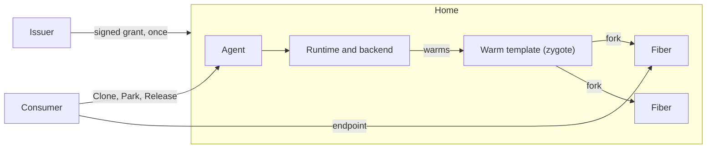

# Architecture

This page is the design overview of fiberd. It shows the parts, how they work together and why each one exists. It is for anyone who has read the [README](../README.md) and wants the big picture before the [design docs](design/README.md). Terms link to the [glossary](glossary.md).

## The problem and the core idea

Starting an isolated workload is slow and memory-hungry. Each new instance boots its runtime, loads its code and fills its caches, which takes seconds and a full copy of its memory. If each start also needs a call to a control plane, that call adds latency, and an outage of the control plane stops every new start.

fiberd splits the work in two.

- **The slow part runs once.** A [template](glossary.md#template) does that setup, then stays [warm](glossary.md#warm). Every [fiber](glossary.md#fiber) is forked or restored from it, so the cost is paid once per template rather than once per start, and each fiber adds only its [W](glossary.md#w-working-set).
- **Permission is granted once, offline.** An [issuer](glossary.md#issuer) decides capacity ahead of traffic, as a signed [grant](glossary.md#grant), not per start. The [home](glossary.md#home) checks it against cached keys, so no start waits on a round trip and the issuer stays off the request path until the [lease](glossary.md#lease) ends.

## Roles

```mermaid
flowchart LR
  I[Issuer] -->|"signed grant, once"| H
  C[Consumer] -->|"Clone, Park, Release"| A
  subgraph H [Home]
    A[Agent] --> R[Runtime and backend]
    R -->|warms| Z["Warm template (zygote)"]
    Z -->|fork| F1[Fiber]
    Z -->|fork| F2[Fiber]
  end
  C -->|"endpoint"| F1
```

- **Issuer.** It signs a grant for a home once and then stays off the request path.
- **Home.** It receives the grant and runs one [agent](glossary.md#agent), which admits the grant and answers callers.
- **[Runtime](glossary.md#runtime) and [backend](glossary.md#backend).** The agent asks its runtime for fibers. Except for the in-memory `stub`, the runtime is a backend behind the runtime host. The runtime host applies the same rules on every backend, and the backend makes the fiber.
- **[Consumer](glossary.md#consumer).** A caller of the agent's API, such as a serverless activator. It asks the agent for a fiber, then talks to that fiber directly.

## Components

Every component below is code in the agent process, except the [zygote](glossary.md#zygote), which is the template's own process, and the sandboxes and helpers that some backends start.

- **Grant verifier.** It checks a grant's signature, audience, issuer and lease against the issuer's published keys, with no round trip. The home must trust a grant while the issuer may be unreachable. See [grant.md](design/grant.md).
- **Ledger.** It is the agent's one record of admitted grants, running fibers and [parked](glossary.md#park) [sessions](glossary.md#session), and it mints every [fence](glossary.md#fence). It keeps a grant within its fiber count and stops a session from running twice. See [core.md](design/core.md).
- **Admission and pressure.** Admission takes a grant only when this home offers the [tier](glossary.md#tier) it needs, then warms its template. Pressure watches each grant's memory and backs off in steps, so one grant cannot drive the home out of memory. See [core.md](design/core.md).
- **Audit spool.** It is a local, hash-chained and signed record of every state change. A home mints fibers without asking anyone, so this record is the only account of what it did. See [audit.md](design/audit.md).
- **Agent process.** It wires the other components together and starts them in a fixed order. A misconfiguration fails the start instead of serving in a weaker state. See [agent.md](design/agent.md).
- **[Runtime host](glossary.md#runtime-host).** It is the layer every backend shares. It gives every fiber the same surroundings, which are a [cgroup](glossary.md#cgroup) capped at its [budget](glossary.md#budget), an endpoint and a filesystem view that hides the agent's secrets. These rules live in one place rather than in each backend. See [runtime-host.md](design/runtime-host.md).
- **Backends.** proc, runc, gVisor and Hyperlight each make a fiber their own way and trade start time against isolation. A narrow seam lets a new sandbox plug in without changing the agent. See [backends.md](design/backends.md).
- **Zygote.** On proc and runc, it forks each fiber straight into its cgroup and confines it before any application code runs. The library does this so that no template author can get it wrong. On gVisor and Hyperlight nothing forks, and each fiber is restored from a snapshot of the warm template instead. See [zygote.md](design/zygote.md).
- **[Handoff](glossary.md#handoff) router.** It is optional. It accepts callers' encrypted connections on one shared address and passes each one to its fiber without reading it, so fibers need no port each. See [handoff.md](design/handoff.md).
- **Artifact and mobility.** It pulls templates by content digest, and it signs, encrypts and publishes parked state so a session can resume on another home. The [registry](glossary.md#registry) between homes is untrusted, so nothing from it is used before its checks pass. See [artifact.md](design/artifact.md).
- **Home [seam](glossary.md#seam).** It delivers grants, reports whether the issuer is reachable, names the slice of the machine the agent may use and reports when that slice is gone. It keeps the agent the same on every kind of home. See [home.md](design/home.md).
- **Control API.** It serves [Clone](glossary.md#clone), Park, [Release](glossary.md#release) and Watch over gRPC with mutual TLS (Transport Layer Security), and each call is authorized as the identity in the caller's certificate. One caller cannot touch another caller's fibers. Caller identity is in [grant.md](design/grant.md), and the wire contract is in [protocol.md](protocol.md).

![The components of one fiberd agent in three lanes. Control holds the grant verifier, the control API, the home and the handoff router. Record holds admission and pressure, the ledger and the audit spool. Execution holds artifact and mobility, the runtime host and the backends. One Clone flows from the consumer through the control API, the grant verifier, the ledger, the runtime host and a backend, and a fiber starts by a fork from the zygote (proc, runc) or a restore (gVisor, Hyperlight). The handoff router passes a caller's TLS connection to its fiber without decrypting it.](images/architecture-components.svg)

## Flows

- **Admit.** The home delivers a grant ahead of traffic, or the first clone carries it. The grant verifier checks it, admission checks the tier, and the runtime host warms the template through the backend before the ledger records the grant.
- **Clone.** The control API identifies the caller, the verifier checks the grant, and the [thrash budget](glossary.md#thrash-budget) may [shed](glossary.md#shed-and-deferred) any clone. The ledger then picks [create, attach or resume](glossary.md#create-attach-and-resume). An attach returns the running fiber at once. For a create or resume, the ledger reserves a [slot](glossary.md#slot) and mints a fence, and pressure may still shed it before a fiber is made. The runtime host forks or restores the fiber, the audit spool records it, and the ledger records the fiber as running and returns the endpoint and fence. Park and Release order their record differently ([protocol.md](protocol.md#outcomes)).
- **Park, and resume on another home.** Park saves the session as a [delta](glossary.md#delta) and stops the fiber. The artifact and mobility component then seals, signs and publishes the delta. A clone of that session on another home finds the delta, checks its signature and [parity](glossary.md#parity), claims it and resumes it under a new fence.
- **Release.** The ledger ends the fiber through the runtime host, frees its slot and writes an audit record.
- **Revocation of one grant.** The home removes the grant, or its lease runs out. The agent [yields](glossary.md#yield) the grant, so its running fibers end and its parked deltas stay. A removed grant also goes on a deny-list, so its token cannot re-admit it. Other grants and the [epoch](glossary.md#epoch) are untouched.
- **[Scope](glossary.md#scope) loss or agent restart.** Either one bumps the epoch, which releases every running fiber on the home and invalidates every earlier fence at once. Grants and parked deltas survive, and after a restart each grant must verify again before it serves.

## Guarantees

- **Authority is checkable.** No fiber is recorded as running after its grant was revoked or the epoch moved, and each incarnation carries a fence of its own. The fence's fields are in [protocol.md](protocol.md#fences-and-epochs).
- **Misses are typed.** A clone this home cannot serve is shed or deferred, or it is a [tier gap](glossary.md#tier-gap) that this home can never serve. The caller always knows which, and [protocol.md](protocol.md#outcomes) lists the outcomes.
- **The home is protected.** Each fiber is capped at its W budget, and the [PSI](glossary.md#psi) pressure ladder sheds new clones, then parks or releases fibers, then yields the grant, before the home runs out of memory.
- **Confinement fails closed.** A fiber that cannot be confined as asked ends before any application code runs, and an agent that cannot drop its extra privileges does not start unless told to keep them.

## Boundaries

Callers reach the agent over mutual TLS with a grant bound to their certificate, and the agent trusts only keys published by its issuer. How strongly fibers are kept apart depends on the backend. proc and runc share the host kernel, while gVisor and Hyperlight put a kernel of their own between tenants. The registry is untrusted storage. [security.md](security.md) covers each boundary and the known gaps.
