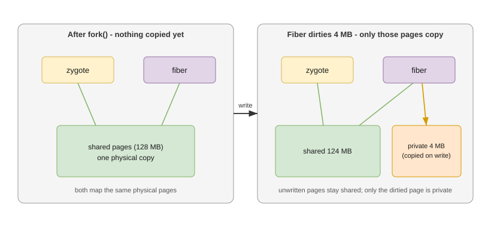
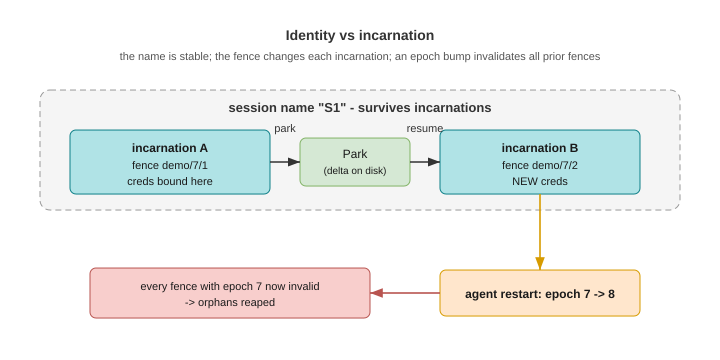
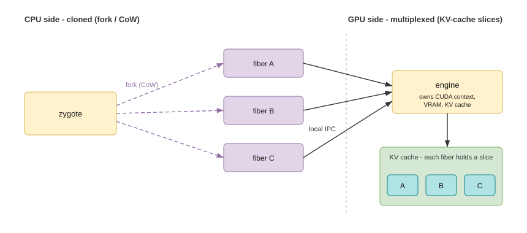
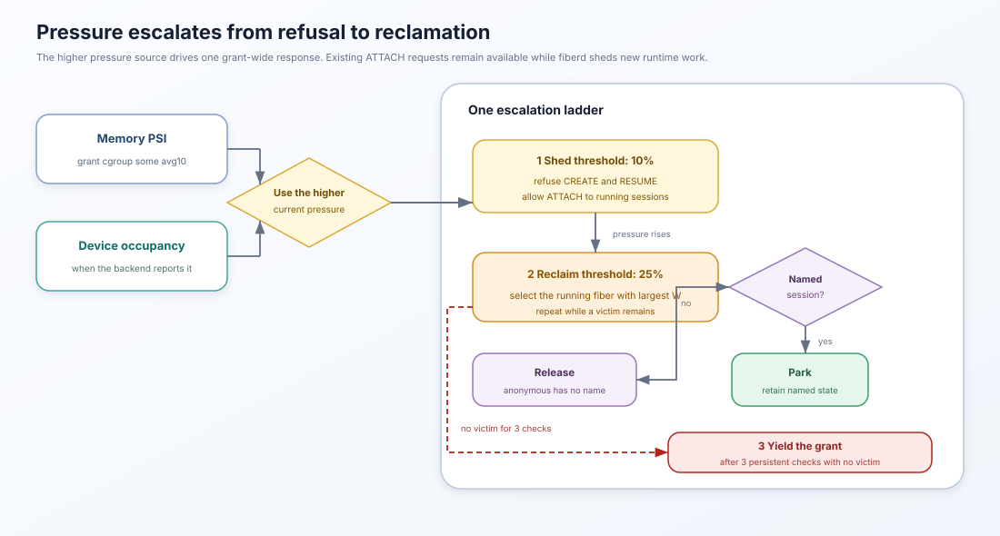
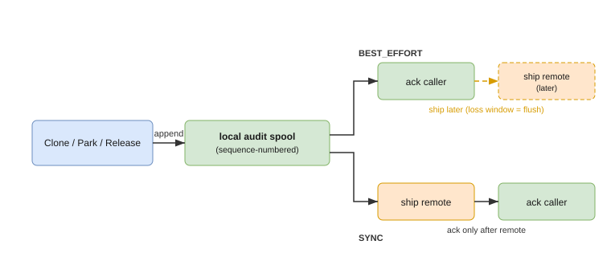
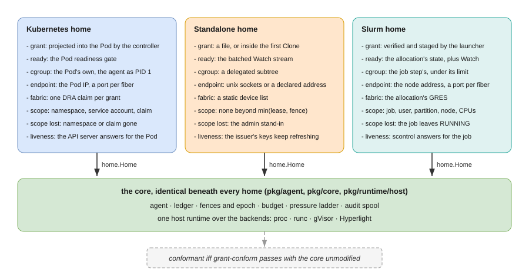

# Concepts

Plain-language definitions of every term in the design, each with an analogy and, where useful, a diagram. For how the pieces fit together, see [architecture.md](architecture.md); for the wire semantics, [protocol.md](protocol.md).

---

## Grant (CapacityGrant)

**An authenticated voucher for a block of capacity, issued once by the control plane, charged once at issue, and then exercised locally by the node with no further calls home.**

A grant says: *this tenant may run up to N fibers of this template, until this expiry.* It carries a template reference, `fibers: {max, warm}`, policy, and expiry — but no per-instance state. Its authenticated arrival is the proof that billing and admission already happened; nothing is re-checked on the warm path.

*Analogy:* the IP prefix a router is delegated — allocated once, then addresses are minted from it freely.

## Fiber

**A single running instance minted by the home from a warm template — a copy-on-write fork or a snapshot restore, by backend — cheap to create, and invisible to the control plane.**

A fiber is "one worker." It is created in milliseconds by cloning the engine zygote, addressed by an endpoint returned at clone time, scoped by a fence, and held by a lease. It is known to exactly two parties: the agent's ledger and the caller. The control plane never sees an individual fiber.

*Analogy:* if the grant is an IP prefix, a fiber is one address minted from it.

## Engine (engine zygote)

**The one warm, fully-initialized template process per grant per home — the thing fibers are cloned from, and, on GPU, the only process that touches device state.**

Two roles:

- **CPU side:** the zygote. A fiber is a `fork()` of it, so expensive initialization is paid once and shared copy-on-write.
- **GPU side:** the only process that owns device state (CUDA context, VRAM, KV cache), like a vLLM server. Fibers are lightweight IPC clients; each fiber's device footprint is a slice of the engine's KV cache, not its own context.

Its declared trade-off: the engine is a grant-wide single point of failure — if it crashes, all fibers in that grant lose service (the same blast radius as any shared inference server). Parked state survives it.

*Analogy:* Android's zygote — one warm process; every app is a copy-on-write fork of it.

## Grant agent (`fiberd`)

**The one agent per home instance (a node, a grant Pod, a Slurm allocation) that ties grants, engines, and fibers together — the sole runtime client for the fiber class.**

It holds the ledger (what exists), the budget (how fast it can mint), the fences (revocation), the audit spool (what happened), and the pressure ladder (what to shed under load). It is distinct from the engine: the agent does bookkeeping and admission; the engine is the template fibers come from.


## Copy-on-write (CoW)

**The kernel mechanism that makes a fiber cheap: after `fork()`, parent and child share the same physical memory pages until one writes to a page, at which point only that page is copied.**

The zygote pays for the heavy initialization once (e.g. a loaded model). Forking is near-instant and adds almost no memory; a fiber only pays for the working set W it dirties.



*Consequences:* activation is ~milliseconds instead of a full cold boot, and many fibers "using" the same image consume a fraction of the naive total memory. The cost of a fiber is approximately W — which is exactly what the thrash budget prices.

*Analogy:* Android launching apps as copy-on-write forks of the zygote.

## Fence

**A monotonic incarnation triple `(grantUID, epoch, seq)` that scopes every credential and claim: nothing minted for a fiber validates beyond `min(lease TTL, its fence)`.**

The fence is what credentials bind to. It is minted fresh on every create and resume and never reused, so a caller holding an older fence is detectably stale. Identity is assigned after the fork, never baked into the template; `Clone` scrubs inherited descriptors, tokens, and entropy.



## Epoch

**The agent's incarnation counter — a single monotonic number bumped every time the agent starts. Bumping it invalidates every fence minted before the restart, all at once, with no coordination.**

It is one field of the fence. Because a fence must match the current epoch to be valid, an epoch bump is mass revocation for free. It is persisted in a one-line file; on a corrupt read the agent jumps forward to a timestamp-derived value rather than guessing — the only requirement is that it never repeats.

*Analogy:* a document revision number that everyone must match to be trusted; incrementing it invalidates every older copy.

## Sequence (seq)

**The per-fiber counter within a `(grant, epoch)`.** Together with the grant UID and epoch it makes every incarnation globally unique and totally ordered, which is how the agent detects a stale caller.

## Ledger

**The node-authoritative, in-memory record of which grants the node holds and which sessions/fibers are live under each — a cache of reality, rebuilt at startup from the runtime and reconciled against an on-disk snapshot, with running reality winning on conflict.**

The ledger stamps every fence it mints with the current epoch, and serializes concurrent `Clone(S)` on the same session name with a per-name lock — this is what makes the verb idempotent under retry. There is one ledger per agent; it is never shared or centralized. The control plane only ever sees aggregated per-grant status, never the ledger's per-fiber entries.

*Analogy:* a bookkeeping table — but one that defers to the actual running processes as the source of truth.

## Session (name vs incarnation)

**A session couples a stable identity (the name — what "my worker" refers to) with a mutable incarnation (the fence — what credentials bind to). The name survives incarnations; nothing else does.**

`Clone(S)` resolves a session to one of three actions:


- **attach** (running) — return the existing endpoint and fence, ~free;
- **resume** (parked) — restore the delta, tens of milliseconds, with a *new* fence;
- **create** (unknown or anonymous) — fork the zygote, milliseconds, with a new fence.

Continuity of a session never implies continuity of its secrets: a resumed session gets fresh credentials scoped to its new fence.

## Lease

**The time-bounded hold that keeps a fiber alive; revocation propagates by lease non-renewal.** Under a revoked or expiring grant, fibers drain by letting leases lapse, bounded by lease TTL even during a control-plane outage. Nothing a fiber holds validates beyond `min(lease TTL, its fence)`.

## Park and resume (delta)

**Park checkpoints a session's delta — its divergence from the zygote (pages dirtied since fork) — and frees its running-tier resources; resume restores that delta into a fresh fiber.** Because a delta is proportional to the working set, park cost is approximately W, the same quantity the thrash budget prices. Parked deltas are the only unreconstructible user state, so they persist across restarts (with TTL garbage collection).

## Thrash budget (working set W)

**The maximum sustainable activation rate, expressed as a function of working-set size W and enforced as a token bucket.** Density is stock; the thrash budget is flow. Bigger working sets mean more copy-on-write faults per clone, so throughput degrades with W:

```
rate(W) = base / (1 + W / refW)
```

The advertised rate is published in grant status so routers and autoscalers can plan. Exceeding it is backpressure (SHED), not failure — a misbehaving router degrades one node, never the fleet.

## Miss codes (SHED vs DEFERRED_FALLBACK)

**The two, deliberately distinct, outcomes of a clone that cannot be served:**

| Code | Carried as | When | Caller action |
|---|---|---|---|
| **SHED** | gRPC `ResourceExhausted`; HTTP 429 + `Retry-After` | over the thrash budget, or out of capacity with the control plane unreachable | back off; never queue on a dead control plane |
| **DEFERRED_FALLBACK** | gRPC `Unavailable`; HTTP 503 | out of capacity with the control plane healthy | fall back to ordinary provisioning |

Every miss carries a `Miss` detail with the code. Conflating the two would let routers retry into a dead control plane believing capacity is coming.

## Runtime tiers

**The advertised capability of the underlying runtime; grants are placed against the tier, and the tier decides which guarantees the platform can sell.**

| Tier | Runtime must have | Enables |
|---|---|---|
| **FIBER_BASIC** | create in an existing warm sandbox | correct semantics, pod-class latency |
| **FIBER_WARM** | zygote fork / snapshot clone (CoW) | millisecond activation + density |
| **FIBER_CHECKPOINT** | per-fiber delta checkpoint + restore | Park/resume — the session model |
| **FIBER_SNAPSHOT** | snapshot-restore of a whole sandbox or micro-VM per fiber | park/resume with a kernel or hypervisor boundary per fiber |
| **FIBER_FABRIC** | multi-node NVLink + IMEX-scoped fabric memory | fabric-tier park + cross-node resume (reserved; nothing implements it) |

A grant names its `min_tier`; a home whose backend advertises less refuses it with `FailedPrecondition` rather than substituting a lesser mechanism.

## Backend

**The sandbox mechanism a home runs fibers in: proc (fork zygote + CRIU), runc (the zygote as a container's init), gVisor (a `runsc` sandbox per fiber) or Hyperlight (a micro-VM per fiber).**

One host runtime implements the runtime contract for every backend — cgroup leaves, W pricing, checkpoint store, delta registry, parity, orphan adoption — and a backend implements only the mechanism beneath it: warm a template, clone a fiber from it, checkpoint, restore, kill, report exits. The backend's name travels with every checkpoint as a parity fact, so a delta from one mechanism is never offered to another.

*Analogy:* a car's drivetrain — the controls are identical, and only what turns the wheels differs.

## Consumer

**Anything that calls `Clone`, `Park` and `Release`: a Knative activator, a containerd shim, a cluster-level herder.**

A consumer never shapes a workload; it selects capacity by naming a grant and, optionally, a session, and branches on the two miss codes. `pkg/consumer` is the typed client: `*Shed`, `*Deferred` and `*TierGap` errors, plus `CloneRetry` to wait out a `SHED`.

## Session domain and delta registry

**A parked session belongs to a session domain — the grant's `policy.session_class`, or its `template_digest` when none is set — and two grants in the same domain, on any two homes, name the same sessions.**

Parked state moves through an OCI registry: park publishes the delta under a tag derived from the session name, `Clone(S)` on a home that does not hold S looks the tag up, pulls the delta if it fits the W budget, and claims the session by deleting the tag. A delta too large to move is a `DEFERRED_FALLBACK` whose `preferred_home` names where the state already is.

*Analogy:* a coat check — one ticket, whoever presents it first takes the coat.

## Platform parity

**The three facts a checkpoint assumes about its host — architecture, kernel release, libc — recorded in every artifact and delta and compared before a home warms a template or takes a session.**

Architecture must always match. Kernel and libc are compared at the level the home is started with (`-parity strict`, `kernel=series`, `off`); a mismatch refuses the template or defers the session with `preferred_home`, never a restore that fails late.

## Scope

**What a home asserts about where it runs — a namespace and service account, a Slurm job, a DRA claim — stamped on every audit record but never a third validity term.**

The core enforces exactly `min(lease, fence)`. A home that loses its scope expresses that through the two mechanisms it already has: an epoch bump for whole-agent loss, a revocation on the grant lane for one grant.

## Fabric channel

**The devices a grant's engine may drive: a static list on a standalone host (`-devices`), a DRA claim under Kubernetes, the allocation's GRES under Slurm.**

Provisioned by the home at admission before the template is warmed, released with the grant, and referred to per fiber only through the fence.

## Device budget

**`device_budget {bytes, class}`: the device-side twin of `w_budget_bytes` — the slice of the engine's device state (KV cache, VRAM) one fiber may hold.**

The kernel has no pressure class for devices, so the engine reports each fiber's slice and its own occupancy over the zygote channel, and the home prices those reports: a fiber over its slice is killed (reason `oom`, like W), and occupancy feeds the pressure ladder alongside PSI. A home whose template offers no device of the grant's class refuses the grant with `FailedPrecondition`.

## CPU-clone vs GPU-multiplex

**The CPU side is cloned; the GPU side is multiplexed** — because `fork()` does not cross the PCIe boundary (device memory has no copy-on-write, and driver contexts do not survive a fork).



On the CPU side each fiber is a real forked process. On the GPU side one engine owns all device state and fibers are IPC clients, each holding a slice of the engine's KV cache — no per-fiber context, no per-fiber VRAM.

## Pressure ladder

**Two inputs, one ordering.** The pressure controller combines kernel PSI on the grant's cgroup slice with ledger-derived device pressure (engine KV occupancy + queue depth), and responds cheapest-first:



**shed** new clones -> **park** over-quota capacity (before entitled capacity) -> **yield/evict** the grant. The expensive step is always last.

## Audit spool

**The agent's local, sequence-numbered, at-least-once log of every fiber operation, shipped upward asynchronously — so a compliance trail exists even though the warm path never talks to the control plane.**



Two durability classes, chosen per grant:

- **BEST_EFFORT** — append locally, ack the caller, ship later; loss window = flush interval.
- **SYNC** — block until the record is remote, then ack; paid as extra activation latency.

## Homes

**A home is any environment that holds a grant and runs fibers under it. The identical core runs in every home; only thin home adapters differ.** A home is conformant if and only if the conformance suite passes against it with the core unmodified.



- **Standalone** — the grant JWT arrives as a file or inside the first `Clone`; readiness rides the batched status stream; the platform's placer schedules; the agent owns its cgroup subtree.
- **Kubernetes** — the issuer controller mints the JWT from a `CapacityGrant` object and projects it into a grant Pod where the agent runs as PID 1; readiness is a Pod readiness gate; the scheduler places the Pod; GPU is a DRA claim per grant.
- **Slurm** — the JWT is handed to the allocation; the launcher verifies it and starts the agent inside; capacity is bounded by the allocation.

In every home callers authenticate the same way: the signed grant travels with the request and is verified offline against the issuer's cached JWKS.
