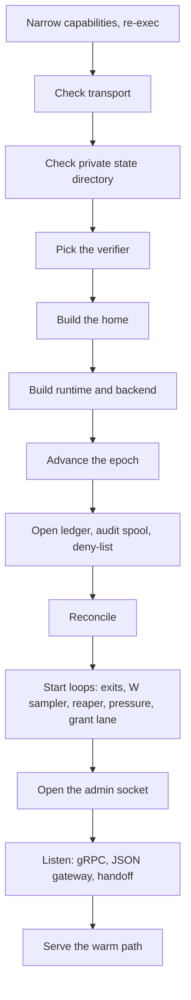

# Design: agent process

The [agent](../glossary.md#agent) is the fiberd process, one per [home](../glossary.md#home) instance. This doc covers how it starts and where it keeps its state. It is for readers changing startup or building a binary for a new home. Read [architecture.md](../architecture.md) first.

## Purpose

The agent wires the verifier, the home, the runtime, the ledger, the audit spool and the servers together. If it served before its view of the home were real, it could mint [fences](../glossary.md#fence) that collide with old ones. If it started half-configured, it could serve without caller identity or write its keys where [fibers](../glossary.md#fiber) can read them. So the start order is fixed, and every misconfiguration fails the start instead of degrading.

## How it works



The agent is a library whose entry point is `RunContext`. It stops when its context ends or on SIGINT or SIGTERM, so a binary or a test owns the agent's lifetime through that context. The standalone binary is this library plus the standalone home. An integration builds its own binary from the library plus its own home.

These checks fail the start.

- **Capabilities.** Before anything else, a proc or runc agent re-executes with only its measured capability set ([sys.md](sys.md)). If it cannot drop the rest, it exits, unless `-all-caps` is set.
- **Transport.** TLS is checked first, so a bad setup leaves nothing half-started ([grant.md](grant.md)).
- **Private directory.** It is created with mode 0700, and an existing one is reset to 0700. A symlink or a non-directory at that path is refused. A proc fiber runs as the agent's uid and sees the state directory outside `private/` and `deltas/`, so a symlink it planted there would send the keys wherever it points.
- **Verifier.** One must be named, and the JWKS verifier needs an [issuer](../glossary.md#issuer).
- **Endpoints.** With an inet4 or inet6 family and no `-endpoint-host`, the agent asks the home for the fibers' address, such as the Pod IP. A home that answers with no address of that family fails the start.
- **Run directory.** A run directory inside the private or [deltas](../glossary.md#delta) directory is refused, because fibers see the run directory ([runtime-host.md](runtime-host.md)).
- **Deny-list.** An unreadable deny-list fails, as [core.md](core.md) explains.
- **Listeners.** The gRPC, `-http` and [handoff](../glossary.md#handoff) addresses are bound before serving, so an address that cannot be bound fails the start.

The state layout keeps what fibers must never read under one hidden directory.

```text
<state>/                default /var/lib/fiberd
  private/              mode 0700, hidden from every fiber
    epoch               the agent's start counter
    ledger.json         snapshot of grants and parked sessions
    revoked.json        the deny-list
    audit.jsonl         the audit spool
    admin.sock          the admin socket
    *-key.json          generated audit, delta, seal and handoff keys
  templates/            the pulled template cache, hidden from fibers
  deltas/               parked deltas, also hidden from fibers
  runc/, gvisor/        backend state, with each grant's staged template copy
```

The private directory is hidden rather than protected by file modes, and so are the [template](../glossary.md#template) cache and the deltas. A proc fiber warmed from a registry template still sees its own executable, bound back read-only inside the cache's cover, because [CRIU](../glossary.md#criu) needs the path to resolve. The full list of what fibers cannot see is in [runtime-host.md](runtime-host.md).

**Test hooks.** The admin socket serves only a health check. A binary built with `-tags fiberd_testhooks` adds `-admin-unsafe` and two test controls, one forcing the [grant](../glossary.md#grant) [lane](../glossary.md#lane)'s health and one simulating [scope](../glossary.md#scope) loss. A normal build has neither the flag nor the handlers.

## Security notes and known gaps

- **Generated keys are per home.** A key that no flag names is generated with a warning. No other home trusts it, so homes that move [sessions](../glossary.md#session) between them must share keys.
- **`-insecure-plaintext`** logs a warning at start. What it gives up is in [grant.md](grant.md).
