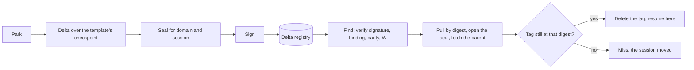
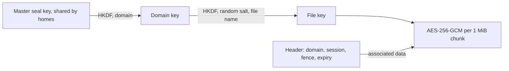

# Design: artifacts and session mobility

This doc explains how [templates](../glossary.md#template) arrive on a [home](../glossary.md#home) and how [parked](../glossary.md#park) [sessions](../glossary.md#session) travel between homes. It is for contributors and reviewers. Read [architecture.md](../architecture.md) first.

## Purpose

Every home that holds a [grant](../glossary.md#grant) for a template must [warm](../glossary.md#warm) the same bytes, and a parked session must be able to resume on another home. The registry in between is untrusted storage. So a home must refuse a template that is not the one the grant names, must never let tenant memory leave in the clear, must take only state a trusted home made for this session, and must refuse a checkpoint its own host cannot restore.

## How it works

- **Templates.** A grant names its template by digest. Without a `-template` entry, the home pulls `<registry>@<digest>`. The digest must be `sha256:` and 64 lowercase hex characters, because it becomes a path in the template cache. The transfer verifies the manifest digest, and the [zygote](../glossary.md#zygote) binary must match the hash in its config. A cached template is checked again on every warm. It must still pack to the digest, and its images are unpacked afresh. A failing entry is pulled again. The host hands the backend the directory and the verified hash of the executable. proc opens the executable in the cache, hashes the bytes through that descriptor against the verified hash, and execs the zygote through the descriptor, so a swap of the cache entry between the host's check and the exec runs nothing. gVisor and runc copy the executable into their own state directory, check the copy against that hash, and bind the copy into every sandbox or container ([backends.md](backends.md)). Nothing in the cache is ever bound, so a re-pull or a rewrite of the cache cannot change what a running sandbox or a later restore loads. The cache itself is hidden from proc fibers ([runtime-host.md](runtime-host.md)).
- **Linking.** `zygotectl build` records whether the executable is static, meaning an ELF with no program interpreter. Anything else, including a script, is dynamic. A backend that runs templates inside a root filesystem of its own (gVisor, runc, Hyperlight) loads the executable against that filesystem's libraries, which the home cannot inspect. Such a home takes only a static bare template. A dynamic one, or a config from before the fact was recorded, is refused at warm with a parity error that names the backend and the way out. `-parity libc=off` lets it through, to fail inside the sandbox. A backend that runs templates on the host (proc) does not compare libc for a bare template, because the host's own loader loads it or fails plainly.
- **Parents.** A park writes a [delta](../glossary.md#delta) over a parent checkpoint of the template, either the artifact's images or a checkpoint the warm instance takes of itself once it reports ready. Parents live in a store keyed by their SHA-256. A parent name must be 64 hex characters, and a loaded parent must hash to its name.
- **Publishing.** After every park of a named session, the home pushes the delta to `<delta registry>/<domain>:s-<hash of session>`. The domain is the grant's [tenant](../protocol.md#grant-fields), then its [session class](../glossary.md#session-class), else its template digest, as `<tenant>/<class or digest>`. Two tenants on one template never share a domain, and grant UIDs play no part, because a session moves between homes whose grants differ. A grant without a tenant has no domain, so a named session is never parked under it. The parent is pushed once as `p-<sha>`. It is template state, so it is signed but not sealed.
- **Signing.** Every delta and parent is signed with the Ed25519 key in `-delta-key`. The signature covers the artifact type, every annotation and each file's name, digest and size. A home accepts its own key and the keys in `-delta-trust`. Nothing in a manifest is believed before its signature checks.
- **Sealing.** Each file is encrypted with AES-256-GCM before it leaves the home, in 1 MiB chunks whose nonce is the chunk index plus a last-chunk flag. Chunks cannot be reordered, dropped, cut short or moved to another file.

- **Session binding and expiry.** The sealed header and the signed annotations name the domain, the session and an expiry 24 hours after the park. A home refuses a delta for another domain or session, such as a signed manifest copied to another tag, and one past its expiry. Either way the [Clone](../glossary.md#clone) gets a [deferred](../glossary.md#shed-and-deferred) miss with no [preferred home](../glossary.md#preferred-home).
- **Claim.** A home that finds the session pulls it by the digest it verified, opens the seal, and fetches the parent if it lacks it. A pulled parent must be signed, signed as that very checkpoint, and hash to the name the delta gives. The home then checks that the tag still holds the digest and deletes the tag. Two homes that both pass the check race on that delete, and only the one whose delete removes the tag resumes. The other gets a miss that names the publishing home. The publishing home sees the tag gone on its next Clone of that session and deletes its own copy.
- **Retire.** A session that resumes on the home that published it deletes its own tag the same way, once the resume is committed. The published copy is older than the running state, so no home may claim it and no later Clone may fall back to it after a Release. A tag that a later park or another home's claim has moved on is left alone. If the registry cannot be reached, the copy stays until a discarding Release withdraws it or it expires.
- **Export and import.** Export moves a session out of the registry into files, with the parent and the parent's signed manifest. Import checks the signature against those files and opens them for the importing grant's session domain, never the domain the export file names, so the unsigned file cannot move one tenant's session into another's grant. The parent must be signed and must be the one the signed delta names. The home then seals the delta for the new session name with a fresh expiry and signs it as its own.
- **[Parity](../glossary.md#parity).** Every checkpoint records the architecture, kernel, libc and [backend](../glossary.md#backend) it was made on. The architecture and backend always must match. `-parity` is `strict` by default, which requires the kernel and libc to match exactly. `off` drops both checks, and a list such as `kernel=series,libc=off` sets the kernel to exact, series or off and libc to exact or off. A home checks parity before it warms from an artifact's images and before it claims a delta. A bare template, one without images, is checked on the architecture and on its linking as described above. gVisor records its runsc version and root filesystem instead of kernel and libc, and runc records its root filesystem. proc also records its template cache path, because its restore reopens a pulled template's executable by that path. So homes that move proc sessions of a registry template must share a state directory path. A claim refuses a session parked under another path, unless the template sits at that path on this machine too.
- **Hyperlight parity.** The helper reports four facts, which are its own version, the `hyperlight_host` crate, the hypervisor and the CPU vendor. The crate version fills the kernel field, and the other three fill the libc field. Hyperlight itself refuses a snapshot from another version, hypervisor or CPU vendor, so relaxing parity only moves the failure into the resume. Run Hyperlight homes with `-parity strict`.

## Security notes and known gaps

- **Rollback within expiry.** Someone who can write the registry can put back an older park of the same session, signed and sealed as it was. A claiming home cannot tell it was superseded.
- **Claim trusts the registry.** The claim relies on the registry answering not-found to the second delete of a tag. A registry that answers success twice lets two homes resume one session.
- **Fresh-state fallback.** If the registry is unreachable, Clone creates the session fresh rather than wait for its parked state.
- **Endpoint topology on resume.** A direct TCP session cannot resume on every home ([networking.md](networking.md#security-notes-and-known-gaps)).
- **Local deltas.** Deltas under `<state>/deltas` are neither signed nor sealed. [Fibers](../glossary.md#fiber) cannot see them, and they leave the home only through the registry.
