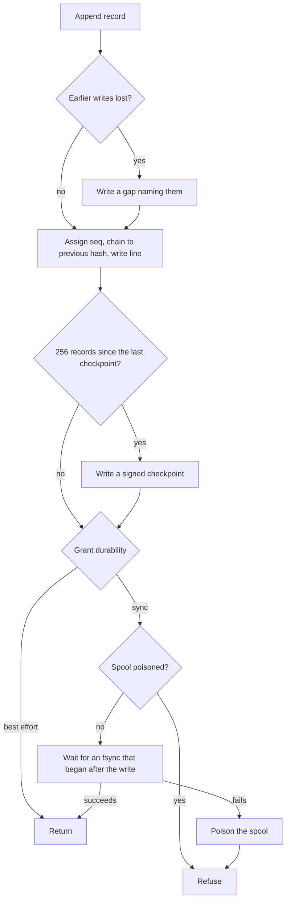

# Design: audit

The audit spool is the [home](../glossary.md#home)'s local, tamper-evident record of every state transition. It is for readers who verify a home's history or change how records are written. Read [core.md](core.md) first.

## Purpose

A home mints and ends [fibers](../glossary.md#fiber) without asking anyone, so its own record is the only account of what happened. That record must show any edit or loss. It must also let a [grant](../glossary.md#grant) choose its price, either a durable record before the caller is acked or a fast one. The spool does this with a hash chain, signed checkpoints and per-grant durability, all on local disk.

## How it works



- **Records.** The spool is `audit.jsonl` in the [agent](../glossary.md#agent)'s private state directory, one JSON line per transition. Each record carries a sequence number, the event, the [fence](../glossary.md#fence), the [session](../glossary.md#session) and fiber, and the home's [scope](../glossary.md#scope) claims ([home.md](home.md)).
- **Chain.** Each record holds the SHA-256 hash of itself and of the record before it. Editing, removing or reordering a record breaks the chain.
- **Checkpoints.** Every 256 records, and when the agent stops, the spool appends a checkpoint. It is an Ed25519 signature over the previous record's sequence number and hash, made with `-audit-key` or a generated key ([agent.md](agent.md)).
- **Gaps.** A failed write is reported, and its sequence number joins a lost range. The next record written first is a gap naming that range. A torn last line, from a crash mid-write, gets a gap when the spool is next opened.
- **Best effort and sync.** Each grant's policy picks one. A best-effort record is written without an fsync, so a crash can lose what the kernel has not flushed. A sync record is acked only after an fsync that began after its write.
- **Group fsync.** One fsync runs at a time and covers every record written before it began. A burst of sync records costs one or two fsyncs, not one each.
- **Poison.** The first failed fsync is sticky. The kernel drops the pages a failed fsync could not write, and a later fsync does not retry them. So every sync record fails until the agent restarts, and best-effort records keep being written.

How a failed record affects [Clone](../glossary.md#clone), [Park](../glossary.md#park) and [Release](../glossary.md#release) is in [protocol.md](../protocol.md#outcomes). Two cases belong to the spool.

- **Migrate-in.** A session claimed from another home is recorded here as parked before its record is written. A failed sync record refuses that Clone, but the session stays parked on this home, so the next Clone of its name resumes it.
- **Best effort.** A failure is logged and the operation succeeds. The next record written is a gap.

**audit-verify.** This command checks a spool against a JWK or JWKS of trusted Ed25519 keys. It checks every hash, the chain, sequence numbers that advance by one except across a gap naming the missing ones, a gap after every unreadable line, and every checkpoint signature. It reports how far the last checkpoint reaches. It exits 1 when the spool does not verify, has records but no checkpoint, or has records from before the chain started.

### Health

A poisoned spool shows on `GET /healthz`, both on the admin socket and on the JSON gateway. The body carries `"audit": "ok"`, or `"audit": "poisoned"` once an fsync has failed. The status is then 503 instead of 200. The fsync error itself names the spool's path, so it goes only to the agent's log, once, when it happens. The gateway serves `/healthz` without authentication. A stale [lane](../glossary.md#lane) shows only as `"grantLaneHealthy": false` and stays 200, because the agent fences it and recovers without a restart.

```json
{"epoch": 3, "tier": "FIBER_CHECKPOINT", "grantLaneHealthy": true, "audit": "poisoned"}
```

Each platform turns the 503 into a restart or a drain.

- **Kubernetes.** The grant Pod's liveness probe runs `fiberd-k8s -healthz`, which asks the admin socket's `/healthz` and fails on anything but 200. So the kubelet restarts the agent. A startup probe holds it off while the agent comes up ([operating-kubernetes.md](../operating-kubernetes.md#readiness-and-status)).
- **Slurm.** `fiberd-job.sh` polls `/healthz` every 10 seconds. On a 503 it stops the agent, and its loop restarts it in the same allocation, as it does for an agent that exits.
- **Substrate.** `ateom-fiberd` answers `/readyz` with 503 while the agent's `/healthz` is not 200, so no actor is placed on the worker.
- **Knative and Kata.** They call the agent but do not probe it, so they see only the failed Clones.

## Security notes and known gaps

- **Local only.** Nothing ships the spool. A deployment that needs records off the host copies the spool there itself.
- **Truncation after the last checkpoint.** Records cut after it, or a whole spool replaced by a shorter valid one, cannot be detected from the spool alone. A copy held off the host shows it.
- **Root can re-sign.** The agent must read its key, so whoever can rewrite the spool can usually read the key, rebuild the chain and sign it again. The chain catches tampering by anyone who can change the spool but not read the key, such as a backup or a log collector's copy.
- **Operations.** Monitor spool failures and disk space. A platform that probes `/healthz` restarts the agent after an fsync failure. Elsewhere, restart it yourself on a 503.
