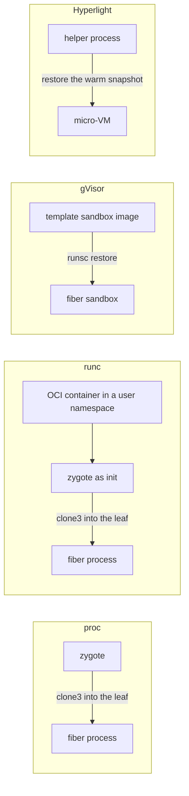

# Design: backends

This doc explains what a [backend](../glossary.md#backend) is and how the four reference backends differ. It is for anyone choosing a backend or reading `pkg/backend`. Read [architecture.md](../architecture.md) first. The [runtime host](runtime-host.md) calls a backend only for the mechanism.

## Purpose

The [runtime host](../glossary.md#runtime-host) decides when a [fiber](../glossary.md#fiber) is made, [parked](../glossary.md#park) or killed, and what it may cost. It does not know how to fork a process, restore a sandbox or snapshot a micro-VM. A backend is that mechanism alone. It knows nothing about [grants](../glossary.md#grant), [fences](../glossary.md#fence), [budgets](../glossary.md#budget) or [parity](../glossary.md#parity), so a new sandbox technology is one package, not a change to the [agent](../glossary.md#agent).

## How it works

`Backend` has one method per lifecycle step. `Warm` starts one [template](../glossary.md#template) instance for a grant in a [cgroup](../glossary.md#cgroup) the host opened. `Clone` makes a fiber from it, `Park` writes a fiber into a directory, `Resume` brings one back under a new fence, and `Kill` ends one. `Exits` reports every end, asked for or not, and the host cleans up on that signal. `Name` is a parity fact, so a checkpoint from one backend is never offered to another. Everything else is an optional interface the host probes for.

| Interface | A backend implements it when |
| --- | --- |
| `Isolator` | its fibers run behind a kernel of their own. Only these serve untrusted grants |
| `EndpointSchemer` | its fibers can serve more than unix sockets under the run directory |
| `Handoffer` | its fibers accept connections the host passes them ([handoff.md](handoff.md)) |
| `ChannelMaker` | its fibers live in a network namespace of their own, so the [handoff](../glossary.md#handoff) channel must be made there |
| `IDMapper` | its fibers run in a user namespace mapped to a range of host ids |
| `Platformer` | its checkpoints depend on something other than the host kernel and libc |
| `DeadlineAdvisor`, `Overheader`, `WMeter`, `WReporter` | a [clone](../glossary.md#clone) is slower than a fork, a fiber has a fixed footprint, or [W](../glossary.md#w-working-set) comes from another counter or from the backend itself |
| `DeviceReporter` | its [warm](../glossary.md#warm) instance is an [engine](../glossary.md#engine) that owns device state |
| `SelfCheckpointer`, `DeltaCodec` | it can checkpoint the warm instance while running and store a park as a [delta](../glossary.md#delta) over it |

| Backend | One fiber is | Park and resume | Isolates tenants | [Tier](../glossary.md#tier) offered |
| --- | --- | --- | --- | --- |
| proc | a forked child of the [zygote](../glossary.md#zygote) in its own cgroup leaf, pid namespace and mount namespace | a [CRIU](../glossary.md#criu) dump, stored as a delta over the zygote's own checkpoint | no, the host kernel as the agent's uid | `FIBER_CHECKPOINT`, or `FIBER_WARM` when CRIU is missing |
| runc | a forked child of the zygote inside the grant's container | a CRIU dump with the container's mounts named as external, restored with the grant's rootfs copy | no, the host kernel as an unprivileged host uid | the same as proc |
| gVisor | a `runsc` sandbox restored from the template image | `runsc checkpoint`, a full image | yes, the Sentry serves its syscalls | `FIBER_SNAPSHOT` |
| Hyperlight | a micro-VM inside the grant's helper process, with no process or leaf of its own | the helper's snapshot | yes, the hypervisor | `FIBER_SNAPSHOT` |

A backend whose tools are missing, such as `runsc` or the Hyperlight helper, offers no tier. The agent then refuses to start, with an error that names the backend and the reason. runc does not look for `runc`, `unshare` or `mount` when it opens, so a home without them fails at warm instead ([user-namespaces.md](user-namespaces.md#security-notes-and-known-gaps)).

**proc.** One zygote per grant, linked with libfiberzygote and driven over a control socketpair at the zygote's fd 3 ([zygote.md](zygote.md)). Every fiber gets its own pid namespace, a private mount namespace with the agent's paths covered, and no capabilities. Fibers serve unix or TCP endpoints. proc is the reference backend and the one the conformance suite runs against.

**runc.** The proc backend with a launcher. `runc run` starts the zygote as the init of a per-grant OCI container, whose user namespace maps the grant onto host ids of its own and whose network namespace holds the loopback alone. So the agent [relays](../glossary.md#relay) a TCP endpoint policy to the fiber's unix socket ([networking.md](networking.md)). Fibers serve unix sockets under `/host`, where the container mounts the grant's run directory, or take handed-off connections. [user-namespaces.md](user-namespaces.md) has the id slots, the rootfs copy and the why.

When runc exits before its container is up, the agent's error quotes the end of runc's debug log and of the zygote log.

A `-template` command names a path inside the rootfs, and the container spec for such a grant is unchanged by what follows. A registry template is staged the way gVisor stages one, with the same helper (`backend.StageTemplate`). At warm the launcher copies the executable alone into `<state>/runc/templates/<grant>/template/`, checks the copy against the hash the host verified, and adds one mount to the grant's container spec: that directory, bound read-only with `nosuid` and `nodev` at `/fiberd/template`. The command runs as `/fiberd/template/<executable>`. The copy is the agent's, mode 0555, and the container's root is an unmapped id to it, so the mapped root reads and runs it with the other bits and cannot write, rename or chmod it. The read-only flag is a second line: a runc fiber keeps the container's capabilities inside its user namespace and runc's mounts are not locked, so it can lift the flag, and still cannot write. The container sees that one file of the host's cache. Every rootfs copy carries the empty mount point, so a copy made for a restore has it. A park names the bind an external mount beside `/host` and the device binds, records that it had one beside the images, and a resume binds the resuming home's own copy there. A park with a template bind needs the grant's warm instance on the resuming home, which is what staged the copy, and is refused by name without it. The staged copy goes with the warm instance.

**gVisor.** Every fiber is its own `runsc` sandbox restored from a checkpoint of the warm template sandbox, on the systrap platform so no KVM is needed. Every runsc command runs with `--network=none` and `--app-huge-pages=false`, so the agent relays a TCP endpoint policy to the sandbox's unix socket. Huge pages are off because W is read from the leaf's `shmem` counter above the template's measured footprint, and 2 MiB pages would move a fresh sandbox several MiB from that measurement. Each sandbox incarnation gets a container ID no other has had, so a reaper deleting its own ID never hits a successor under the same grant or fence. A park is a full image written with direct I/O, so its pages are never charged to the fiber's leaf.

A `-template` command names a path inside the rootfs. A registry template ([artifact.md](artifact.md)) lives outside it, so the backend stages it (`backend.StageTemplate`, shared with runc). At warm it copies the executable alone into `<state>/gvisor/templates/<template sandbox>/template/`, a directory that goes with the template sandbox, checks the copy against the hash the host verified, and binds that directory read-only at `/fiberd/template` in the template sandbox and in every fiber restored from it. The command runs as `/fiberd/template/<executable>`. The bind carries `ro`, `nosuid` and `nodev`, and the sandbox's init has no capabilities, so `mount(2)` inside it fails with EPERM and nothing can remount or rebind the directory. The sandbox sees that one file. It does not see the artifact's config, its images, the rest of the cache or another template. runsc checks at restore that every mount's destination, type and options match the checkpoint's, and lets the host-side source differ, so a park taken on one home resumes on another whose state and cache live elsewhere. The resuming home binds its own verified copy. A park and a home that disagree about having a template mount are refused by name. The mount is the one addition to a sandbox's spec, and a `-template` sandbox gets no mount, so its spec is unchanged.

**Hyperlight.** Hyperlight has a Rust host API only, so the mechanism lives in a helper process that fiberd starts per grant inside the grant's cgroup and drives over the line protocol in [hack/hyperlight/PROTOCOL.md](../../hack/hyperlight/PROTOCOL.md). Fibers are micro-VMs restored from the warm snapshot, named by fence, with W reported by the helper. Which facts its parity covers, and why Hyperlight [homes](../glossary.md#home) keep `-parity strict`, is in [artifact.md](artifact.md).

## Security notes and known gaps

- proc and runc share the host kernel. Admission refuses an untrusted grant on either ([security.md](../security.md)).
- runc has no egress. A fiber reaches neither the network nor the host's loopback, so a workload that needs to call out cannot run there.
- Credentials differ by backend. fiberd mints no per-fiber credential except the HANDOFF TLS identity ([handoff.md](handoff.md)). A proc fiber runs as the agent's uid with the agent's private paths covered, so a credential mounted elsewhere in the home is readable when its mode allows. A runc fiber sees its rootfs copy and `/host` alone. A gVisor or Hyperlight fiber sees nothing of the home but the grant's run directory, plus, on gVisor or runc with a registry template, the read-only copy of its own executable. A custom rootfs, bind mount or helper can expose more, so review the backend configuration rather than assume.
- The gVisor rootfs is shared by every sandbox and served by runsc's gofer, which creates a missing mount point in it. A registry template leaves an empty `/fiberd/template` directory in the rootfs on the host. Nothing is written there afterwards, and the root is read-only inside every sandbox.
- The template cache is hidden from proc fibers ([runtime-host.md](runtime-host.md)), and proc execs a registry template through a descriptor it hashed ([artifact.md](artifact.md)). A `-template` path outside the hidden list is protected by its owner's permissions alone, and a proc fiber is the owner's uid.
- A runc fiber can lift the read-only flag of its template bind inside its own mount namespace. Ownership is what keeps the copy unwritable.
