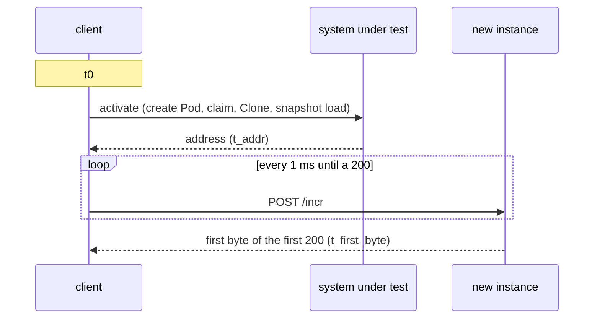

# Activation comparison

This is the design of the activation benchmark in `bench/compare`. It is for readers who run it or judge its numbers. Read [architecture](../architecture.md) and [backends](backends.md) first. The commands live in [the benchmark's README](../../bench/compare/README.md).

## Purpose

fiberd claims that its protocol layer adds little overhead while removing the per-instance control-plane cost. The benchmark tests both halves against the usual ways to get another instance of the same workload.

| Half | Measured as | Supported when |
| --- | --- | --- |
| Little overhead | Activation to first byte, per isolation class | fiberd gVisor is at or below a gVisor Pod and within 2x of an agent-sandbox pool hit. fiberd Hyperlight is within 2x of a Firecracker restore. fiberd proc on kind is within 2x of standalone proc |
| No per-instance control-plane cost | API server writes, stored objects, scheduler attempts and audit events per run | Zero for fiberd once its [grant](../glossary.md#grant) is placed, against at least 3 writes and 1 scheduling decision per Pod or claim |

A pool hit that beats fiberd gVisor by more than 2x, or idle density no better than Pods, refutes the claim. Either result is reported, one class and one host per table.

## How it works

| Class | Comparators | fiberd |
| --- | --- | --- |
| Shared kernel | Pod with the image on the node, Pod with the image removed first, agent-sandbox v1.0.5 warm pool under runc | proc, runc |
| Sandboxed | Pod under the gvisor RuntimeClass, agent-sandbox under gvisor | gVisor |
| MicroVM | Firecracker v1.17.0 snapshot restore from a file, and through UFFD as a variant | Hyperlight |

agent-sandbox is the Kubernetes SIG's answer to warm sandboxes. Firecracker is plain Firecracker over its API socket, the lower bound every Firecracker product sits above. firecracker-containerd has no snapshot restore, and E2B's stack is too heavy to stand up per run.

**One workload.** Every system runs `workload/counter.c` with a 32 MiB heap it touches at start. It is built once as a static PIE with the Makefile's `ZYGOTE_CFLAGS`. Pods, agent-sandbox and the Firecracker guest run it as a plain server. proc and runc run it as a [zygote](../glossary.md#zygote). gVisor runs it as the sandbox's init with a self-checkpoint. Hyperlight is the exception. Its guest is the Rust guest in `hack/hyperlight/guest`, which speaks a line protocol and not HTTP. So proc runs under both framings in the same run, and the gap is reported.

**Templates from a registry.** Every fiberd [home](../glossary.md#home) pulls the counter as a [template](../glossary.md#template) artifact from a [registry](../glossary.md#registry), the way a production home does, so no image carries the workload. Phase 1 packs one artifact per argument set and pushes each to the `compare` cluster's registry. The grant Pods run stock `fiberd:kind`, and the client names the digest in the grant it mints. Standalone, the runc and gVisor homes pull from the local registry, and proc takes a `-template` path.

**First byte.** One client process times everything with its own monotonic clock. No server-side timestamp enters a number.

Pods, claims and Firecracker return an address before the instance listens, so they are polled. The poll interval and the failed attempts are in every record as the quantization bound. A [clone](../glossary.md#clone) returns an endpoint that already listens, so fiberd's first request is the measurement. On kind, gVisor and runc fibers are reached through the agent's [relay](../glossary.md#relay), one hop per request. The standalone rows over unix sockets bound that cost.

**Fairness.**

- Every instance gets the same 64 MiB limit. For fiberd it is the grant's [W](../glossary.md#w-working-set) budget. Pods and claims also get a 250m CPU limit but reserve only 10m, since a fiber reserves nothing per instance and a burst of 50 must fit the node. A Firecracker guest gets 1 vCPU and 128 MiB, the same 64 MiB plus its own kernel.
- fiberd keeps one [warm](../glossary.md#warm) template and no pre-made fibers. So agent-sandbox runs with a pool of 1 as the like-for-like and with a pool of N, each refilled untimed before every burst. Pool memory is charged in density. Sandboxes run without agent-sandbox's default NetworkPolicy, which blocks the client. A pool is deleted after its own runs, so it never stands during another system's.
- The client sits beside the system. On kind it is a Pod pinned to the node, since Pod IPs are not routable from a Mac.
- Image pulls, template warm, pool fill, snapshots and grant placement are setup. Setup is timed once and reported apart. Removing the image before a cold Pod is not timed, and a burst removes it for all its Pods before the first clock starts.
- Each run does bursts of 1, 10 and 50 and releases everything in between. Every number is the median of 3 timed runs after a discarded cold run.
- Each run records the host load before and after. A phase refuses to start when the load exceeds the core count.

Runs can also [park](../glossary.md#park) an instance untimed and then time its resume to first byte, and hold idle instances for 30 seconds to read their memory from cgroups or the Firecracker process.

**Phases.** Phase 0 records the host and its load. Phase 1 is the shared-kernel class on a kind cluster named `compare`, with control-plane deltas. Phase 2 is fiberd proc, runc and gVisor standalone in the dev container. Phase 3 is the sandboxed class on the same cluster. Phase 4 is everything again on one host with `/dev/kvm`, plus Firecracker and Hyperlight. Docker Desktop has no `/dev/kvm`, so the headline table comes from phase 4 alone.

**The workflow.** `bench-compare` is a GitHub workflow started only by hand. It runs phase 4 on an x86_64 `ubuntu-24.04` runner, which exposes `/dev/kvm`. The selected classes run in one job, so they share one host and one run. The runner's facts and load are recorded first, and the raw records are kept as an artifact.

## Security notes and known gaps

- The homes serve plaintext. The client mints its own grants from the issuer's private key, which is copied into the client Pod.
- The client Pod is privileged, to read the node's cgroups and remove images through containerd. The Firecracker adapter runs as root to make network namespaces.
- The kind scheduler listens on every node address and skips authorization for `/metrics`, so the client can read its counters.
- Control-plane deltas include the cluster's background traffic.
- Sustained closed-loop throughput is not measured. Only bursts are.
- Shared runners are noisy and nested. Their numbers compare only within their own run.
