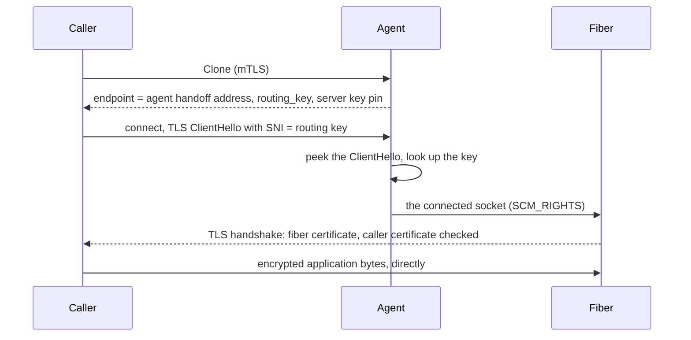

# Design: connection handoff

> **Status:** designed, not implemented. This document describes the planned
> behavior so it can be reviewed before any code changes. For what fiberd
> does today, see [Networking](../networking.md).

## The problem

Under the TCP model, every fiber listens on its own port on the home address.
Anyone who can route to the home can connect to that port, including other
fibers on the same home, and fiberd checks nothing per connection. The port
number is the only secret, port numbers can be scanned, and the data path
has no encryption unless the workload adds it.

## The idea

With handoff, a fiber never listens, and every connection to it is TLS that
the fiber itself terminates:

1. The agent owns one listening port for the home.
2. The caller opens a TLS connection to that port. The TLS server name (SNI)
   carries the routing key that `Clone` returned.
3. The agent reads the server name from the TLS ClientHello without
   consuming it or decrypting anything, and passes the connected socket to
   the fiber the key belongs to.
4. The fiber completes the TLS handshake. It accepts only the client
   certificate the grant is bound to, and the caller accepts only the fiber
   certificate `Clone` named.
5. From then on, bytes flow directly between the caller and the fiber,
   encrypted. The agent is not in the data path and never sees plaintext.

The routing key is not a credential. It is visible in the ClientHello, like
any SNI. Access is decided by the TLS handshake with the fiber: a copied key
gets an observer nothing without the caller's private key.

## Opting in

Handoff is chosen per grant. `Policy` gets an `endpoint_mode` field:

- `DIRECT` is the default and today's behavior: the fiber listens on its own
  endpoint.
- `HANDOFF` means the fiber receives TLS connections from the agent.

Grants that don't set the field behave exactly as they do today. A
`HANDOFF` grant must be bound to a caller certificate (its `cnf` claim). The
agent refuses an unbound one, because the fiber would have no certificate to
check.

## Identities

Two certificates are involved, and neither needs a certificate authority.

- **The caller's.** This is the certificate the caller already uses for the
  control API, whose SHA-256 thumbprint the grant carries. The fiber
  gets the thumbprint with its identity at birth, requires a client
  certificate, and accepts only one with that thumbprint.
- **The fiber's.** Each grant has one TLS key, shared by its fibers, which
  all belong to one tenant. The certificate is self-signed. The caller
  verifies it by the SHA-256 hash of its public key, which `CloneResponse`
  returns in a new `server_key_sha256` field.
- **The fiber's key is derived, not generated.** It is an Ed25519 key whose
  seed is derived with HKDF from a home handoff key and the grant UID.
  - Every home that shares the handoff key derives the same key for the same
    grant, so a session resumed on another home still holds the key `Clone`
    pins. This mirrors the delta seal key: homes that move sessions between
    them share it.
  - The handoff key is `-handoff-key`. Without it, the agent generates
    `<state>/private/handoff-key.json` and logs a warning, as it does for the other
    keys.
- **Fibers get the key over their channel, never from a file.** Before
  it asks the zygote to clone a handoff fiber, the agent queues one
  message on the fiber's end of the handoff channel: the grant's key and
  certificate (PEM) and the caller thumbprint. `libfiberzygote` reads it
  in the child, before any application code runs, and exposes it with
  `fz_handoff_identity()`. The zygote never sees it, so the key never ends
  up in a template checkpoint. A resumed fiber already holds it in its
  restored memory and is sent no new one. Parked deltas are sealed (see
  [Security](../security.md#trust-boundaries)). Nothing is written to the
  run directory, which every grant's fibers can read (under proc they all
  run as the agent's user without capabilities, so no file mode would
  keep one grant's fibers out of another's key).

## The routing key

- The key is 16 random bytes, written as 26 lowercase base32 characters. On
  the wire the server name is `<routing_key>.fiberd`.
- Each incarnation gets its own key, so a resumed session has a new one. The
  fence string isn't used, because it can be guessed (grant, epoch,
  sequence).
- `CloneResponse` carries it in a new `routing_key` field. Its `endpoint` is
  the agent's handoff address rather than a per-fiber port.
- The agent keeps routing keys in memory only. A restart bumps the epoch and
  ends every fiber, so no key outlives the agent.

## Reading the ClientHello

The agent reads with `MSG_PEEK`, so the whole ClientHello stays in the socket
for the fiber's TLS server. It treats what it reads strictly:

- The ClientHello must arrive within a short deadline (1 s by default) and fit
  in one 16 KiB TLS record.
- The agent parses only the record header, the handshake header and the
  server name extension.
- Anything else closes the connection without a reply: not TLS, no server
  name, a name without the `.fiberd` suffix, an unknown key, or a missed
  deadline. Each refusal is counted.

## Passing the socket to the fiber

- When it creates a handoff fiber, the agent makes a Unix `SOCK_SEQPACKET`
  pair. It sends one end to the zygote with `CLONE`, as it already sends the
  fiber's cgroup descriptor. The zygote puts that end at a fixed descriptor
  that survives the descriptor scrub before the fiber runs.
- The fiber calls `fz_accept()` from `libfiberzygote`, which blocks until the
  agent passes it a connected socket. It then runs the TLS handshake on that
  socket with its own TLS library. It still calls `fz_fiber_ready()` once it
  is ready to accept, and the descriptor number is in `FIBERD_HANDOFF_FD`.
- The reference template (`zygote/refzygote.c`) shows the whole server
  side with OpenSSL 3: `fz_accept()`, the TLS 1.3 handshake, and the client
  certificate check. `make zygote` builds it with `-DFZ_TLS`. A build
  without it refuses to start handoff fibers rather than serve them in
  plaintext.
- Forked fibers, and fibers restored from the same checkpoint, start with
  the same random generator state. The reference template mixes fresh
  `getrandom` bytes into OpenSSL before every handshake, and other
  templates must do the same. A handshake that stalls is dropped after 5
  seconds, and session resumption is off, so every connection presents the
  caller's certificate.
- The agent passes each socket without blocking, then closes its own copy.
  If the fiber's queue is full because it isn't accepting, the connection is
  closed rather than queued in the agent.
- On release, the agent closes its end of the pair, and the fiber's next
  `fz_accept()` returns an error.

## The caller

`Fiber.DialHandoff` in `pkg/consumer` dials the handoff address with TLS.
It uses `<routing_key>.fiberd` as the server name and presents the
certificate the grant is bound to. It accepts only a server key whose hash
matches `server_key_sha256`. `handoff.ClientConfig` holds these settings.
Callers in other languages must apply the same three.

## Park, resume and mobility

- The fiber's end of the pair has its peer outside the checkpointed tree,
  much like the zygote's control socket today. The dump marks it as external.
  The restore gives the resumed fiber a fresh pair end at the same
  descriptor. This is the riskiest part of the design and is tested first.
- Connections and TLS sessions that were already handed to the fiber belong
  to the fiber, and are handled at park exactly as in direct mode.
- A resumed session gets a new routing key and, on another home, that home's
  handoff address. Its server key is the same, because it is derived from
  the grant. Handoff grants therefore don't need endpoints that are valid on
  both homes.

## Load and speed

- Creating, parking and resuming fibers are unchanged. The grant's key and
  certificate are made once, when its template warms.
- One accept loop runs per home. Reading each ClientHello has its own
  deadline.
- At most 1024 connections can be waiting for their ClientHello at once.
  Beyond that, new connections are closed immediately.
- Each new connection costs the agent one accept, one peek and one
  descriptor pass. The TLS handshake is the workload's cost, as with any TLS
  server. An open connection costs the agent nothing.
- This overhead is measured before handoff ships.

## What it does not cover

- Only proc and runc get handoff. Both start fibers through
  `libfiberzygote`, and both run trusted grants only.
- gVisor and Hyperlight, which run untrusted grants, don't use the zygote.
  Passing connections into their sandboxes is future work.
- Protocols that aren't TLS can't use handoff.
- The routing key is visible to anyone observing the network, as SNI is.
  Encrypted ClientHello (ECH) is not used.
- Fibers of one grant share its server key, so they can impersonate each
  other to that grant's caller. They belong to the same tenant.
- Under proc, every grant's fibers run as the agent's user, so file
  permissions keep nothing in the run directory from another grant's
  fibers. The TLS key therefore never touches it (it goes down each
  fiber's channel), but the unix endpoints and fence files there are
  still shared ground. This is one reason proc serves trusted grants
  only. Under runc, a container sees only its own grant's run directory.
- Unix endpoints are unchanged. Their protection is file-system access to
  the run directory.
