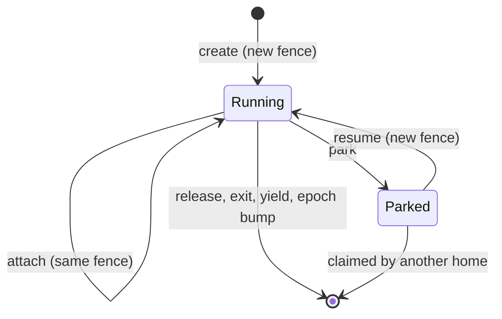
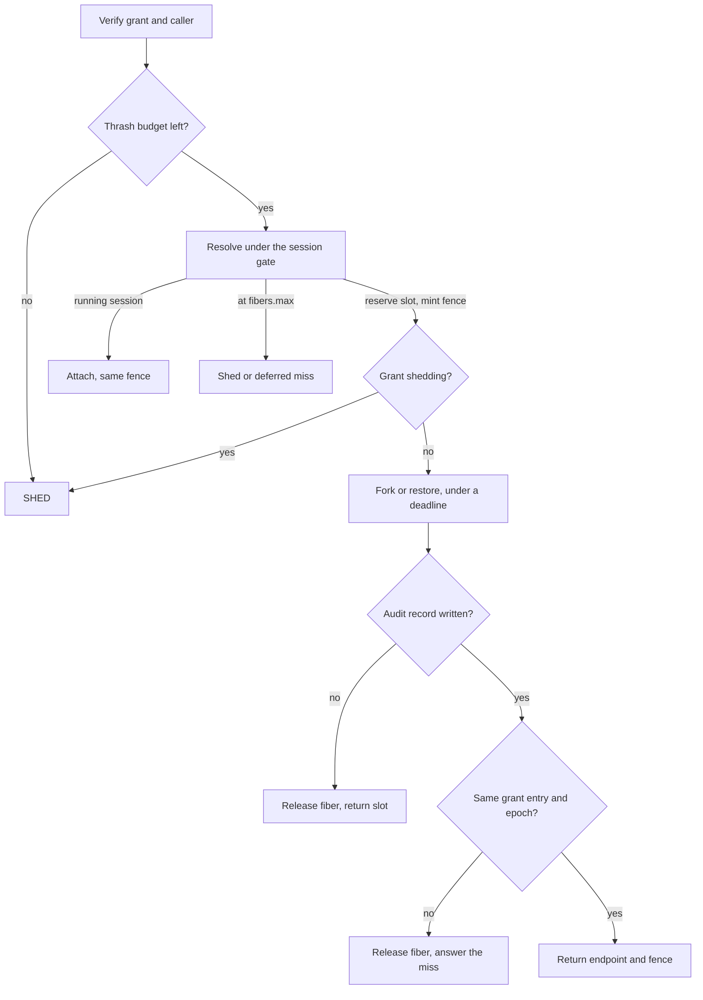

# Design: core

The core is the [agent](../glossary.md#agent)'s decision engine. It keeps the ledger, mints [fences](../glossary.md#fence) and decides every [Clone](../glossary.md#clone). It is for readers changing that logic. Read [architecture.md](../architecture.md) first. The wire format of fences and outcomes belongs to [protocol.md](../protocol.md).

## Purpose

A [home](../glossary.md#home) mints [fibers](../glossary.md#fiber) locally, in milliseconds, with no call to a control plane. It must still never run more fibers than the [grant](../glossary.md#grant) paid for, never run two incarnations of one [session](../glossary.md#session), and never let a revoked fiber live on. The core does this with one in-memory ledger, a fence on every incarnation, and an [epoch](../glossary.md#epoch) that moves whenever trust is lost.

## How it works

- **Ends.** A running fiber ends by [release](../glossary.md#release), its own exit, a [yield](../glossary.md#yield) of its grant or an epoch bump. A parked one leaves when another home claims its [delta](../glossary.md#delta). A resumed delta is consumed by its resume. It stays on disk only while that fiber runs, and goes however the fiber ends, including a restart that finds the session was running. Parked deltas stay.
- **Session gates.** Every Clone of one session name runs under that name's gate, so concurrent Clones and retries attach instead of creating a twin.
- **Exits.** A fiber that dies on its own frees its slot and its session is forgotten. Its state is gone, so the ledger never calls it [parked](../glossary.md#park).

The [thrash budget](../glossary.md#thrash-budget) is checked right after verification, for every Clone. It allows 200 clones a second while running fibers write almost nothing, and half that when their average [W](../glossary.md#w-working-set) reaches 256 MiB. Both numbers are defaults that nobody has measured.

The commit is the step where the ledger records the new fiber as running. It keeps four invariants.

- **Reserve before runtime.** The slot is reserved when the fence is minted. The runtime works for milliseconds before commit, and a late reservation would let a burst overshoot `fibers.max`. A Clone that never commits returns its slot.
- **Audit before commit.** A [sync](audit.md) record is durable before the caller is acked, and a failed record releases the new fiber. The order of every call is in [protocol.md](../protocol.md#outcomes).
- **Commit refuses a changed grant or epoch.** Commit holds the ledger lock and checks that the admitted grant is still the entry it reserved under, and that the epoch has not moved. A revocation followed by a re-admission still counts as a change. Revocation and the epoch bump take the same lock, so each one either sees the new fiber or makes its commit fail. A fiber whose commit fails is [released](../glossary.md#release).
- **Early exits.** A fiber that dies before its Clone commits has its exit held and settled at commit, under one lock, so no exit is missed and no slot leaks.

**Epochs and restart.**

- The epoch is a file in the private state directory, advanced on every start. A missing file starts at 1, as on a first boot. A corrupt or unreadable one jumps to the current Unix time instead of guessing.
- Before it serves, the [agent](agent.md) reconciles, rebuilding the ledger from its snapshot on the home's disk. The snapshot is only a cache, so a grant comes back only when its stored token verifies again. A failing or missing token drops the entry, and an undecidable one is held, with its parked sessions, unadmitted.
- Parked sessions whose delta still exists are remembered. Every fiber the runtime still reports is from a prior epoch and is killed.
- An epoch bump without a restart releases every running fiber and keeps grants and parked deltas ([home.md](home.md) says when).

**Revocation.**

- Every 5 seconds a reaper yields every grant whose [lease](../glossary.md#lease) lapsed. A valid token re-admits it.
- When the home's [lane](../glossary.md#lane) removes a grant, the grant is yielded and its UID also goes on a deny-list. Only the lane delivering the grant again lifts the entry, never a Clone.
- The deny-list is its own file, because an unreadable snapshot counts as empty and a deny-list never may. An unreadable deny-list fails the start.
- An entry lasts until the later of the latest lease seen and `-max-lease` past removal (24 hours without it). A grant with no lease is denied for good.

**Pressure ladder.** The input is [PSI](../glossary.md#psi) "some avg10" on the grant's [cgroup](../glossary.md#cgroup), or the [engine](../glossary.md#engine)'s device occupancy, whichever is higher. The [shed](../glossary.md#shed-and-deferred) and park watermarks come from the grant's policy. A failed park falls back to release, and every rung is an agent verb, so it writes its audit record.

**Miss selection.** The lane's health picks the miss for capacity this home does not hold, as [outcomes](../protocol.md#outcomes) maps it.

## Security notes and known gaps

- **Release is best effort.** Yield and the epoch bump log a failed runtime release and still drop the fiber from the ledger. The work can outlive its revocation while its slot looks free.
- **Grant fields are not immutable per UID.** A lane redelivery replaces the admitted fields in place, and the [warm](../glossary.md#warm) [template](../glossary.md#template) stays. A Clone whose token names another caller than the admitted grant is refused, but other fields are not compared. [Issuers](../glossary.md#issuer) should change only the lease for a UID and mint a new UID for anything else.
- **Revocation is per home.** Every home holding the grant must remove it.
- **Watch has no tombstone.** A grant that leaves emits no record.
- **Epoch loss.** A deleted epoch file looks like a first boot and restarts fences at 1, so the private state must live as long as the home's identity.
