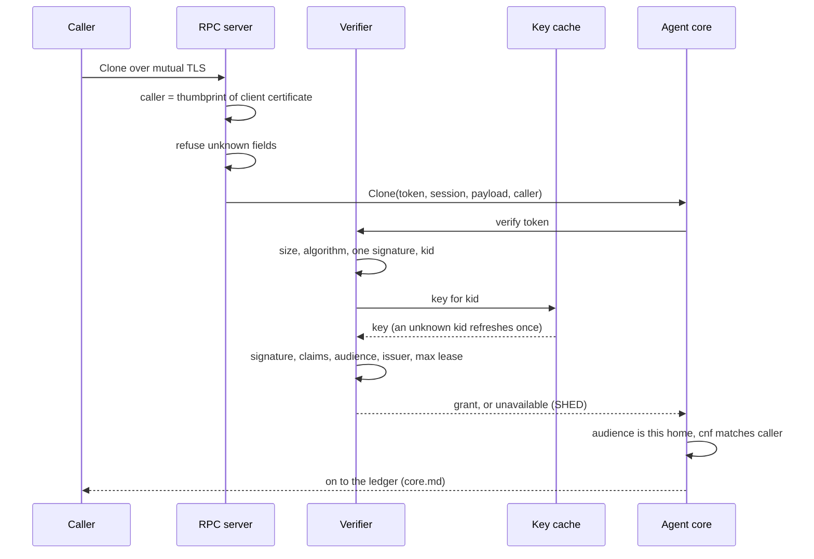

# Design: grant verification

[Grant](../glossary.md#grant) verification decides, offline, whether a [Clone](../glossary.md#clone) may spend a grant's capacity and who may act on its [fibers](../glossary.md#fiber). It is for readers changing the verifier, the transport or caller checks. Read [security.md](../security.md) first. The token's wire layout belongs to [protocol.md](../protocol.md).

## Purpose

A caller hands the [agent](../glossary.md#agent) a signed grant with every Clone. The [home](../glossary.md#home) must check it with no round trip to the [issuer](../glossary.md#issuer). It must refuse a forged token, one for another home, a lease longer than policy allows, and a copied token replayed by another caller. It must also stop one caller from [parking](../glossary.md#park), [releasing](../glossary.md#release) or watching another caller's fibers.

## How it works

**Token checks.** Each of these must pass before the grant is trusted.

- A token over 8 KiB is refused before parsing.
- Only EdDSA and ES256 are accepted, before any key lookup, so `none` and symmetric algorithms never reach verification. The token has exactly one signature and a `kid`, and its algorithm must match the key's.
- The registered claims (`iss`, `aud`, `jti`, `exp`) must agree with the grant claim inside the token.
- The UID must be a DNS-1123 label, and the tenant, when set, one path segment ([grant fields](../protocol.md#grant-fields)).
- The audience must be this home and the issuer the configured one.
- With `-max-lease`, a grant signed for longer (`exp` minus `iat`), or with no lease, is refused.

The verifier does not enforce `exp`. Lease expiry is a capacity miss the [core](core.md) handles.

**Keys.** Keys come only from OIDC discovery of the configured issuer, and the discovery document must name that same issuer. Keys are looked up by `kid` alone. An unknown `kid` triggers one refresh, at most once a minute. A key set older than `-jwks-max-stale` is refreshed once, and is refused if still stale. A stale key set, or one never loaded, makes the token unverifiable rather than bad, so the answer is [SHED](../glossary.md#shed-and-deferred), not `Unauthenticated`. Each refresh is the standalone home's liveness signal ([home.md](home.md)).

**Caller binding.** The `cnf` claim holds the `x5t#S256` thumbprint, the base64url SHA-256 of the caller's whole certificate. A bound grant presented over another certificate, or over plaintext, is refused. A home serving mutual TLS refuses unbound grants. When a token names another caller than the already admitted grant with that UID, it is refused until the [lane](../glossary.md#lane) delivers the grant again.

**Transport and ownership.** The gRPC API and the JSON gateway require TLS 1.3 and a client certificate signed by `-client-ca`. The start fails unless exactly one of these holds.

- All three TLS files are set, `-tls-cert`, `-tls-key` and `-client-ca`.
- `-insecure-plaintext` is set, and no TLS file is.

The certificate's thumbprint is the caller on every call. Park and Release answer `NotFound` for a fiber whose grant is bound to another caller, the same as for a fiber that does not exist. Watch and the gateway's status report only the caller's grants.

**Admission completeness.** The RPC server refuses unknown fields at any depth before the core sees a Clone, so a caller cannot shape the workload the [template](../glossary.md#template) fixed ([protocol.md](../protocol.md#admission-completeness)).

**Development modes.** The `insecure-json` verifier checks no signature and must be chosen explicitly. `-insecure-plaintext` is a separate switch. It serves without TLS and without caller identity, so every caller sees every grant.

## Security notes and known gaps

- **Certificate rotation means re-minting.** The thumbprint covers the whole certificate, so a caller with a new certificate needs new grants. Keep leases short.
- **An unbound JWT is a bearer token.** Anyone holding it can spend the capacity at the named home. Keep tokens out of logs, annotations and readable files. Over plaintext only unbound grants work.
- **Without `-max-lease`** a grant may carry no lease and never expire.
