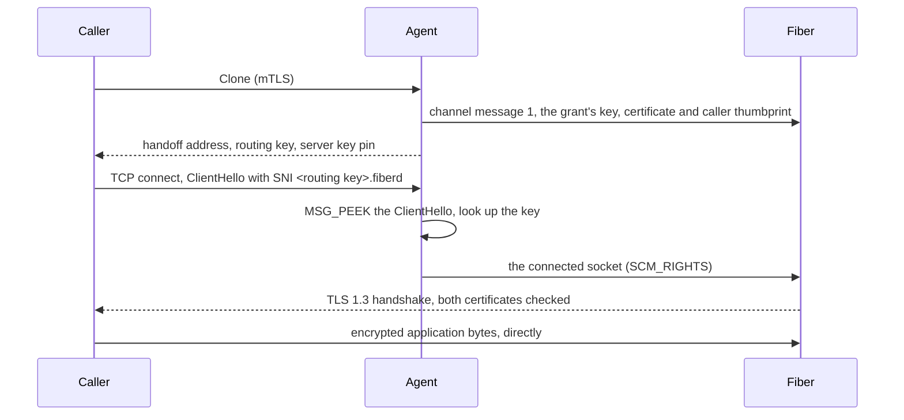

# Design: handoff

This doc explains how the [agent](../glossary.md#agent) passes a caller's TLS connection to a [fiber](../glossary.md#fiber). It is for contributors and reviewers. Read [architecture.md](../architecture.md) first. The caller's side of the contract lives in [protocol.md](../protocol.md).

## Purpose

A fiber reached directly listens on a port of its own. Anyone who can route to the [home](../glossary.md#home) can connect to that port, nothing checks who connects, and the bytes are plaintext unless the workload adds TLS.

[Handoff](../glossary.md#handoff) removes the per-fiber port. A handoff fiber never listens. Every connection to it is TLS that the fiber terminates itself, and the agent routes connections without ever seeing plaintext.

A [grant](../glossary.md#grant) opts in with `endpoint_mode: HANDOFF`, and [grant fields](../protocol.md#grant-fields) says what such a grant needs and when a home refuses it.

## How it works

- **Routing key.** Each incarnation gets 16 random bytes, written as 26 lowercase base32 characters. The caller sends `<routing key>.fiberd` as the TLS server name. Keys live in the agent's memory only. A restart bumps the [epoch](../glossary.md#epoch) and ends every fiber, so no key outlives the agent. The key is a route, not a credential.
- **Peek.** One accept loop runs per home. The agent reads the ClientHello with `MSG_PEEK`, so every byte stays in the socket for the fiber's TLS server. It parses only the record header, the handshake header and the server name extension. The ClientHello must fit in one 16 KiB record and arrive within 1 s. A connection that is not TLS, names no server, lacks the `.fiberd` suffix, names an unknown key or misses the deadline is closed without a reply.
- **Limits.** At most 1024 connections wait for their ClientHello at once, and at most 32 of them from one source IP. Beyond either limit a new connection is closed at once.
- **Passing the socket.** Each handoff fiber has a `SOCK_SEQPACKET` pair to the agent. The fiber's end sits at fd 4 (`FIBERD_HANDOFF_FD`). A [backend](../glossary.md#backend) whose fibers live in their own network namespace makes the pair there, so the fiber's checkpoint can carry it. The agent sends each socket with `SCM_RIGHTS` without blocking, then closes its own copy. If the fiber is not accepting and its queue is full, the connection is closed rather than queued in the agent. The fiber takes sockets with `fz_accept()` from libfiberzygote, which fails once the agent closes its end at [release](../glossary.md#release).
- **Identity.** Each grant has one Ed25519 key. Its seed is HKDF-SHA256 of the home's handoff key (`-handoff-key`) and the grant UID. The self-signed certificate has fixed fields, so every home that shares the handoff key derives the same certificate. [Clone](../glossary.md#clone) returns the SHA-256 pin of its public key as `server_key_sha256`.
- **Key delivery.** Before the fiber is born, the agent queues one message on the fiber's channel. It holds the key, the certificate and the caller thumbprint. libfiberzygote reads it in the child before any application code runs and exposes it with `fz_handoff_identity()`. The key is never a file, and the [zygote](../glossary.md#zygote) never sees it, so it never lands in a [template](../glossary.md#template) checkpoint.
- **Resume keeps the key.** A resumed fiber already holds its identity in restored memory and is sent none. The checkpoint marks the channel as external, and the restore gives the fiber a fresh pair end at the same fd. The resumed fiber gets a new routing key and, on another home, that home's handoff address. Its pin is unchanged, because the key derives from the grant.
- **Reference template.** `zygote/refzygote.c` built with `-DFZ_TLS` serves TLS 1.3 with OpenSSL 3 and accepts only the bound caller certificate. It mixes fresh `getrandom` bytes into OpenSSL before every handshake, drops a handshake that stalls for 5 s, and turns session resumption off. A build without TLS refuses to start handoff fibers.

## Security notes and known gaps

- **Same-grant impersonation.** The fibers of one grant share its server key, so they can impersonate each other to that grant's caller. They belong to one tenant.
- **SNI on the wire.** The routing key is visible to anyone who watches the network. Encrypted ClientHello is not used. A copied key gains nothing without the caller's private key.
- **proc and runc only.** Only backends that start fibers through libfiberzygote support handoff. gVisor and Hyperlight do not, and protocols other than TLS cannot use it.
