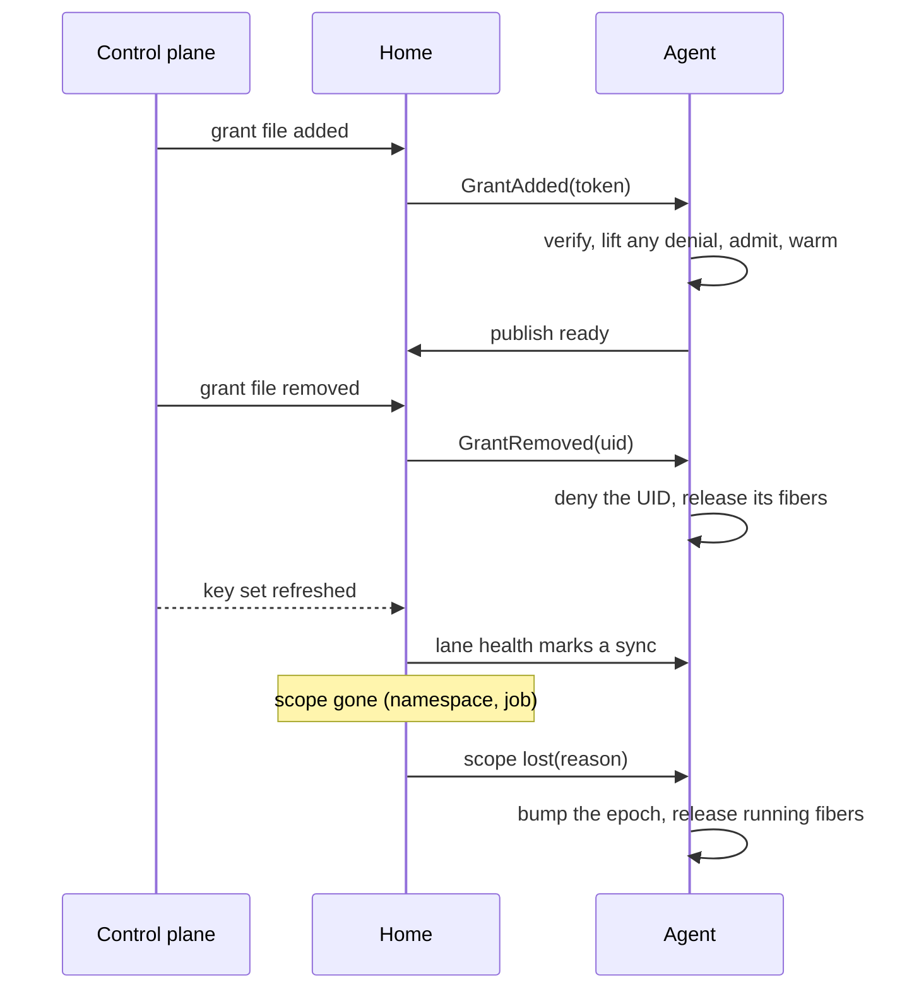

# Design: home seam

The [home](../glossary.md#home) seam is what lets one [agent](../glossary.md#agent) run unchanged on a plain host, in a Kubernetes Pod or in a Slurm job. It is for readers writing a new home. Read [architecture.md](../architecture.md) first.

## Purpose

Environments differ in how [grants](../glossary.md#grant) arrive, how the control plane shows it is alive, which [cgroup](../glossary.md#cgroup) the agent owns and what it can vouch for. The core must not know which environment it runs in. A home answers those questions behind one interface, and a home is conformant when the conformance suite passes against it with the core unchanged.

## How it works

| Question | The standalone home's answer |
| --- | --- |
| How do grants arrive ahead of time? | `*.jwt` files in `-grants-dir`, else only inside [Clone](../glossary.md#clone) |
| Is the control plane alive? | The [issuer](../glossary.md#issuer)'s key set refreshed recently |
| Which cgroup subtree may the runtime carve? | `-cgroup-root` |
| Where do callers reach this home? | `-advertise` |
| How is readiness published? | Only through the Watch stream |
| What does the home vouch for? | Nothing |
| Which devices may an [engine](../glossary.md#engine) drive? | The static `-devices` set, its [fabric channel](../glossary.md#fabric-channel) |

A home may also implement two optional interfaces. A **[scope](../glossary.md#scope) loser** reports when its scope is gone. An **endpoint hoster** knows the one address its [fibers](../glossary.md#fiber) share, such as a Pod IP, and fills `-endpoint-host` for an inet4 or inet6 family when the flag is empty. The Kubernetes and Slurm homes are examples ([kubernetes.md](kubernetes.md), [slurm.md](slurm.md)).

**The grant [lane](../glossary.md#lane).** The agent verifies a delivered token like any other. The lane is the authority, so a delivery lifts the UID's deny-list entry before admission. A token that fails verification is logged and skipped. A removal goes through the core's revocation path ([core.md](core.md)).

**The file lane.** Every file-fed home shares it. It polls a directory every 2 seconds. A new or changed `*.jwt` regular file is GrantAdded. A FIFO or device is skipped, because reading it could block the lane. A removed file is GrantRemoved, with the UID read unverified from the last copy seen. The Kubernetes home points it at the Secret volume its controller projects grants into.

**Lane health.** The core owns the staleness rule, so it is the same in every home, and a home only marks syncs. The lane turns unhealthy once the last sync is older than the stale TTL (`-stale-ttl`, 30 seconds by default). It turns healthy again only below half of that, which stops flapping. Startup counts as a sync. The standalone home's sync is a successful key refresh, attempted every half TTL. Without an issuer, a timer keeps the lane healthy. Which miss each state gives is in [outcomes](../protocol.md#outcomes).

**Scope.** A home asserts its scope as name and value claims. The agent stamps them on every audit record ([audit.md](audit.md)) and never interprets them. Scope never decides whether a fiber is valid. Only the [lease](../glossary.md#lease) and the [fence](../glossary.md#fence) do. A home that loses its scope bumps the [epoch](../glossary.md#epoch) ([core.md](core.md) says what that ends). When a loss concerns only one grant, the home may remove that grant instead.

## Security notes and known gaps

- **Scope claims are facts, not authorization.** Nothing checks them at Clone time. They let an auditor check where work ran.
- **The lane directory is an authority.** Whoever can write it can add or remove grants on this home. A removal names its UID from an unverified copy, so a planted file that is then deleted denies that UID here. Only the control plane should be able to write the directory.
- **Without an issuer the lane is always healthy**, so misses are [deferred, never shed](../glossary.md#shed-and-deferred).
