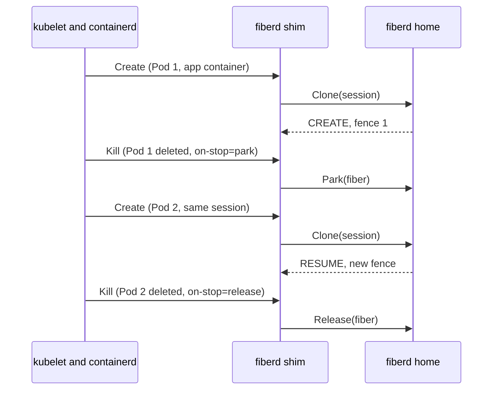

# Kata-shaped shim

This is the design of the Kata example in `examples/kata`, a containerd shim that is a protocol consumer. It is for readers who want Kubernetes Pods whose containers are [fibers](../glossary.md#fiber). Read [architecture](../architecture.md), [the protocol](../protocol.md) and [the Kubernetes integration](kubernetes.md) first.

## Purpose

Kata Containers plugs into Kubernetes as a containerd shim. Where the default shim starts a process with runc, Kata boots a micro-VM. Both pay a full start for every container. `containerd-shim-fiberd-v1` has the same shape with fiberd behind it, and does not use Kata Containers itself. Where a process would start, a fiber is [cloned](../glossary.md#clone), so a Pod gets clone, [park](../glossary.md#park) and resume with no change to Kubernetes.

## How it works

The shim runs on each node, started by containerd. The fiberd [home](../glossary.md#home) runs elsewhere, such as a grant Pod of the [Kubernetes example](kubernetes.md), and the shim dials it at the address the Pod names. Fibers run in that home, not in the application Pod.

A Pod selects the `fiberd` RuntimeClass. containerd passes the Pod's `io.fiberd/*` annotations into the OCI spec through the runtime handler's `pod_annotations`. They name the [grant](../glossary.md#grant), the home's address, the [session](../glossary.md#session), what to do on stop, and an optional [payload](../glossary.md#payload).

| containerd asks the shim | The shim does |
| --- | --- |
| Create (sandbox container) | Records the Pod. Nothing runs, because fibers are the workload |
| Create (app container) | Clone of the annotated session on the annotated home, then one line to stdout naming the fiber |
| Start | Marks the container running |
| Kill | Park or [release](../glossary.md#release), as `io.fiberd/on-stop` says, then the container exits |
| Delete | Stops the container if it still runs, then forgets it |
| Wait | Returns when the container exits |
| Stop for a dead shim | Parks or releases the fiber from the bundle's record |

Exec, ptys, pause, checkpoint and [cgroup](../glossary.md#cgroup) stats are refused. A fiber is reached through its endpoint, parked through its home and priced by the home's ledger. Misses map to containerd errors. [Shed](../glossary.md#shed-and-deferred) and deferred are Unavailable, and a [tier](../glossary.md#tier) gap is FailedPrecondition.

**Dead-shim cleanup.** At Create the shim writes the home, fiber id, session and on-stop choice into the bundle. When a shim dies, containerd calls the manager's Stop for its containers. Stop reads that record, parks or releases the fiber, and removes the record.

**Resume across Pods.** Two Pods that name the same grant, home and session share state. A parked session resumes in the replacement Pod with a new [fence](../glossary.md#fence). This needs a [backend](../glossary.md#backend) that can checkpoint.

## Security notes and known gaps

- `io.fiberd/grant` holds the whole bearer JWT in Pod metadata. Anyone who can read the Pod can replay it against the home until its lease ends. Do not use this transport in a multi-tenant cluster.
- The shim dials the home without TLS, and the example home runs `-insecure-plaintext`. Production serves mutual TLS ([grant verification](grant.md)).
- Cleanup is best effort. A failed dial, Park or Release still removes the record, so a fiber can outlive its container.
