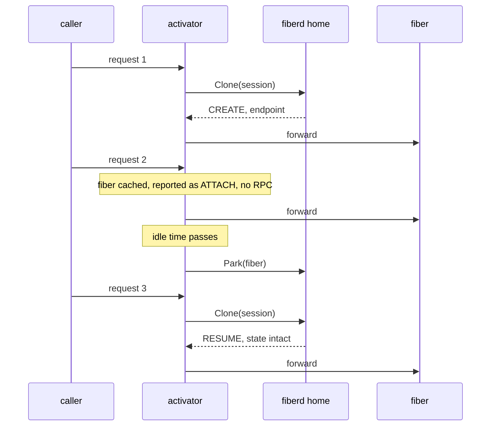

# Knative integration

This is the design of the Knative example in `examples/knative`, a protocol consumer. It is for readers who want scale from zero without a cold start. Read [architecture](../architecture.md) and [the protocol](../protocol.md) first.

## Purpose

In Knative Serving a revision scaled to zero has no Pods. The activator holds the first request, asks the autoscaler for a Pod and waits seconds for it to become ready. The example plays the same role with [fibers](../glossary.md#fiber). Each revision is a [session](../glossary.md#session) on a fiberd [home](../glossary.md#home) whose [backend](../glossary.md#backend) is a Hyperlight sandbox. Scale from zero becomes a [Clone](../glossary.md#clone) from a [warm](../glossary.md#warm) snapshot, in milliseconds.

## How it works

| Knative | This example |
| --- | --- |
| A revision | A session on a Hyperlight home, under one [grant](../glossary.md#grant) |
| Scale from zero | Clone, answered with CREATE |
| A warm Pod | A fiber the activator already holds |
| Scale to zero | [Park](../glossary.md#park) after the idle time |
| The next request after zero | Clone again, answered with RESUME and the state intact |
| The Pod cannot be scheduled | DEFERRED_FALLBACK, a 503 naming the home that holds the session |
| The control plane is unreachable | [SHED](../glossary.md#shed-and-deferred), a 503 with `Retry-After` |

**Placement.** A Hyperlight fiber serves only a unix socket ([networking.md](networking.md)), so the activator runs on the same host as the fiberd home it dials.

**Routing.** The activator picks the revision from the first path segment, then the Host's first label, then the only revision. Each revision keeps up to `concurrency` fibers, one session each. A second fiber is cloned only when every serving fiber is busy.

**A cached ATTACH is local.** A request served by a fiber the activator already holds is reported as ATTACH, but it makes no Clone call. So the example does not exercise the [agent](../glossary.md#agent)'s own ATTACH path.

**Line and http modes.** In `line` mode the request body's first line goes to the fiber as one line of the reference guest's protocol, and the reply is the response body. In `http` mode the activator reverse-proxies the request to a guest that serves HTTP. The `X-Fiberd-Clone`, `X-Fiberd-Fence` and `X-Fiberd-Session` reply headers say how a request was served.

**Misses.** The consumer's typed errors map to HTTP. SHED is 503 with `Retry-After`, deferred is 503 with `X-Fiberd-Preferred-Home`, and a [tier](../glossary.md#tier) gap is 412. fiberd's own JSON gateway maps SHED to 429. The 503 is this activator's choice.

## Security notes and known gaps

- This example runs the agent with `-insecure-plaintext`, and the activator dials without TLS. Production serves mutual TLS and dials with the consumer's TLS client ([grant verification](grant.md)).
- The activator holds each revision's grant, a bearer token. Protect it at rest and in transit.
- The example is a standalone run, with no Knative manifests.
