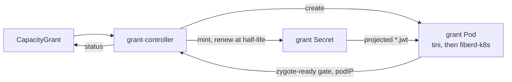
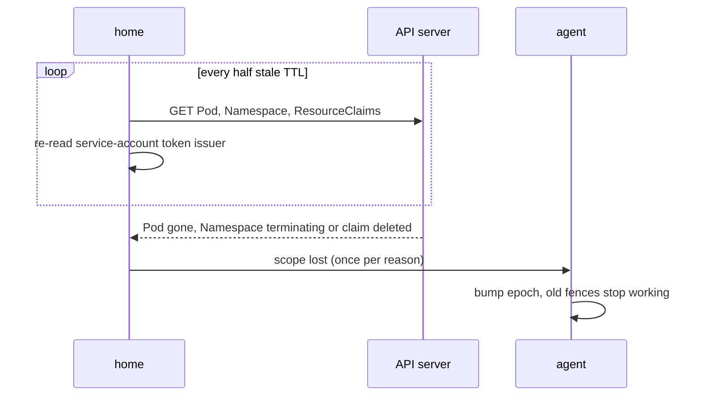

# Kubernetes integration

This is the design of the Kubernetes example in `examples/kubernetes`. It is for readers who adapt fiberd to a cluster. Read [architecture](../architecture.md) and [the home seam](home.md) first. Operator steps live in [operating on Kubernetes](../operating-kubernetes.md).

## Purpose

A cluster schedules Pods, not [fibers](../glossary.md#fiber). fiberd needs a place to run, a signed [grant](../glossary.md#grant) addressed to that place, and a signal when the place loses its authority. The example maps each need onto plain Kubernetes objects, without changing fiberd.

## How it works

**Controller.** The grant-controller is the [issuer](../glossary.md#issuer). It polls every CapacityGrant every 2 seconds and makes one grant Pod and one grant Secret, both owned by the resource. Its EdDSA signing key lives in a Secret it creates on first start. It serves discovery and the JSON Web Key Set (JWKS) on its Service. Each grant carries the resource's uid and the Pod's name as audience. The lease defaults to 10 minutes. Once less than half of it is left, the controller mints the same grant with a longer lease into the same Secret. A spec it cannot serve, such as `UNTRUSTED` on proc, gets a status message and no Pod ([CapacityGrant fields](../operating-kubernetes.md#capacitygrant-fields)).

**Grant Pod.** The [agent](../glossary.md#agent) runs under `tini`, which is PID 1 and reaps the orphans a sandbox leaves. `-node-id $(FIBERD_NODE_ID)` makes the Pod's name its node id. Kubernetes fills `FIBERD_NODE_ID` from `metadata.name`, so the node id and the grant's audience match. A proc Pod drops every capability and adds back only the ones proc needs ([capabilities](sys.md)). Its seccomp profile is Unconfined, because [CRIU](../glossary.md#criu) cannot dump from under a filter. Pods for the other [backends](../glossary.md#backend) run privileged unless `spec.pod.privileged` says otherwise. State and run directories are `emptyDir` volumes.

The example Pod runs `-insecure-plaintext`. Production serves mutual TLS (mTLS) instead, which binds each grant to the caller's certificate ([grant verification](grant.md)).

**[Home](../glossary.md#home).** The home answers fiberd's questions from the Pod itself.

| fiberd asks | The Kubernetes home answers |
| --- | --- |
| How grants arrive | `*.jwt` files in the projected Secret, polled |
| Control-plane liveness | The API server answering for the Pod, every half stale time-to-live (TTL) |
| Readiness | The Pod gate `fiberd.io/zygote-ready`, True while any grant's [template](../glossary.md#template) is [warm](../glossary.md#warm) |
| The [cgroup](../glossary.md#cgroup) subtree | The container's own, delegated. The kubelet's memory limit is the ceiling, and its memory QoS is what lets the template's `memory.min` hold above the delegated root ([resources.md](resources.md)) |
| Endpoints | The Pod IP of the configured family, waited for up to 90 seconds |
| [Fabric channel](../glossary.md#fabric-channel) | The Pod's Dynamic Resource Allocation (DRA) claim, or a static device list |
| [Scope](../glossary.md#scope) | Namespace, Pod, Pod uid, service account, node, token issuer, ResourceClaims |

An unprivileged Pod gets cgroupfs and four CRIU sysctls read-only. The home remounts them writable. Without the sysctls, proc offers only the warm [tier](../glossary.md#tier).

**Kube client.** `kube/` speaks the few API calls it needs as plain HTTPS with the projected token, re-read on every request. There is no client-go, so the agent stays a small static binary. `kube/kubetest` is an in-memory API server for tests.

**Images.** The example needs its own image, built locally ([operating on Kubernetes](../operating-kubernetes.md#image)). It includes `runsc` and a gVisor rootfs, so an `UNTRUSTED` grant Pod runs on gVisor from the same image.

**Acceptance.** `make conform-kind` runs the conformance suite and the overcommit storm against grant Pods. Its last step applies an `UNTRUSTED` gVisor grant and runs `hack/sessioncheck` from a client Pod. That check clones a fiber, speaks HTTP to it over the Pod IP through the agent's [relay](../glossary.md#relay), then parks and resumes it with its state intact.

## Security notes and known gaps

- `status.ready` is not the Pod's Ready condition ([routing on both](../operating-kubernetes.md#readiness-and-status)).
- `status.endpoint` uses the primary `podIP`, while the home picks by family. On dual stack they can differ.
- The [epoch](../glossary.md#epoch), the ledger snapshot and the audit spool live on `emptyDir`. A container restart keeps them and a Pod replacement does not, so a replacement Pod can restart at epoch 1 and repeat old [fences](../glossary.md#fence).
- There is no finalizer and no rollout. Deleting a CapacityGrant garbage-collects its Pod at once, and a changed `spec.pod` never reaches a running Pod.
- Discovery and the JWKS are served over plain HTTP inside the cluster.
- A runc Pod runs privileged, although the capability set runc needs is measured.
- On a node whose containerd applies its default AppArmor profile, the cgroupfs and sysctl remounts are denied, so an unprivileged Pod needs `appArmorProfile: Unconfined`, which the example does not set.
- The example's grants are not bound to a certificate. The JWT in the Secret is a bearer token until its lease ends.
