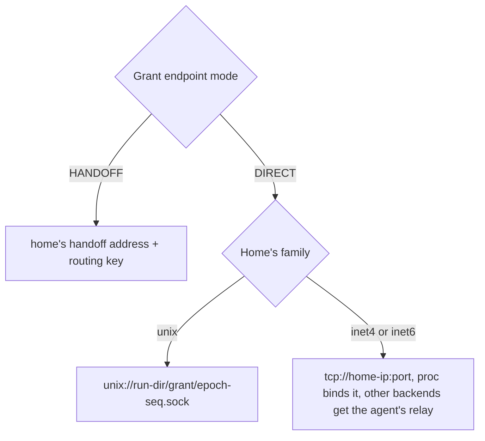

# Design: fiber endpoints

This doc explains how a [fiber](../glossary.md#fiber)'s endpoint is formed on each [backend](../glossary.md#backend). It is for contributors and operators who plan a [home](../glossary.md#home)'s network. Read [networking.md](../networking.md) first.

## Purpose

[Clone](../glossary.md#clone) hands the caller one address, and the caller dials it with no discovery step. That address must be unique on the home, must come back after a [park](../glossary.md#park) and resume, and must not give one [grant](../glossary.md#grant)'s fibers a path to another's. Backends differ in what a fiber can bind, so the runtime host picks the form, relays TCP for a backend that cannot bind it, and refuses a handoff the backend cannot serve.

## How it works

- **One family per home.** The home declares `unix` (the default), `inet4` or `inet6`. A TCP family needs one IP literal of that family and a port range, 30000 to 32767 by default. A dual-stack home still advertises one family. There is no per-fiber IP address and no per-fiber network namespace.
- **Unix.** The socket is `<run-dir>/<grant>/<epoch>-<seq>.sock`. It serves callers on the same host.
- **TCP.** Each live fiber takes the lowest free port in the range, and an IPv6 host is bracketed in the URL. A parked fiber keeps its port, so the restored listener comes back on it. The port is freed when the fiber ends without a park or when its [delta](../glossary.md#delta) is discarded. The 24-hour delta expiry frees nothing, because it applies only to the copy published in the registry ([artifact.md](artifact.md)). The holds live in the agent's memory, so a restart forgets them all.
- **[Relay](../glossary.md#relay).** proc binds the port itself. On runc, gVisor and Hyperlight the backend serves the fiber's unix socket under the run directory, and the agent listens on the fiber's port in its own network namespace and splices each connection to that socket. Bytes are copied and never read, so TLS between caller and fiber keeps the agent blind. The fiber writes its grant's directory, so the relay opens the socket without following links and dials that inode, never a link the fiber planted at the name. A fiber may have 256 open connections and a home 4,096. A new connection past either cap is closed at once. The listener opens before the backend is asked for the fiber, so a port the agent cannot bind fails the Clone, and it closes with the fiber.
- **[Handoff](../glossary.md#handoff).** The endpoint is the home's handoff address, and Clone adds a routing key and a key pin. The mechanism is in [handoff.md](handoff.md).
- **Startup check.** A backend lists the schemes it can serve. Under a TCP family, a backend that lists `tcp` is told the address. Any other is told the unix socket, and the host relays the port to it.

| Backend | Unix | TCP | Handoff | Network a fiber sees |
| --- | --- | --- | --- | --- |
| proc | yes | yes | yes | The home's network namespace |
| runc | yes | relayed by the agent | yes | Its grant's namespace, loopback only |
| gVisor | yes | relayed by the agent | no | None (`--network=none`) |
| Hyperlight | yes | relayed by the agent | no | None, the helper serves the socket |

- **runc.** A grant's network namespace holds only the loopback ([user-namespaces.md](user-namespaces.md)), so no caller could dial a port the fiber binds. The agent relays its TCP endpoint instead.
- **gVisor.** The grant's run directory appears at `/host` in the sandbox, and `--host-uds=all` lets the workload serve a unix socket there.
- **Resume.** A unix fiber binds its parked socket name again, under the resuming grant's run directory. A proc TCP fiber binds its parked port again. A relayed fiber binds its parked socket name again and gets a relay on its parked port, or on any free port when another fiber holds it, and its endpoint is the resuming home's address. Either way the parked scheme must match the home's family. Whichever home parked a unix or relayed fiber minted its socket name, so the resume is refused while a live fiber of the grant serves that name. A clone whose name a resumed fiber serves is refused the same way. A handoff fiber gets a new routing key.

## Security notes and known gaps

- **An endpoint is a route, not an identity.** fiberd neither authenticates nor encrypts a direct endpoint.
- **Every TCP port faces the home's network.** Anything that can route to the home can reach every TCP fiber's port, whether proc binds it or the agent relays it.
- **TCP resume across homes.** A proc TCP [session](../glossary.md#session) resumes only where its parked address and port can be bound. A relayed session resumes on any home of the same backend, at that home's address.
- **Relay cost.** Each relayed connection costs the agent two descriptors and three goroutines, and each relayed fiber one listening socket. That cost sits outside the fiber's [cgroup](../glossary.md#cgroup), so only the caps above bound it.
- **Ports and parked sessions.** Parked sessions hold ports until their deltas are discarded, so a long-lived pool of parked sessions can exhaust the range.
