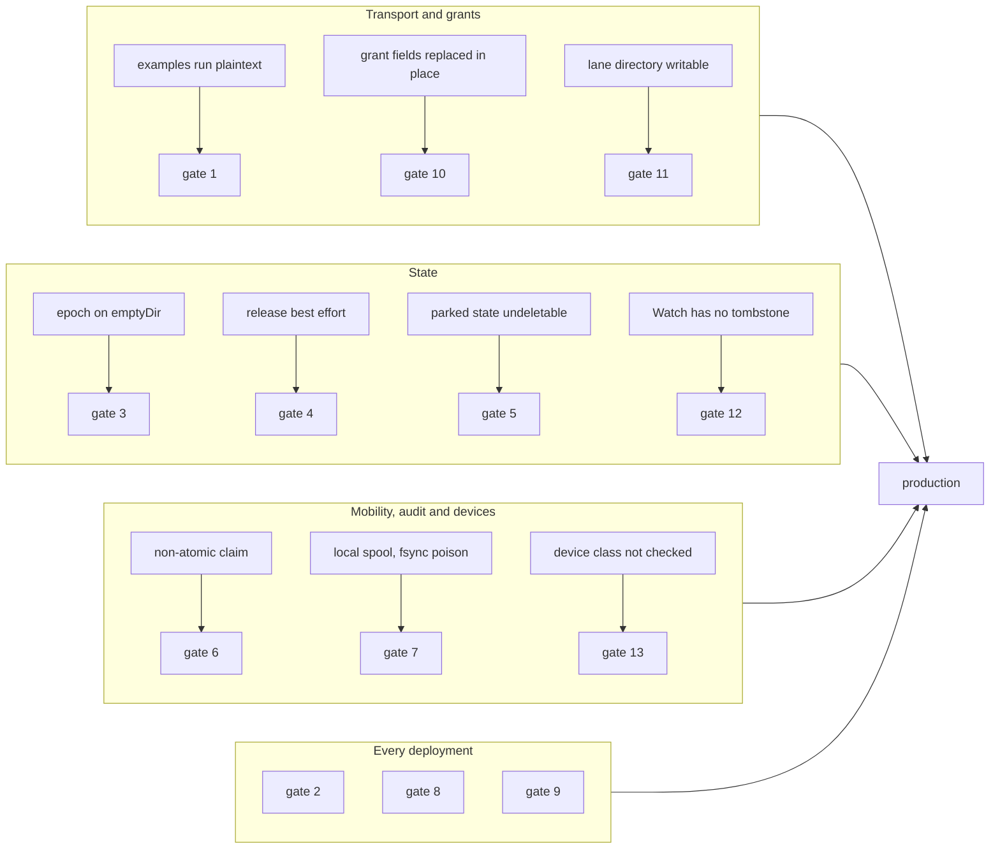

# Design: production readiness

This doc explains which gaps keep fiberd a reference implementation and which gates a deployment passes before it counts as production. It is for operators and reviewers planning a rollout. Read [production-readiness.md](../production-readiness.md) first.

## Purpose

fiberd mints [fibers](../glossary.md#fiber) offline against a signed [grant](../glossary.md#grant), so a deployment cannot lean on a control plane to catch what the [home](../glossary.md#home) gets wrong. The code keeps its invariants, and a short list of behaviours is still best effort or left to the deployment. This doc turns that list into gates with evidence, so nobody infers a guarantee from a design doc or an example.

## How it works

**The gaps** are the blockers in [production-readiness.md](../production-readiness.md#blockers), each linked to the doc that owns it.

**The gates.** A deployment passes each with recorded evidence against its own configuration.

1. Every home serves TLS, every consumer dials with a client certificate, and a plaintext call is refused.
2. Grant replay, removal, lease expiry and an issuer-key outage behave as [core.md](core.md) and [grant.md](grant.md) describe, tested on the real platform.
3. The [epoch](../glossary.md#epoch) survives a process restart and the intended home replacement, or the replacement starts under a new audience and grant UID.
4. A failed runtime [release](../glossary.md#release) is retried or the capacity stays quarantined, checked by killing the [backend](../glossary.md#backend) under a release.
5. [Parked](../glossary.md#park) [deltas](../glossary.md#delta) and ports stay bounded under the deployment's retention policy, and anonymous parks are not used.
6. Cross-home resume runs only with a claim that cannot double-resume, and fresh-state fallback is acceptable or disabled.
7. A full disk and a failed fsync are visible in monitoring, and the spool is copied off the host where records matter.
8. Readiness, [scope](../glossary.md#scope) loss, drain and deletion are tested against the real platform, not only through the test hooks ([agent.md](agent.md)).
9. The conformance suite passes on the exact production backend and configuration, and the benchmarks are re-run there with the method in [benchmarks.md](../benchmarks.md).
10. Issuers change only the lease of a grant UID and mint a new UID for any other change ([core.md](core.md)).
11. Only the control plane can write each home's grant lane directory ([home.md](home.md)).
12. Consumers reconcile their grants through an inventory other than Watch ([core.md](core.md)).
13. A grant with a [device budget](../glossary.md#device-budget) runs only on homes whose [engine](../glossary.md#engine) has the class it asks for ([runtime-host.md](runtime-host.md)).

## Security notes and known gaps

- Passing the gates does not make proc or runc isolate tenants. Untrusted grants still need gVisor or Hyperlight ([backends.md](backends.md)).
- The gates are a checklist, not a test suite. Only gate 9 is executable as shipped.
