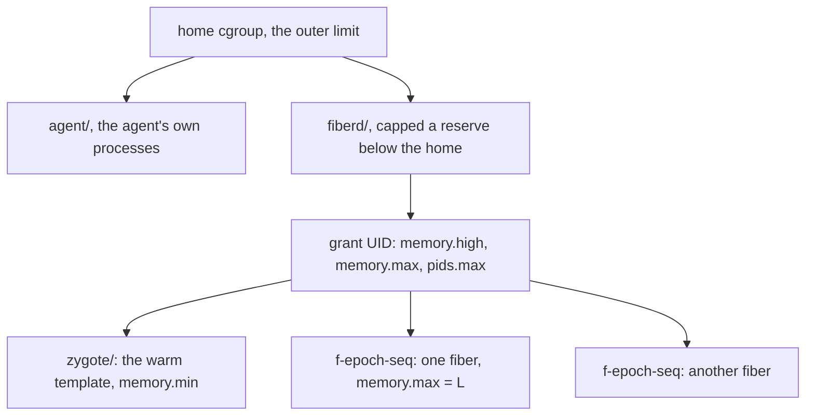

# Design: resource limits

This doc explains how the runtime host turns a [grant](../glossary.md#grant)'s [budgets](../glossary.md#budget) into [cgroup](../glossary.md#cgroup) limits, and how a [fiber](../glossary.md#fiber)'s end is classified. It is for contributors and operators who size a [home](../glossary.md#home). Read [resources.md](../resources.md) first.

## Purpose

A grant lets many fibers share one block of memory, and each fiber dirties a different amount. One fiber that runs away must end alone, without taking its neighbours, its grant or the home with it. The limits the home placed around the [agent](../glossary.md#agent) must stay the outer bound.

## How it works



- **Delegation.** The agent moves its own processes into an `agent` leaf and carves `fiberd/` beside it ([sys.md](sys.md)).
- **The subtree cap.** The agent's leaf and `fiberd/` share the home's limit, so fibers that filled it would fail the agent's next charge. A thread the agent cannot create is a Go fatal error, and every fiber dies with it. The runtime therefore reads the smallest `memory.max` and `pids.max` above its root and caps `fiberd/` a reserve below each. The reserve is an eighth of the limit, at least 64 MiB or 64 tasks, at most half. `memory.high` on the subtree sits an eighth under its `memory.max`, so the ladder sees the pressure before the kernel kills a leaf. A root with nothing above it (a bare host) gets no cap.
- **The fiber leaf.** Each fiber gets `memory.max = L`, with `memory.oom.group=1` and swap closed, and on fork [backends](../glossary.md#backend) `pids.max` 256. On proc and runc, L is the grant's [W](../glossary.md#w-working-set) budget. A sandbox backend's fiber also carries a fixed footprint T, measured from the [warm](../glossary.md#warm) [template](../glossary.md#template), so its L is W budget + T + T/2 + 32 MiB. The extra room covers the sandbox's own variance, and the host enforces the W budget itself by sampling (see [runtime-host.md](runtime-host.md)).
- **The grant ceiling.** With a positive `fibers.max` and W budget, the grant's cgroup gets these limits.

```text
block       = fibers.max × L + warm template footprint
memory.high = block + 25%      (or -grant-ceiling)
memory.max  = memory.high + L
pids.max    = (fibers.max + 1) × 256   (fork backends)
```

- **Why two limits.** `memory.high` makes the kernel reclaim and stall the grant, which [PSI](../glossary.md#psi) reports, so the pressure ladder can act before the hard stop. Swap is closed on the grant too, so pages cannot slip out under the ceiling unseen. The ladder itself is in [core.md](core.md).
- **Template protection.** The [zygote](../glossary.md#zygote)'s cgroup and the grant's cgroup carry `memory.min` for the warm template's footprint. The delegated root carries the sum over all grants, because the kernel caps a child's protection at its parent's.
- **OOM classification.** When a fiber exits, the host reads its leaf's `memory.events`. A nonzero `oom_kill`, or a host kill for exceeding the W or device budget, makes the exit `oom`. A signal makes it `signal`, and anything else is `exit`. `oom.group` ends the whole leaf, so only that fiber goes.
- **Task limits.** A [clone](../glossary.md#clone) or resume refused because the grant or the subtree hit `pids.max` is the home's own pressure. The caller gets [shed](../glossary.md#shed-and-deferred) and is never sent to another home. Sandbox backends get no task limit, because the sandbox's own threads would count against it.

## Security notes and known gaps

- **Budgets are ceilings, not reservations.** A sudden spike across many fibers can reach the home's limit before the ladder reclaims enough.
- **Unlimited grants have no ceiling.** A `fibers.max` or W budget of 0 means unlimited. Without `-grant-ceiling`, such a grant gets no `memory.high` or `memory.max`, and a W budget of 0 leaves each leaf without `memory.max`.
- **Limits above the agent's sight.** The subtree cap follows the limits the agent can read, up to the root of its cgroup namespace. A limit an ancestor outside that namespace carries (a job cgroup around the whole node) is not known, and fibers can still reach it.
- **Protection above the root.** `memory.min` holds above the delegated root only when the home also protects the agent's cgroup.
- **No CPU isolation.** One busy fiber slows its neighbours ([resources.md](../resources.md)).
