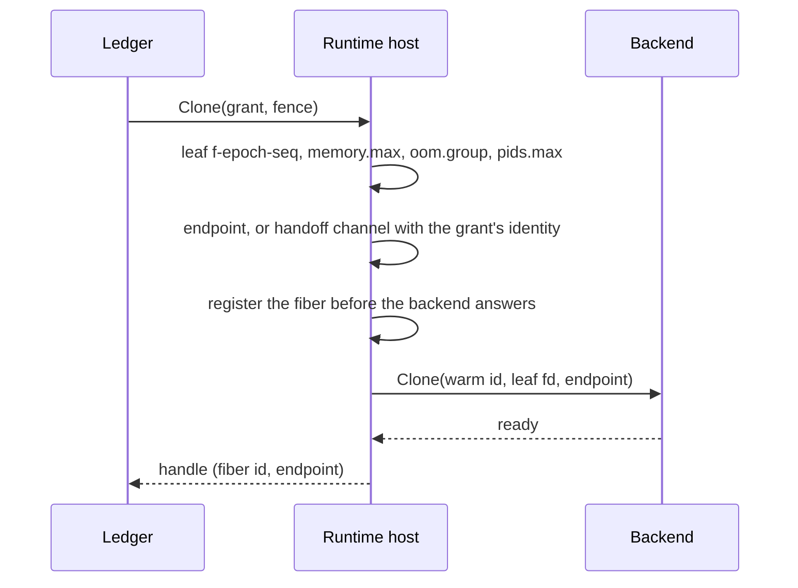
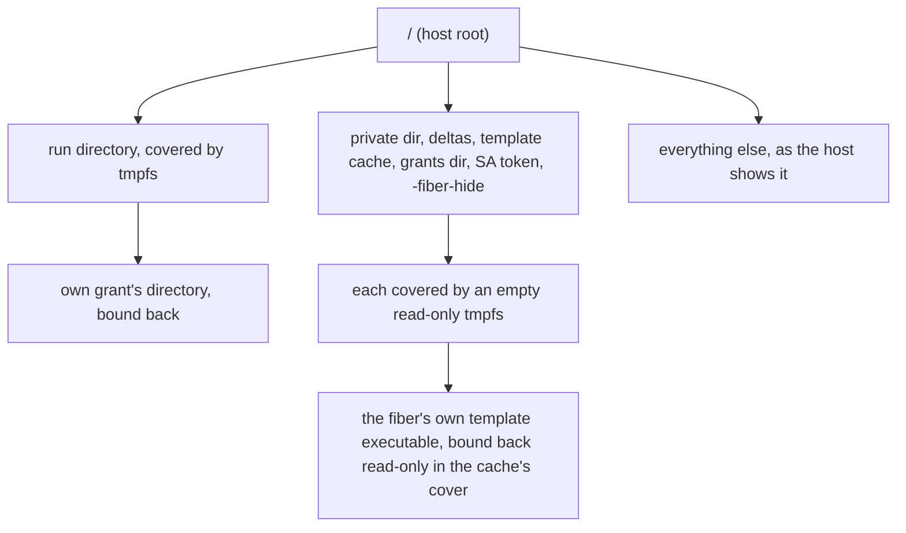

# Design: runtime host

This doc explains the [runtime host](../glossary.md#runtime-host), the layer between the [agent](../glossary.md#agent)'s ledger and a sandbox [backend](../glossary.md#backend). It is for contributors and backend authors. Read [architecture.md](../architecture.md) first, and [backends.md](backends.md) after this doc.

## Purpose

A backend knows how to fork, checkpoint and restore, and nothing else. Every backend still needs the same surroundings. Each [fiber](../glossary.md#fiber) needs a memory limit, an endpoint and a view of the filesystem that hides the agent's secrets, and each [park](../glossary.md#park) needs a size bound. The runtime host does that work once, the same way for every backend.

## How it works

- **[Warm](../glossary.md#warm).** At admission the host resolves the [template](../glossary.md#template) (see [artifact.md](artifact.md)), makes the [grant](../glossary.md#grant)'s [cgroup](../glossary.md#cgroup), and asks the backend to start the warm instance in a `zygote` child cgroup. On proc and runc that instance is a [zygote](../glossary.md#zygote). It registers a parent checkpoint for [deltas](../glossary.md#delta), protects the template's pages with `memory.min`, and sets the grant's ceiling. A warm instance that dies is warmed again on the next [Clone](../glossary.md#clone).
- **The leaf.** The host makes a leaf for each fiber, `f-<epoch>-<seq>`, capped at its [W](../glossary.md#w-working-set) [budget](../glossary.md#budget) plus any fixed footprint. proc, runc and gVisor fibers run in it. A Hyperlight fiber is a micro-VM inside the grant's helper, which runs in the grant's cgroup, so its leaf stays empty and the budget is enforced by sampling W. A backend that maps the grant to a user namespace (runc) is given the leaf's `cgroup.procs` and nothing else, so every limit stays the host's. The limits are in [resources.md](resources.md), and the endpoint forms in [networking.md](networking.md).
- **W.** On proc and runc, W is the leaf's `memory.current`, and the kernel enforces the budget. gVisor counts W as the leaf's `shmem` less a fixed footprint, and the Hyperlight helper reports W itself. For those backends the leaf gets extra room, and the host samples W every 25 ms and kills a fiber over its budget.
- **Hidden paths.** Fibers must not see the Kubernetes service-account token, the agent's private directory (keys, ledger, [epoch](../glossary.md#epoch), audit spool), the delta directory, the template cache (pulled templates, their configs and images, the parent checkpoints and the zygote self-checkpoints), `-grants-dir` and every `-fiber-hide` path. proc fibers run as the agent's uid, so file modes cannot keep them out. A backend that gives fibers their own mount namespace covers each path with an empty read-only tmpfs. A relative path, or one that holds the run directory, is skipped with a log line. A private, delta or template cache directory that holds the run directory fails the start ([agent.md](agent.md)).
- **The fiber's own executable.** A proc zygote warmed from a registry template runs from the cache, and CRIU names a mapped file by its path, which must resolve in the fiber's namespace to the file it maps. So when a hidden directory holds the zygote's own executable, the zygote covers the directory and binds the executable back at its own path, read-only, from a descriptor it opened before the cover ([zygote.md](zygote.md)). A fiber sees the cache as an empty tree with that one file. It sees no other template, no config and no parent. A park dumps the bind by name like the other single-file mounts, and a resume binds the file at that path on the resuming home.
- **Run-directory view.** A proc fiber sees the run directory covered and only its own grant's directory bound back, so other grants' sockets and [fence](../glossary.md#fence) files do not exist for it. A park records that bind as an external mount, and a resume binds the resuming grant's directory there.
- **Fence file.** A resumed fiber holds its birth fence in memory. The host publishes the new one as `<socket>.fence` beside the unix socket the fiber serves, behind a relay or not. A fiber that binds TCP itself finds it under its grant's directory as `<epoch>-<seq>.fence`. The grant's fibers write that directory too, so the host writes the file under the run directory, which no fiber sees, and renames it into place. A link a fiber planted is replaced, never followed.
- **[Relay](../glossary.md#relay).** Under a TCP family, a backend that cannot bind TCP is told the fiber's unix socket. The host listens on the fiber's port and splices each connection to it, from before the backend's Clone until the fiber ends ([networking.md](networking.md)).
- **Delta quota.** Before a checkpoint, the grant's parked bytes plus the fiber's W must fit in 4 × `fibers.max` × W budget, or 1 GiB when either is unlimited. A park over the quota is refused with [shed](../glossary.md#shed-and-deferred), and the fiber keeps running.
- **Device seam.** A [home](../glossary.md#home) may provision a [fabric channel](../glossary.md#fabric-channel) for a grant, and its devices reach the warm instance's environment. An [engine](../glossary.md#engine) reports each fiber's device slice and its own use and capacity. The host kills a fiber over its [device budget](../glossary.md#device-budget), evicts the slice before a park, and feeds occupancy to the pressure ladder.

## Security notes and known gaps

- **Device class not enforced.** A grant asking for a device is admitted when the engine reports any capacity. The host does not compare `device_budget.class` with the engine.
- **Rest of the filesystem.** Paths outside the hidden list are protected only by their owners' permissions.
