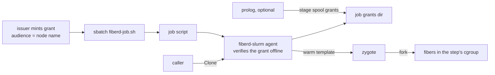

# Slurm integration

This is the design of the Slurm example in `examples/slurm`. It is for readers who run fiberd on a batch cluster. Read [architecture](../architecture.md) and [the home seam](home.md) first.

## Purpose

On a Slurm cluster every new task is a scheduler submission, which costs seconds and a trip through the controller. The example runs the [agent](../glossary.md#agent) inside one allocation instead. One `sbatch` buys a bounded slice of a node, and repeated [Clone](../glossary.md#clone) calls then start [fibers](../glossary.md#fiber) under that slice's ceiling with no new submission.

## How it works

The [home](../glossary.md#home) answers fiberd's questions from what Slurm tells a job.

| fiberd asks | Slurm answers |
| --- | --- |
| How [grants](../glossary.md#grant) arrive | `*.jwt` files in `/run/fiberd/job-<id>/grants` |
| Control-plane liveness | `scontrol show job` reporting a state that does not end the allocation (RUNNING, CONFIGURING, PENDING, SUSPENDED or RESIZING), every half stale time-to-live (TTL) |
| Readiness | The allocation's own state plus the Watch stream. Nothing is published |
| The [cgroup](../glossary.md#cgroup) subtree | The job step's cgroup. Its `task/cgroup` memory limit is the ceiling |
| Endpoints | The node's address of the declared family, one port per fiber |
| [Fabric channel](../glossary.md#fabric-channel) | The allocation's generic resources (GRES), the GPUs Slurm exposed |
| [Scope](../glossary.md#scope) | Job id and name, user, account, partition, node, nodelist, GRES, CPUs |
| Capacity bound | A grant whose `fibers.max` exceeds the allocation's CPUs is refused before warm-up |
| Scope loss | Any other job state while the agent lives. The agent bumps its [epoch](../glossary.md#epoch), then stops |

**Grants.** The grant's audience is the node name. The main path is the job's environment. The submitter passes the token to `sbatch` as `FIBERD_GRANT`, and `fiberd-slurm` verifies it offline against the [issuer](../glossary.md#issuer)'s keys before it serves anything, then stages it in the grants directory, where the file lane reads it. The optional prolog (`PrologFlags=Alloc`) is a second path. It only copies grants an issuer left in the node's spool, and it verifies nothing.

**Job script.** `fiberd-job.sh` runs the agent for as long as the allocation lasts and restarts it in place if it exits or its `/healthz` answers 503 ([audit.md](audit.md#health)). The allocation, its cgroup and the state directory survive the restart, and the epoch bumps. slurmstepd signals the job script and the cgroups it made, not the ones fiberd carves beneath the step. So the script forwards SIGTERM to the agent, and the agent leaves with the allocation. An agent that lingers gets the node drained with "Kill task failed".

**Swap closed.** fiberd closes swap on the grant cgroup so the [pressure ladder](core.md) sees pressure ([resources.md](resources.md)), and the example's `cgroup.conf` gives jobs no swap as well.

**No pids controller.** A job step's cgroup offers cpuset, cpu and memory, but not pids. fiberd tolerates that, because memory is what it needs.

## Security notes and known gaps

- This example runs the agent with `-insecure-plaintext`. Production serves mutual TLS ([grant verification](grant.md)).
- Without a pids controller, the per-grant task limit is not enforced. Memory is the only bound on forks.
- The grant travels in the job's environment (`FIBERD_GRANT`). It is a bearer token for whoever can read that environment until its lease ends.
