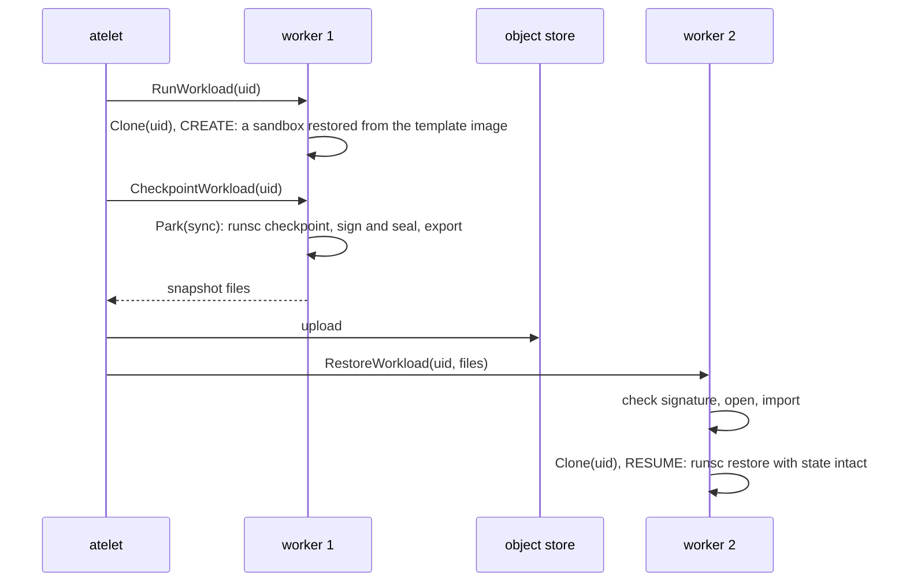

# Agent Substrate integration

This is the design of the Substrate example in `examples/substrate`, a worker image for [Agent Substrate](https://github.com/agent-substrate/substrate). It is for readers who want Substrate actors that are [fibers](../glossary.md#fiber). Read [architecture](../architecture.md), [backends](backends.md) and [artifacts and mobility](artifact.md) first.

## Purpose

Substrate starts, suspends, restores and terminates actors, the workloads it schedules, inside worker Pods. Its own sandbox classes boot a gVisor sandbox or a micro-VM for each actor. The example answers Substrate's worker contract with fiberd instead. A start is a [clone](../glossary.md#clone) of a [warm](../glossary.md#warm) [template](../glossary.md#template), and a suspend ships the actor's [delta](../glossary.md#delta). Substrate itself is unchanged.

## How it works

On each node Substrate's atelet drives workers through Ateom, the gRPC service a worker implements. One binary, `ateom-fiberd`, is the worker here. It embeds the [agent](../glossary.md#agent) with the gVisor [backend](../glossary.md#backend) and a file delta registry. Every actor is its own runsc sandbox, restored from the template's sandbox image. Beside the agent run five pieces.

- **Herder.** This example's piece that serves `Ateom` on the socket atelet drives. The service is copied unchanged from Substrate, so an unmodified atelet drives it.
- **Capacity.** Substrate places an actor only on a worker that has said what it can host. At start the worker reports one actor and its container's cpu and memory limits, which Substrate projects into the Pod. The report is `SetWorkerCapacity` on atelet's AteomSupport socket, over mTLS with the Pod's certificate. The worker accepts only atelet on its own node. It retries until atelet records the report, and exits if the peer is not that atelet.
- **[Home](../glossary.md#home) and [issuer](../glossary.md#issuer).** A Substrate cluster has no [grant](../glossary.md#grant) controller, so the home is its own issuer on the loopback. It mints one grant per ActorTemplate, Substrate's resource naming an actor's image and limits, sized by the actor's memory limit. Liveness is atelet answering on its socket. Readiness (`/readyz`) is every minted template warm and the agent's `/healthz` at 200.
- **Ingress.** The router dials port 443 over mutual TLS (mTLS) and names the actor in the `ate-target-actor` header. The ingress checks the router's SPIFFE identity, a workload certificate in the Secure Production Identity Framework For Everyone format, and proxies to the fiber's endpoint. An actor that is not here gets 421 with `X-Ate-Assignment-Stale`, so the router re-resolves.
- **Workload.** Each template is the reference [zygote](../glossary.md#zygote) in HTTP mode, the init process of its sandbox, named by `ATEOM_FIBERD_TEMPLATE` as a path inside the image's rootfs. atelet pulls the ActorTemplate's image but does not run it.

| atelet calls | The herder does |
| --- | --- |
| RunWorkload | Clone of the actor's uid as a fresh [session](../glossary.md#session), kind CREATE |
| CheckpointWorkload | [Park](../glossary.md#park) with sync, a checkpoint of the whole sandbox, then export it as files atelet uploads |
| RestoreWorkload | Import the files, then Clone of the uid, kind RESUME |
| TerminateWorkload | [Release](../glossary.md#release) with discard |
| Stats | Watch, reporting the grant's [W](../glossary.md#w-working-set) |

**Golden snapshots.** Substrate starts each ActorTemplate's first actor once with RunWorkload, checkpoints it as the template's golden snapshot, and starts every later actor of that template with RestoreWorkload from it. So a new actor is a RESUME of the golden image under its own session.

Misses map to the codes the router parks on. [Shed](../glossary.md#shed-and-deferred) is Unavailable, deferred is ResourceExhausted, and a [tier](../glossary.md#tier) gap is FailedPrecondition.

**One actor per worker.** Substrate's Worker record holds one actor, so a second RunWorkload on a busy worker is refused. A fiberd pool declares `sandboxClass: gvisor`, and that is what its workers run. The worker image carries runsc and the rootfs.

**Delta keys.** A snapshot restores only on a worker that holds its signing and seal keys. So every worker of a pool shares both. `kind/run.sh` creates them once in a Kubernetes Secret and mounts it at `/etc/fiberd`. The image holds no keys, and a worker without both refuses to start. `ATEOM_FIBERD_DELTA_TRUST` may name a JWKS of further signing keys to accept.

## Security notes and known gaps

- Each actor's system calls are served by its sandbox's kernel, not the worker's. So the home mints its grants `UNTRUSTED`, and the pool's `gvisor` class is what really runs. The sandbox runs on gVisor's systrap platform and needs no KVM.
- The worker runs under the Pod spec Substrate gives its gVisor class. It is not privileged, has that class's capabilities and no seccomp filter, and runs as root. That is all runsc needs. The Pod's cgroup mount is read-only there, so the home remounts it read-write, which CAP_SYS_ADMIN from that set allows.
- A sandbox has no network. The agent's plaintext loopback port and the issuer's plain HTTP key set are out of an actor's reach.
- Anyone who can read the key Secret can sign and open every snapshot of the pool.
- Each worker is its own issuer, with a grant key it generates at start. So nothing outside the worker decides or limits its capacity, and its grants verify on no other worker.
- The ingress serves plain HTTP when it is given no credential and trust bundles.
- A snapshot is the whole sandbox, its kernel included, so it weighs megabytes where a process delta weighs kilobytes, and the actors of a template share no pages.
- Only Substrate's full snapshots are supported. Its data-only snapshot kinds are refused.
