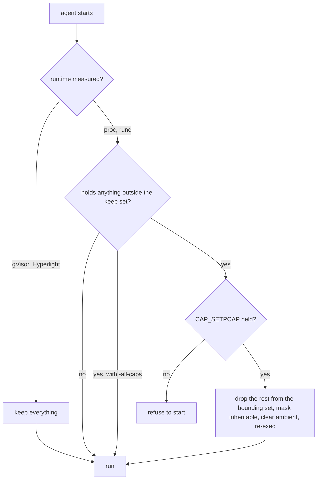

# Design: sys

This doc explains the Linux pieces every [backend](../glossary.md#backend) leans on. They are [cgroup](../glossary.md#cgroup) v2 leaves, [CRIU](../glossary.md#criu) dump and restore, capability narrowing and network namespace entry. It is for readers of `pkg/sys` and anyone auditing the [agent](../glossary.md#agent)'s privileges. Read [backends.md](backends.md) first.

## Purpose

The backends share four needs that are not about any one sandbox. A [fiber](../glossary.md#fiber) must be born into a cgroup leaf the host can meter and kill. A process tree must be dumped and brought back with the mounts it did not make. The agent must run with as few capabilities as its [runtime](../glossary.md#runtime) needs. A socket must be made inside another process's network namespace. `pkg/sys` holds each as plain file operations and system calls.

## How it works

**cgroup.** Whatever starts the agent, a kubelet, a Slurm step or a shell, puts it in some cgroup. `Delegate` moves every process there into an `agent` leaf, because a cgroup with processes may enable no controllers for its children, then enables `memory` and `pids` in `cgroup.subtree_control` and hands back a `fiberd` subtree. A controller the parent does not offer is skipped, and memory is required. The limit the starter put on the root stays the ceiling on everything below. Under the subtree the runtime makes one leaf per fiber ([resources.md](resources.md) has its limits), opens it as a descriptor for `clone3`, and reads `memory.current`, one `memory.stat` counter, `memory.pressure` ([PSI](../glossary.md#psi)) and `memory.events`. `cgroup.kill` ends a leaf whole.

**criu.** `DumpWith` runs `criu dump` on one tree with `--ext-unix-sk` and `--manage-cgroups=ignore`. When the host wants the tree to end only once the images are durable, the dump leaves it running. `RestoreWith` starts `criu restore` inside the cgroup descriptor it is given, so the tree lands in its new leaf. criu stays as the tree's parent, and its exit is the fiber's. A tree with a mount namespace of its own carries mounts it did not make. `DumpMounts` records every single-file mount by name beside the images and passes each as `--external mnt[path]:name`, because criu's automatic detection dumps them but cannot restore them. `RestoreMounts` reads the record and binds each name back under `--root`, a bind of the host's `/`. The runc launcher names its own external mounts instead ([backends.md](backends.md)).

**caps.** A process started as root gets exactly its bounding set, and one that execs a file with inheritable file capabilities gets what the inheritable and ambient sets allow. `Narrow` drops everything outside the keep set from the bounding set on one locked thread, masks the inheritable set to the keep set, empties the ambient set and re-executes `/proc/self/exe`, so the new process starts with those sets on every thread. Nothing is ever added. The keep sets were measured, proc by `hack/test/caps.sh` and runc by running `tests/runc` and the conformance suite under `setpriv` with each candidate left out.

| Runtime | Keeps | Why |
| --- | --- | --- |
| proc (7) | SYS_ADMIN, SYS_CHROOT, SYS_TIME, NET_ADMIN, SETPCAP, SYS_PTRACE, SYS_RESOURCE | Namespaces, mounts and cgroups. CRIU restoring a fiber's mount and time namespaces, and TCP repair. The [zygote](../glossary.md#zygote) emptying each fiber's bounding set. CRIU attaching to fibers it did not start, which Yama's default `ptrace_scope` 1 allows only with SYS_PTRACE, and raising its open-file limit |
| runc (11) | the seven plus CHOWN, DAC_OVERRIDE, SETGID, SETUID | runc writes the mapped root's id maps and chowns `exec.fifo` to it. runc, criu and the agent open files the mapped root owns with modes that keep root out. KILL is not needed, since fibers and the container's init end through their cgroups |

The agent re-executes with its keep set unless `-all-caps`. One that holds more but lacks SETPCAP refuses to start rather than run with everything.

**netns.** A unix socket belongs to the namespace it was created in, and criu finds only the sockets of the namespaces it dumps. `Do` locks an OS thread, enters the network namespace of a pid with `setns`, runs a function and returns. A thread that cannot return is left locked to a goroutine that ends, so the runtime discards it instead of handing it to other goroutines. `Socketpair` makes a [handoff](../glossary.md#handoff) channel there, and `LoopbackUp` brings `lo` up in a namespace criu created empty.

## Security notes and known gaps

- SYS_ADMIN is broad. Namespaces, mounts and cgroups need it, and it covers far more. The fibers hold none of it on proc, and on runc only inside their user namespace.
- Unmeasured runtimes keep everything. With gVisor or Hyperlight the agent runs with the capabilities it started with.
- The measured sets assume fibers run as the agent's user. A proc [template](../glossary.md#template) that switches user is likely to need more.
