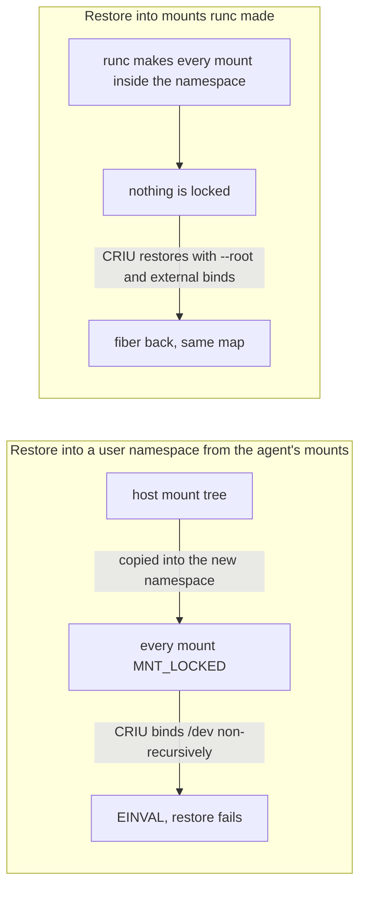
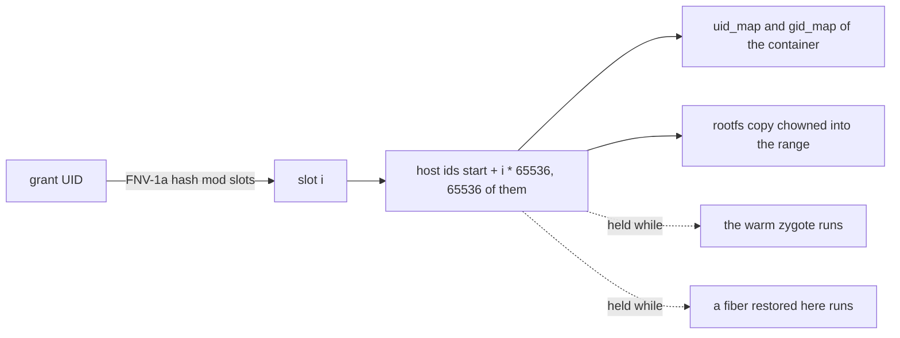

# Design: per-grant user namespaces

This doc explains why runc [fibers](../glossary.md#fiber) run in a user namespace of their [grant](../glossary.md#grant)'s own, and what that does at runtime. It is for anyone auditing the runc [backend](../glossary.md#backend)'s isolation. Read [backends.md](backends.md) first.

## Purpose

A fiber on the proc backend is host root with every capability dropped. The kernel checks the owner write bit for euid 0 on sysctl and kernfs files and asks for no capability, so read-only mounts of `/proc/sys` and `/sys`, covered paths and empty capability sets are all that stands between the fiber and the host. Mapping a grant's root to an unprivileged host uid range makes the kernel refuse host resources by ownership, and the mounts become a second line.

**The problem with [CRIU](../glossary.md#criu) restore.** A restore creates the fiber's user namespace and a mount namespace copied from the [agent](../glossary.md#agent)'s, and the kernel marks every copied mount `MNT_LOCKED` together with its children. CRIU re-creates a mount inherited from the host, such as `/dev`, with a non-recursive bind, which the kernel refuses for a source with locked children. The restore fails with `open_tree /dev: EINVAL`.

**Two options.** The first patches CRIU to bind an external mount with children recursively inside a user namespace and treat the mounts under it as restored. The proc backend would keep its shape, but the fiber would still inherit host mounts the deny list must hide, and every [home](../glossary.md#home) would run a privately patched CRIU mount engine. The second lets runc own the root filesystem. The [zygote](../glossary.md#zygote) is already the init of a grant's OCI container, the container adds a user namespace with id maps, runc makes every mount the fiber sees from inside it so none is locked, and CRIU restores with `--root` and plain external binds.

**The decision.** fiberd takes the second option. It needs no CRIU change and only standard OCI, a fiber cannot see the home, and the container's capabilities are capabilities inside the namespace alone. The cost is a rootfs copy per grant and runc on every home. The proc backend stays host root.

**Evidence.** A prototype confirmed the choice. The mapped root was refused host controls such as `core_pattern` and `mknod` by ownership alone, and a [parked](../glossary.md#park) fiber restored three times with its state intact, once onto a rootfs copy standing in for another home. A fiber with its own mount namespace does not dump inside a container at all, so the runc backend never asks for one.

## How it works

- **Slots.** `-userns-pool START:SLOTS` carves the host id space into 65536-id slots. The default `1073741824:49151` starts at 2^30, above useradd's `/etc/subuid` ceiling and the LXC and kubelet ranges. Its last slot ends at 4294901760, one slot below 2^32. That is the most slots that fit under the kernel's overflow id, 4294967294, which a pool must not reach, and the many slots make two grants rarely share one. A grant's slot is the FNV-1a hash of its UID modulo the slot count, so every home with the same pool maps it the same way and a checkpoint restores on any of them. The backend refuses to open when the pool overlaps an `/etc/subuid` or `/etc/subgid` entry, since those ids are some user's to map and sharing them would make that user's containers and fiberd's grants one identity.
- **Claims.** A slot is held while the grant's zygote is up or any fiber CRIU restored on this home maps it, because a restored tree is a pid namespace of its own and outlives the zygote. A second grant hashing to a held slot is refused with an error naming both grants and the slot, at admission and again at [warm](../glossary.md#warm) and restore. A larger pool makes collisions rarer.
- **The rootfs copy.** Each hold makes sure the grant's copy of `-runc-rootfs` exists under the state directory, with every owner shifted into the range and device nodes, fifos and sockets skipped. A marker records the source and range, and a copy with another marker is remade. The copy goes with the last hold.
- **The container.** User, pid, mount, network, ipc and uts namespaces, and no [cgroup](../glossary.md#cgroup) namespace, since `clone3` into a leaf needs the host's hierarchy. `/sys` is read-only with no cgroup mount, the grant's run directory is at `/host`, and runc's default read-only and masked `/proc` paths are the second line. The zygote starts with ten capabilities inside the namespace, over the namespace's resources alone, and drops SYS_RESOURCE before it serves. The run directory stays root's with the grant's mapped gid and group write, so the zygote can bind sockets there but cannot change the directory.
- **Loopback netns.** The network namespace holds the loopback alone. criu dumps and restores it empty (`--empty-ns net`), the network lock is skipped, and the launcher brings `lo` up in the restored tree's fresh namespace. The control channel and every [handoff](../glossary.md#handoff) channel are made inside the container's namespace, where a checkpoint finds them.
- **Nested user namespaces denied.** The zygote caps nested user namespaces at 0 before READY, and every fiber carries a seccomp filter that refuses new ones, because a restored tree gets a fresh user namespace with the default limit ([zygote.md](zygote.md)).
- **Restore.** The restored tree reads some of its images itself as the mapped root, so the image directory gets the grant's mapped gid with group read. The tree takes a hold, and gets the rootfs copy as `--root`, with `/host`, the six device binds (`null`, `zero`, `full`, `random`, `urandom`, `tty`) and, for a grant on a registry template, `/fiberd/template` as external mounts ([backends.md](backends.md)).

## Security notes and known gaps

- A rootfs copy per grant costs disk and time. Idmapped mounts (runc 1.2, util-linux 2.39) would remove it.
- The zygote keeps nine capabilities inside its namespace while serving, and the kernel allows it overlayfs. The nested-namespace cap and the seccomp filter bound what a fiber can do with that.
- runc coupling. The device bind list and the `exec.fifo` ownership are runc 1.1's and need a check on each bump.
- Untested with Yama `ptrace_scope` 1.
- A Pod with `hostUsers: false` gets a range of only 65536 ids, which leaves no room for per-grant slots ([security.md](../security.md#known-gaps)).
