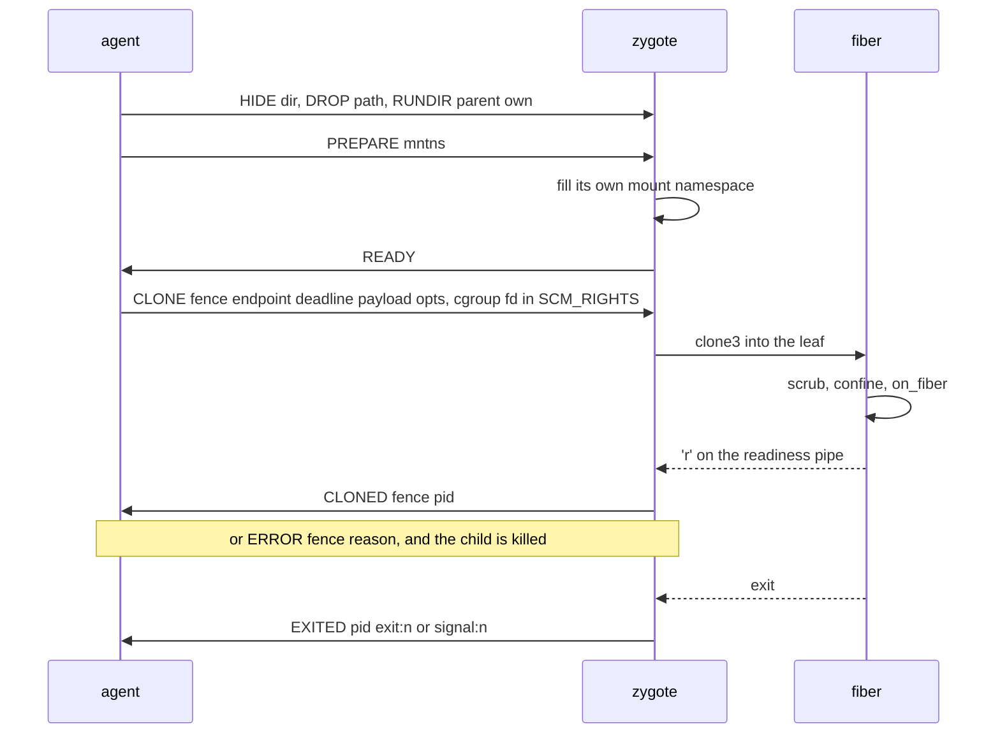

# Design: zygote

This doc explains libfiberzygote, the C library a [template](../glossary.md#template) links to become a [zygote](../glossary.md#zygote), and the line protocol it speaks with the [agent](../glossary.md#agent). It is for template authors and readers of `zygote/` and `pkg/backend/proc`. Read [backends.md](backends.md) first.

## Purpose

A [fiber](../glossary.md#fiber) on the proc and runc [backends](../glossary.md#backend) is a fork of a [warm](../glossary.md#warm) process. The fork must land in the right [cgroup](../glossary.md#cgroup), carry nothing of the zygote's descriptors or environment, be confined as the agent asked, and report ready under a deadline. A template author should get none of that wrong, so the library does it. The application initialises once, calls `fz_init` first thing in `main` and `fz_serve(3, on_fiber)` when warm, and supplies `on_fiber`, which runs in the child. In the zygote, fd 3 is the control socket fiberd hands it.

## How it works

**The contract.** `fz_init` turns address-space randomisation off and re-execs, so a fiber's checkpoint can be a [delta](../glossary.md#delta) over the zygote's pages on any [home](../glossary.md#home) warmed from the same artifact. It also blocks `SIGCHLD` before any thread exists. `fz_serve` reads the signal from a descriptor in its poll set, so a fiber's exit wakes the loop and the EXITED line goes out at once instead of at the next timeout. With `FIBERD_OWN_MNTNS` in the environment, which the proc backend sets, it also moves the zygote into a private mount namespace of its own, which `fz_serve` fills before READY (see "One namespace, copied per fiber" below). A template that skipped `fz_init` is refused at `fz_serve`. `on_fiber` receives the [fence](../glossary.md#fence), the endpoint and the [payload](../glossary.md#payload). It serves on the endpoint, calls `fz_fiber_ready` once listening, and its return value is the exit code. Until `fz_fiber_ready` the child's stderr is the zygote's log, and after it stderr is `/dev/null`. In the fiber, fd 3 is the readiness pipe instead, and it is not the fiber's to use. A [handoff](../glossary.md#handoff) fiber loads `fz_handoff_identity` into its TLS library before ready and serves `fz_accept` instead of listening ([handoff.md](handoff.md)).

**The lines.** Each message is one text line on the control socket.

| Line | From | What it says |
| --- | --- | --- |
| REBIND | agent, runc only | A new control socket, made inside the container's network namespace so a checkpoint finds it. It comes first |
| HIDE, DROP, RUNDIR | agent | Before READY, what every mount-namespace fiber covers, what it unmounts and which one run-directory entry it keeps. DROP names the resume restore root, a bind of the host's `/` ([sys.md](sys.md)). A refused one turns every later mount-namespace CLONE into an ERROR |
| PREPARE | agent | Ends the setup lines. `PREPARE mntns` has the zygote build the view the lines describe in its own mount namespace, once. `PREPARE none`, which the runc launcher sends, says no fiber will ask for a mount namespace. A setup line after READY, or any other line before PREPARE, is a protocol error |
| READY | zygote | The template is warm and its namespace is built. Sent once, after REBIND, the nested-namespace cap when the environment asks for it, and PREPARE. A zygote that could not prepare says READY, then `ERROR ?` with the reason |
| CLONE | agent | The fence (at most 127 characters), endpoint, deadline, hex payload and options `pidns`, `mntns`, `nocaps` and `handoff`. The leaf's cgroup descriptor and then the handoff channel ride in SCM_RIGHTS |
| CLONED, ERROR | zygote | The new fiber's fence and pid, or why the clone failed |
| EXITED | zygote | A fiber ended, with its exit code or signal |
| DEVICE, EVICT | zygote, agent | An [engine](../glossary.md#engine) reports each fiber's device slice, and drops one on EVICT |

**Fork into the leaf.** `clone3` with `CLONE_INTO_CGROUP` forks the child straight into its leaf, so not one page is charged elsewhere. A kernel without it (before 5.7) gets the legacy `clone` with the same namespace flags, and the child writes itself into the leaf's `cgroup.procs` as its first act. A child that cannot ends with exit 125, and no fiber runs charged to the zygote's cgroup.

**Scrub.** Before confinement the child closes the zygote's `SIGCHLD` descriptor and every descriptor above its readiness pipe and handoff channel, replaces its environment with the few `FIBERD_` entries the zygote built for this fiber, starts a new session and empties its signal mask.

**One namespace, copied per fiber.** Most of a fiber's mount work is the same for every fiber of a grant. Every mount under `/sys` is made read-only, the run directory is narrowed to this grant's entry and the HIDE directories are covered. Doing that in each child cost about 110 to 140 µs per birth, most of it the mountinfo scan and the remounts. The zygote now does it once. `fz_init` calls `unshare(CLONE_NEWNS)` and makes every mount private, before any thread exists, because with a thread already made only the calling thread would move and CRIU refuses a tree whose threads differ in namespace. It does so when `FIBERD_OWN_MNTNS` is in its environment. The proc backend sets it, and the runc launcher and an artifact build do not, since their zygote forks no mount-namespace fiber and stays in the namespace it was started in. At `PREPARE mntns` the zygote, in that namespace, makes `/sys` read-only, unmounts the DROP paths, narrows the run directory and covers the HIDE directories, then says READY. A mount-namespace fiber's `clone3` copies that namespace, so its birth adds only what is its own. Private propagation means a mount the host adds later never reaches the zygote or any fiber. The zygote itself sees other grants' run directories and the hidden paths no more than its fibers do.

| Step | Where | Why there |
| --- | --- | --- |
| `/sys` read-only, every mount under it | zygote, at PREPARE | Grant-wide. A mount added under `/sys` after that never reaches the private namespace |
| DROP (the restore root) | zygote at PREPARE, and each fiber | Grant-wide, and repeated per fiber because it is one system call and fails closed |
| RUNDIR narrowed | zygote, at PREPARE | Grant-wide. The zygote's cwd moves onto the bind and every fiber inherits it there |
| HIDE covered | zygote, at PREPARE | Grant-wide. A HIDE directory that did not exist yet is looked for again at each birth and covered then, as the old code did at every birth. A HIDE directory that holds the zygote's own executable (the template cache, for a registry template) is covered with the executable bound back at its path, read-only, from a descriptor opened before the cover, since CRIU names a mapped file by a path that must resolve ([runtime-host.md](runtime-host.md)) |
| `MS_REC` `MS_PRIVATE` on `/` | each fiber | The copy is private already. The call restates it, and a refusal ends the child before anything else is mounted |
| fresh `/proc` for the pid namespace | each fiber | Its own |
| `/proc/sys` bound onto itself and read-only | each fiber, after its `/proc` | A fiber's fresh `/proc` is a mount of its own and would cover a bind the zygote made, leaving the fiber's `/proc/sys` writable |
| capabilities dropped, user-namespace filter | each fiber | Its own |

**Confinement fails closed.** When a step the agent asked for is refused, no fiber runs short of it. A step that fails at PREPARE, or a zygote with no namespace of its own (`FIBERD_OWN_MNTNS` unset, `fz_init` skipped, a thread before it, `unshare` refused), sets one reason, and every mount-namespace CLONE is answered with an ERROR naming it, while fibers without a mount namespace are still served. A step that fails in the child ends it before any application code, and the CLONE is answered with an ERROR naming the step.

| Exit | The child could not |
| --- | --- |
| 110 | make its mount namespace private. Nothing is mounted after this, since a change to a shared mount would propagate back to the zygote |
| 111 | mount its own `/proc` |
| 112 | unmount a DROP path |
| 113 | cover a HIDE path that appeared after READY with an empty read-only tmpfs |
| 114 | drop its capabilities (`no_new_privs`, empty sets, empty bounding set) |
| 115 | make `/proc/sys` read-only on its fresh `/proc` |
| 116 | retired. The run directory is narrowed at PREPARE, and a failure there refuses every mount-namespace CLONE |
| 117 | install the seccomp filter that denies user namespaces |
| 120, 121 | set up its descriptors, or read its handoff identity |
| 125 | join its cgroup leaf on the legacy clone |

**Nested user namespaces.** With `FIBERD_USERNS_NESTED=deny`, which the runc launcher sets, the zygote writes 0 to `user.max_user_namespaces` in its own user namespace and drops CAP_SYS_RESOURCE before READY. It refuses to do so in the initial user namespace. Every fiber also gets a seccomp filter. `unshare` and `clone` with CLONE_NEWUSER and `setns` onto a user namespace answer EPERM, and `clone3` answers ENOSYS so libc falls back to `clone`. On x86_64 a system call number with the x32 bit set kills the process, because the x32 table numbers these calls differently and the filter could otherwise be sidestepped through it. A checkpoint carries the filter into the fresh user namespace a restore puts the fiber in.

**Checkpoints.** A fiber's mount tree is the same shape it was when each child built it, since the copy carries the same mounts with the same flags, so a park dumps and a resume restores as before. The zygote now has a mount namespace of its own too, so its self-checkpoint (the parent for deltas) names its mounts the way a fiber's park does.

**Fork safety.** The raw clone copies one thread and runs no atfork handlers, so a lock another thread held at that instant stays held in the copy, malloc's and stdio's included. Between the clone and `on_fiber` the library allocates nothing, takes no lock and uses no stdio, and the fiber's environment is built in the parent before the clone. It reseeds no random generator either, since `srandom` takes a lock. A template reseeds its own from `getrandom` in every new incarnation, libc's `random()` included. That is in `on_fiber`, after a gVisor restore returns, and when the fence beside the endpoint changes after a CRIU resume, as refzygote's `reseed_rngs` does ([zygote/README.md](../../zygote/README.md)).

**arm64.** Build the whole program with `-mbranch-protection=none`. A restored process keeps stale pointer-authentication keys, so a return address signed before the checkpoint fails to authenticate.

**Hardening.** Every build uses `-D_FORTIFY_SOURCE=3 -fstack-protector-strong -fstack-clash-protection -fPIE -Wformat=2 -Werror=format-security` with `-pie -Wl,-z,relro,-z,now`, and `make fuzz` runs six libFuzzer harnesses over the library's parsers and the reference workload under ASan and UBSan.

## Security notes and known gaps

- Fibers run as uid 0 on proc. Confinement is what stands between them and the host, and a file outside the covered paths is protected by its owner's mode alone.
- The handoff identity lives in the fiber's memory, never the zygote's, so no key lands in a template checkpoint. A [parked](../glossary.md#park) fiber's key is in its delta, which is sealed ([artifact.md](artifact.md)).
- ASLR (address-space layout randomisation) is off, as the contract requires. What that costs is in [security.md](../security.md#known-gaps).
- A HIDE path is covered when a fiber is born. A fiber already running when the host first creates that path can read it. The agent creates every real HIDE target before any grant warms.
- proc fibers may create nested user namespaces. The read-only `/sys` and `/proc/sys` mounts still hold inside them, so the kernel refuses a fresh writable `proc` or `sysfs`.
