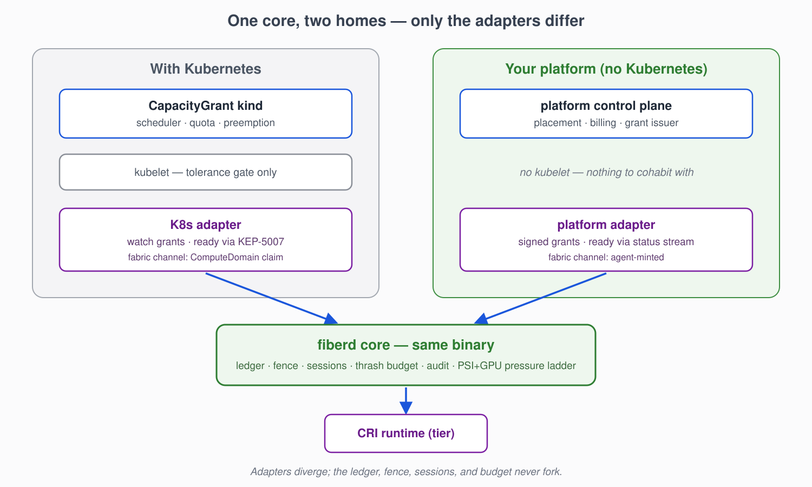
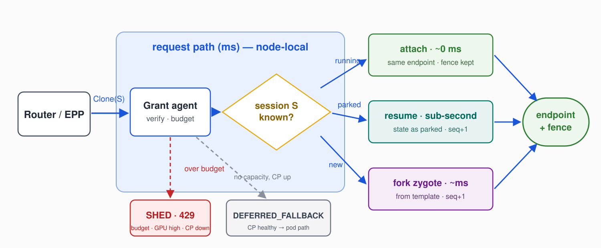
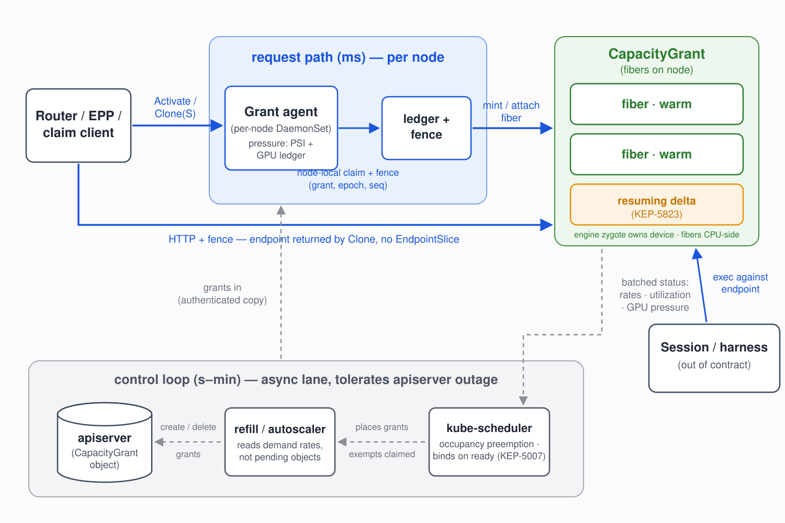
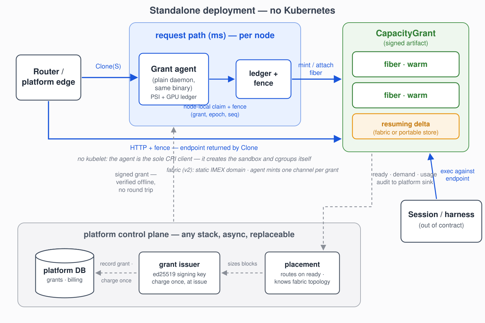

# fiberd: Delegated Capacity and Millisecond Instances for Container Platforms

Status: DRAFT

---

## 1. Problem

Serverless container platforms all fight the same three-way tension: an
instance must be **cheap** (thousands per host, or the economics fail),
**fast** (created inside the request path, or cold starts leak into
latency SLOs), and **billable** (attributed to a tenant with a hard
ceiling, or capacity leaks into overcommit incidents). Existing designs
pick two. Per-instance control-plane records are billable and can be made
fast, but never cheap. Warm pools are fast but pay full per-instance cost
while idle. Userspace multiplexers are cheap and fast, but the instances
are invisible to the platform's own accounting.

> **Instances that cost nothing to create but still count.**

The resolution is an inversion of who does what: the control plane's
involvement ends at *issuing capacity*; the node *exercises* it. This is
how IP allocation already works everywhere (a router delegates a prefix
once; hosts mint addresses from it with zero allocator involvement), and
how Android has launched applications for fifteen years (one warm zygote,
every app a copy-on-write fork). This proposal applies the same two moves
to container instances.

**What a per-instance record provides.** The reason per-instance records
resist removal is that they carry seven fused roles; Kubernetes' Pod is
the sharpest worked example, and the record itself is *not* on the list —
it is the delivery mechanism for the authority behind most of them, and
it is where the per-instance cost lives.

| # | Role | Notes |
|---|------|-------|
| 1 | Scheduling unit | placed once |
| 2 | Accounting unit | quota charges requests at admission; nothing re-consults it at runtime |
| 3 | Isolation / failure domain | cgroup tree + sandbox boundary |
| 4 | Workload identity | principal, policy subject |
| 5 | Lifecycle | restart policy, probes, hooks |
| 6 | Ecosystem contract | watchable, reconcilable by controllers, admission-gated, audit-logged, operator-visible; plus per-instance logs/exec |
| 7 | Network identity | IP, DNS, policy subject; per-instance registry membership is already a cost at high density |

The design below splits them: **roles 1, 2, 6 stay on a block-level
object the control plane owns; roles 3, 4, 5, 7 are delivered per
instance by the node.** Every pain point in the motivating discussions
targets one of these roles, not per-instance records in general.

## 2. Goals

**(a)** Activation is synchronous, node-local, ms-scale, with **zero
control-plane dependency on the warm path** — no reads, no writes, no
leases. Consequence: a control-plane outage freezes refill and new supply
but never breaks binds against supply already on nodes; misses shed
(429), they never queue on a control plane that cannot answer.

**(b)** Density is stated per state with a per-instance budget —
*activatable* (checkpoint on disk), *resident* (warm in RAM + ledger
entry), *running* (cgroup, fds, address) — plus a node-enforced **thrash
budget**: the maximum sustainable activation rate as a function of
working-set size.

**(c)** Per-instance supervision and fencing exist, and fencing covers
credentials: nothing minted for an instance validates beyond
min(lease TTL, its fence).

**(d)** **Accounting precedes activation.** The block is charged once at
admission. At activation the node's authenticated copy of the grant is
the proof — no control-plane call. Usage reports back asynchronously as
resource-time integrals.

**(e)** Falsifiable simplicity: no new template-shaped schema (reference
the template, never embed), one thin kind with a handful of fields, no
mandatory infrastructure dependency, consumer integration measured in
LoC against a named consumer (an inference router).

**(f)** Boundary semantics: each runtime tier states what an instance
boundary guarantees on clone **and** reuse (filesystem, memory, devices)
— density bought by weakening isolation is declared, never silent. Under
pressure, instances shed first (lease non-renewal, cheaper than
ranking); **the grant is the disruption unit**.

**(g)** **One core, two homes**: the identical agent and semantics run
standalone and under Kubernetes; only thin adapters differ, and an
adapter is conformant iff the core runs unmodified beneath it.

## 3. Non-goals

- No replacement of your scheduler, billing, or tenancy model — the grant
  is deliberately shaped so your existing block-accounting *is* the
  accounting.
- No per-fiber device isolation in v1; the engine owns device state.
- No control-plane visibility into individual fibers — that is the design,
  not a gap: anything needing platform-level lifecycle belongs at grant
  granularity.
- No Windows: the mechanism stack (fork/CoW, cgroups v2, PSI, CRIU) is a
  Linux kernel property.
- No opinion on what runs inside a fiber beyond the template's own
  contract: entropy reseeding and per-instance credential fetch after
  clone are the template author's obligations, stated in the tier table,
  enforced by scrub.

## 4. Design



Three components:

**CapacityGrant** — an authenticated artifact your control plane issues
once per block of capacity: template reference, `fibers: {max, warm}`,
session and durability policy, per-fiber device budget, expiry. Billing
charges the block at issue, exactly once. How the artifact's authenticity
reaches the node is the one thing the two homes do differently (§6);
that it arrives *proven* is what the design requires, so no activation
ever calls home.

**Grant agent** — one daemon per node, the sole runtime client for the
fiber class. It holds the ledger (which fibers exist, under which grant,
with which lease), the fence (a monotonic incarnation triple
`(grantUID, epoch, seq)` that scopes every claim and credential), the
thrash budget, the audit spool, and the pressure ladder.

**Fibers** — node-minted instances inside a grant: copy-on-write clones of
a checkpointed **engine zygote** (one fully initialized template instance
per grant per node). A fiber is addressed by the endpoint returned at
clone time, scoped by its fence, held by a lease, and known to exactly two
parties: the agent's ledger and the caller. Your control plane sees the
grant and its batched status — never individual fibers — the same way an
IP allocator sees the prefix, never the addresses.

**Grant lifecycle: issued → ready → serving → expiring.** Delivery of the
grant is not readiness: the agent builds the zygote, checkpoints it, and
only then reports `ready`. **Readiness is a state the agent publishes,
never a call anyone makes** — how the state travels upward is per-home, and 
routing happens against ready grants only.

**The core never forks.** An adapter is conformant if the core
runs unmodified beneath it.

## 5. The contract



```
Clone(grant, deadline)              -> anonymous fiber          (fungible worker)
Clone(grant, deadline, session: S)  -> attach | resume | create (idempotent: "my worker")
Park(fiberID, sync)                 -> checkpoint delta, keep name
Release(fiberID)                    -> destroy state, free name
```

`Clone(S)` resolves against the node ledger: S running → return the
existing endpoint and fence (attach, ~free); S parked → restore its delta
(sub-second); S unknown → fork the zygote and bind the name
(milliseconds). One verb, three costs; retries cannot create duplicate
sessions — the agent serializes per session name.

**Admission completeness (invariant).** Every executable property of a
fiber — image, command, args, env, mounts, security context, resource
shape — is fixed by the template referenced in the grant, validated when
your control plane issued it. `Clone` accepts exactly a grant reference, a
deadline, an optional session ID, and an opaque size-capped payload
delivered as data, never interpreted as configuration. The data plane
selects capacity; it never shapes workloads. Nothing expressible at clone
time was not already admitted.

**Miss semantics.** Over the thrash budget, or out of grant capacity with
the control plane unreachable: `SHED` (429 + Retry-After). Out of capacity
with the control plane healthy: `DEFERRED_FALLBACK` — the caller may fall back to
your platform's ordinary provisioning path. Conflating the two lets
routers retry into a dead control plane believing capacity is coming. A
`Clone` racing ahead of a grant's `ready` state resolves under the same
two codes — "zygote not yet built" is indistinguishable from "capacity
not yet on this node" from the caller's seat, so no third code exists.

**Sessions.** A session *name* is caller-supplied identity that survives
incarnations; the *fence* is minted per incarnation and credentials die
with it — continuity of a session never implies continuity of its secrets.
A parked session's *delta* is its divergence from the zygote (pages
dirtied since fork), so park cost ≈ working set, the same quantity the
thrash budget prices. Fresh fibers get a reset contract
(restored-to-template); resumed fibers get a continuity contract (state as
parked, devices renegotiated). Cross-node resume requires the delta
reachable from the target node and the router knowing where — "a worker"
survives your control plane's outage at full strength; "my worker"
survives at the strength of the router's cache plus reachable storage.

## 6. CPU vs GPU design

The split in one sentence: **the CPU side is cloned; the GPU side is
multiplexed.** `fork()` does not cross the PCIe boundary — device memory
has no copy-on-write and driver contexts do not survive a fork — so each
side gets the primitive that is actually cheap there, and the two meet
over local IPC.

### 6.1 CPU: clone-not-create

The mechanism is an unmodified kernel primitive; its economics are
measurable on any Linux host before a line of platform integration exists:

| Measurement (PoC) | Result | Claim it grounds |
|---|---|---|
| Warm clone: fork 128MB zygote, dirty 4MB | ~4 ms | ms-scale activation |
| Cold start, full init per instance | ~225 ms (56×) | clone-not-create is the only path |
| 50-way fork storm, p99 | 33 ms | concurrency survivable, tight tail |
| Throughput at W = 1MB vs 4MB | ~110/s vs ~32/s | thrash budget is genuinely f(W) |
| 51 × 128MB heaps, total PSS | 180–330 MB vs 6.5 GB naive | CoW density basis for ~1000/host |

Cross-kernel control: the identical benchmark on Darwin collapses the
warm/cold advantage to ~2.5× — **the economics are a Linux kernel
property**, which is why the platform requirement is Linux and not a
preference. The thrash budget prices the one real variable: activation
throughput degrades with working-set size W, and park cost ≈ W is the
same measured quantity — one number governs both.

All numbers above are the floor (bare fork, 1-CPU sandbox). The
remaining feasibility gate is the checkpoint tier: warm restore p99
under 100 ms at 200+ concurrent fibers through containerd's restore path.
The bare-fork floor leaves ~25× of headroom for that plumbing; pass, and
integration is an object-model argument — fail, and the named bottleneck
(page-server vs snapshot layering) decides whether zygotes need per-node
replication, which changes the grant spec.

#### CRI: verbs and tiers

The agent drives any CRI-conformant runtime through three verbs
(`CloneFiber` / `ReleaseFiber` / `ListFibers`) carrying fence, lease, and
clone provenance in-protocol. Capability is advertised
RuntimeHandlerFeatures-style, conformance is tiered, and your placer (or
the Kubernetes scheduler, §6.1) places grants against the advertised
tier — the tier decides which guarantees your platform can sell:

| Tier | Runtime must have | Enables |
|------|-------------------|---------|
| FIBER_BASIC | create in an existing warm sandbox | correct semantics, pod-class latency |
| FIBER_WARM | zygote fork / snapshot clone (CoW) | millisecond activation + density |
| FIBER_CHECKPOINT | per-fiber delta checkpoint + restore | Park/resume — the session model |
| FIBER_FABRIC | multi-node NVLink + IMEX-scoped fabric memory (v2, hardware-gated) | fabric-tier park + cross-node resume at NVLink bandwidth |

`Clone(S)` on a parked session against a sub-CHECKPOINT runtime fails
loudly; it never silently forks a fresh, amnesiac instance. FIBER_FABRIC
is strictly an upgrade of CHECKPOINT's park and resume paths and degrades
to it. Prototyping reuses create-from-checkpoint on containerd ≥ 2.0; the
honest verbs are proposed rather than smuggled through annotations —
private-protocol reuse is the failure mode this design exists to end.

### 6.2 GPU: engine-multiplexed

The **engine zygote** is the **only process that touches device
state**; fibers are CPU-side clients over local IPC — how vLLM-class
servers already multiplex. A fiber's device footprint is its slice of the
engine's KV cache, not a context: no per-fiber context creation (~100ms+),
no per-fiber VRAM overhead, no partition-count ceiling. A fiber crash
cannot poison a device context; an engine crash drops service for the
grant's fibers — the same blast radius a shared inference server has today
— and parked state survives it.

**Device pressure is a ledger comparison, not a kernel signal.** The
kernel's pressure interface (PSI) has no device class, so the CPU-side
shed ladder is blind to a saturated GPU by construction — and the design
removes the need for a sensor instead of adding one. The grant declares a
per-fiber device budget (`gpu.kvBytesPerFiber`); the engine reports KV
occupancy (the binding constraint) and queue depth (the leading
indicator) over the IPC channel that already exists; the agent evaluates
watermarks against Σ declared. High → shed new clones (one more ledger
predicate at Clone admission — the existing wire code, no new path); warn
→ park fibers holding burst headroom beyond their declared budget or the
grant's warm target — **over-quota capacity is reclaimed before entitled
capacity**; critical → evict, weighted by occupancy and device
resource-seconds from the same async usage flow billing already consumes.

Two honest edges. Per-fiber device attribution is engine-apportioned
(per-request tokens / SM-time, divided) — approximate the same way CoW
memory attribution is approximate (§6): the grant total is exact, the
fiber share is an estimate. And ledger pressure is per-grant: a
mis-reporting engine's telemetry starves only its own grant's park and
evict rungs (bounded blast radius), but grants sharing a device below
hard-partition granularity need device-level utilization (DCGM-class) as
a tiebreaker — **on the evict rung only, never the warm path**.

**Fabric (FIBER_FABRIC).** On multi-node NVLink hardware, per-operation
memory export/import between GPUs is scoped by IMEX channel, and the tier
assigns **one channel per grant**: held by the engine (the
device-confinement invariant is untouched — fibers still hold nothing),
recorded in the ledger, and torn down with the grant — channel teardown
*is* revocation for fabric mappings. What the tier buys: park offload
lands in fabric-addressable peer memory at NVLink bandwidth instead of
host memory over PCIe, and cross-node resume within the domain approaches
import + re-fork instead of a storage round trip. What it costs, stated
rather than discovered: **fabric offload is an optimization of the park
rung — it degrades to the PCIe path when the fabric daemon ensemble is
unhealthy and is never a dependency of Clone** — so warm-path
independence survives by construction, not by the fabric's uptime. How
the channel is provisioned, and which trust boundary scopes it, is where
the two homes genuinely differ.

## 7. Architecture

The core is home-invariant and stated once; each home below adds only
what it changes: how grants arrive proven, how readiness travels, who
schedules, who owns the runtime, how callers authenticate, and how fabric
channels are provisioned.

**The agent's subcomponents**: RPC frontend (authn, admission-completeness
enforcement), budget enforcer (thrash f(W), backpressure), ledger
(sessions, leases, fences, fabric channels), pressure controller 

**two inputs, one ladder**: kernel PSI on the grant slice and the ledger-derived
device pressure responding shed → park → yield in that order,
the expensive step last — zygote manager (build, scrub on clone and
reuse, maxAge drain-and-swap), checkpoint store (deltas, TTL GC), audit
spool, runtime client.

**Persistence and restart**: the epoch file (bump on start;
timestamp-jump on corruption — never guess), a ledger snapshot (cache;
runtime reality wins at reconcile), parked deltas (the only
unreconstructible user state), the audit spool (at-least-once,
sequence-numbered; loss window = flush interval). Startup order is fixed:
epoch++ → runtime reconcile → open RPC. The epoch bump invalidates all
prior fences — orphans are reaped, fabric channels re-established, and
nothing minted before the restart validates after it.

**Fencing is revocation.** Nothing minted for a fiber validates beyond
min(lease TTL, its exact fence); revocation of a grant propagates by
lease non-renewal, bounded by lease TTL even during an outage. Clone
scrubs inherited descriptors, baked tokens, and entropy: identity is
assigned after the fork, never baked into the template.

**Accounting.** The grant's cgroup slice is the hard ceiling: a fiber can
burst within the block, and the block cannot exceed what was charged.
Usage returns asynchronously as resource-time integrals — CPU and memory
exact per grant. Per-fiber memory attribution is approximate under CoW 
(the slice is exact; the fiber is an estimate); per-fiber `memory.max` + 
`oom.group` make the kernel the executioner for over-limit fibers. Reclaim 
is drain-then-kill everywhere: park named sessions, shed anonymous fibers, 
then take the grant.

**Identity and audit.** v1: fibers share the grant's identity,
distinguished by port; a later phase mints per-fiber identities from a
node-held, grant-scoped signing key with delegation depth of one — a
compromised agent compromises its node's grants and nothing else. With
zero control-plane involvement on the warm path there is no central audit
record of who activated what: the agent ships structured audit
asynchronously with a declared loss window, and compliance-grade
deployments buy the SYNC class, where Clone acks only after the record is
remote — priced as latency, chosen per grant.

**Network.** A fiber's endpoint is returned by Clone and exists nowhere
else. Under IPv4, fibers share the grant's IP with port distinction
(network policy at grant granularity); per-fiber IPs are viable under
IPv6 (policy at fiber granularity). Which applies is declared per
deployment, never discovered.

**Honest limits**, stated rather than discovered: the engine is a
grant-wide service SPOF with the blast radius of any shared inference
server, and `zygoteMaxAge` refresh is a scheduled drain-and-swap; fibers
within a grant share the sandbox boundary of their runtime tier —
inter-fiber isolation is namespace/cgroup-level by default, declared per
tier, never silent; delta-over-base is runtime-dependent (incremental
dump maturity varies), and the worst case is a full per-fiber checkpoint,
which inflates parked-storage budgets without changing the model.

### 7.1 Kubernetes



The Kubernetes adapter has a normative specification of its own: the
companion proposal *Synchronous Activation on Delegated Capacity* defines
the grant kind and spec, scheduling and quota semantics
(declared-capacity Σ fibers.max, occupancy-weighted preemption), node
integration, caller authentication on the warm path, network identity,
and the enhancement topology. **This section states only what the adapter
changes relative to the core**; where this summary and the companion
disagree, the companion wins.

**Grant delivery and proof.** The grant is an API object delivered over
the cluster's authenticated control-plane→node watch channel — the same
trust that runs workload specs today — so in-cluster signing would add a
PKI surface the accounting invariant does not require. Signing is the
default only standalone, where no such channel exists.

**Readiness.** The `ready` state rides DRA Device Binding Conditions
(KEP-5007, beta track): the grant publishes `fiberd.io/zygote-ready` and
never binds to a node whose agent has not checkpointed the zygote —
grant placement is the cold path, so the wait is free. Inherited caveat:
a grant waiting on binding conditions is invisible to autoscaling until
KEP-5278 lands, and the demand signal (rate counters, not pending
objects) does not surface the stall either (open questions below).

**GPU under Kubernetes.** The device is one DRA claim per grant — device
attachment, reset, and accounting all at grant boundaries, charged at
admission with everything else. FIBER_FABRIC provisions its channel
through a ComputeDomain-class claim (one per grant): the cluster
orchestrates the IMEX daemons and channels as an ephemeral domain that
follows the grant, and fabric readiness joins zygote readiness in the
grant's binding conditions — the same KEP-5007 wait, no second mechanism.
Two declared weaknesses relative to the fence: the IMEX boundary is
namespace-grade — an actor with namespace access can mutate the
ComputeDomain primitives — so claims on fabric-parked deltas are scoped
min(lease, fence, namespace integrity); and independent IMEX domains
sharing a physical NVLink clique conflict over fabric memory permissions
today, which gates the tier on upstream domain coordination (open
questions below).

**Open questions**

1. **Dynamic-domain arbitration**: independent IMEX domains on nodes
   sharing a physical NVLink clique conflict over fabric memory
   permissions — until domain coordination within a clique is settled
   upstream, multi-grant-per-clique cannot assume the FIBER_FABRIC tier.
2. **Pressure-ladder vs kubelet-eviction race**: under fast host
   pressure, does the agent's shed rung fire before kubelet's eviction
   manager ranks the grant? Measured on a real node, not argued.
3. **Autoscaling visibility for grants waiting in PreBind**: KEP-5278
   node nomination vs surfacing the wait in the grant's demand counters —
   one side must close the gap before the readiness ride-along is
   load-bearing.

### 7.2 Standalone



**Grant delivery and proof.** The grant is a signed artifact (ed25519);
verification is offline, so the proof travels with the grant and no
activation ever calls home. This is the home where signing is the
default, because no authenticated delivery channel pre-exists.

**Placement.** Your placer treats the grant as the unit of placement,
disruption, and reclaim, and routes traffic against grants reporting
`ready` in the batched status stream — the stream your platform already
consumes is the readiness carrier, so nothing analogous to a scheduler
binding protocol exists or is needed.

**Node.** The agent is the node's sole runtime client and owns the
sandbox and cgroup hierarchy itself — the awkwardest parts of running
beside a general orchestrator (reconciliation exemptions, eviction races,
dual runtime writers) do not get solved here.

**Caller authentication.** Local JWT validation against cached JWKS plus
the grant capability — the same warm-path posture, with the JWKS
endpoint being your platform's, and the same stated revocation window.

**GPU standalone.** The fabric domain is static infrastructure — the rack
is the domain, configured at node provisioning, not per workload — and
**the agent mints one IMEX channel per grant** from the node's channel
namespace: the fiber move applied to fabric access, with the domain
delegated once at provisioning and channels minted locally with zero
control-plane involvement. Channel assignment is guarded by the signed
grant plus the agent ledger, so fence scoping stays min(lease, fence) —
no namespace-integrity term — and the dynamic-domain clique conflict of
§6.1 dissolves, because static domains never contend. The residual
weakness is domain trust: IMEX daemons within a domain trust each other,
so a compromised node's blast radius for *fabric mappings* is the domain,
not the node — larger than the node-scoped radius everything else here
claims — mitigated but not eliminated by channel scoping (a peer cannot
import what was never exported to its channel). Fabric locality is fixed
at provisioning: cross-node resume is NVLink-fast within the domain and
falls back to the portable-store path across domains — a topology
constraint your placer must know about.

**Open questions**

1. **Fabric multi-tenancy**: within a domain-wide trusted daemon
   ensemble, is per-grant channel scoping sufficient isolation, or is
   domain-per-tenant the floor a platform must provision?

## 8. Delivery: phases

**v0 (exists).** Agent + process-tier fibers (the zygote self-forks,
Android-style; the agent speaks a control socket). Runs on any Linux host
with no platform changes; this is where the §5.1 evidence comes from, and
where the semantic invariants (idempotent Clone(S),
admission-completeness rejection, shed backpressure, epoch rotation) are
exercised live.

**v1.** Checkpoint tier on containerd ≥ 2.0 (zygote as a
checkpoint-annotated OCI image; Clone as create-from-checkpoint), real
JWKS/ed25519 verification, audit shipping, the two-input pressure ladder
of §6 including the device ledger signal — gated on the §5.1 feasibility
number. On the Kubernetes side, v1 corresponds to the node-integration
enhancement (tolerance gate, fiber class, CRI verbs and tiers), with the
agent iterating out-of-tree.

**v2.** FIBER_FABRIC (per-grant channels, fabric-tier park, cross-node
session mobility within a domain), portable delta store for cross-domain
mobility, per-fiber identity delegation, and MPS/MIG runtime tiers where
per-fiber device isolation is worth its density cost. On the Kubernetes
side, this phase spans the grant kind with its scheduling semantics
(including the KEP-5007 readiness ride-along) and the trailing,
non-blocking identity enhancement.

**The conformance test.** An adapter is conformant iff the core runs
unmodified beneath it. Readiness and fabric provisioning are the proof
in miniature: the same two core states (`ready`; channel-per-grant) are
carried by a scheduler binding condition and a cluster device claim in
one home, and by the status stream and agent minting in the other —
two carriers, zero core changes. A platform adopting fiberd standalone is
never locked out of Kubernetes, and its capacity can later surface there
natively.

## 9. Open questions (core)

1. **The checkpoint-tier gate** (the one real feasibility bet): warm
   restore p99 < 100 ms at 200+ concurrent fibers through containerd's
   restore path. Pass → v1 is integration work. Fail → the named
   bottleneck (page-server vs snapshot layering) decides whether zygotes
   need per-node replication, which changes the grant spec.
   
2. **Park under device pressure**: KV offload cost ∝ W over PCIe — if the
   park rung is too slow exactly when pressure is highest, the ladder
   degrades to shed → evict for device-pressure events. FIBER_FABRIC
   changes the constant, not the question: PCIe remains the floor the
   ladder must survive on.

3. **Sub-partition device sharing across grants**: is one hard partition
   per grant the floor (exact attribution, clean arbitration), or is the
   device-utilization tiebreaker of §5.2 sufficient to admit
   shared-context co-residence?
