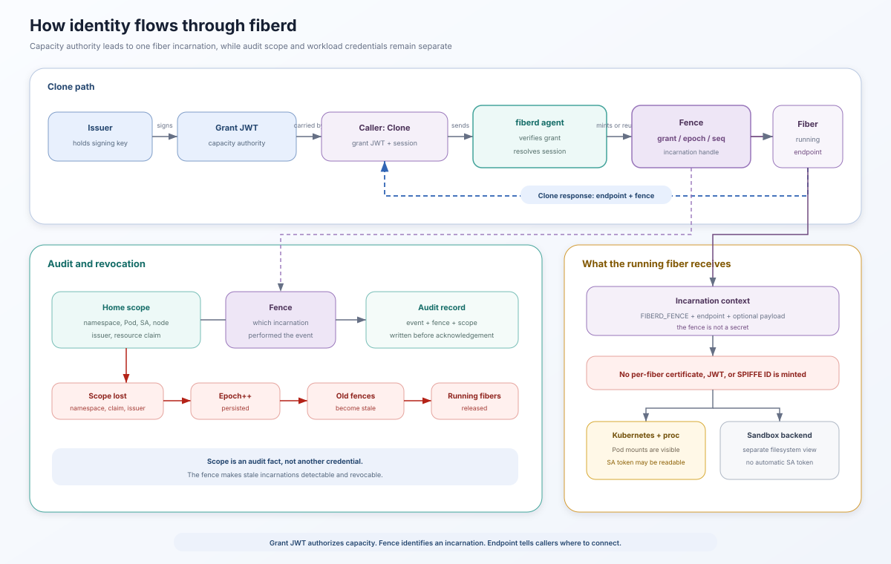

# Identity

fiberd separates capacity authority, fiber incarnation, home scope, and
workload credentials. These layers are connected, but they are not
interchangeable. In particular, an endpoint or fence is not a cryptographic
identity.



## The grant authenticates delegated capacity

A `CapacityGrant` is carried in a signed JWT. The home verifies the signature,
issuer, audience, and registered claims against the embedded grant. The
audience must name the home that is allowed to exercise the grant.

The verified grant authorizes fiberd to create fibers within its signed
limits. It is not a credential for the workload running inside a fiber, and it
does not give each fiber a separate principal.

The grant travels with `Clone`, so verification stays on the home. A grant
seen for the first time can be admitted and warmed there without a synchronous
call to the issuer. Lease expiry is then enforced by the ledger and reaper
rather than by treating the JWT as a request-time user token.

## The fence identifies one incarnation

Every created or resumed fiber receives a fence with three fields.

```text
grant UID / agent epoch / sequence
```

- The grant UID ties the incarnation to delegated capacity.
- The epoch identifies the current agent incarnation.
- The sequence distinguishes fiber incarnations within that epoch.

An attach to an already running named session returns its existing fence. A
create or resume mints a new fence. The stable session name can therefore
survive parking and resuming, while the old running incarnation does not.

A fence is a monotonic identifier and revocation boundary. It is not currently
a signed certificate, JWT, or secret. Callers must not treat possession of a
fence as authentication.

An agent restart advances the epoch. Scope loss can advance it while the agent
continues running. In both cases, prior fences become stale and running fibers
from the previous epoch are released.

## Home scope records where work ran

A home can assert scope facts about its environment. The core does not
interpret these facts as authorization. It copies them onto audit records so
an auditor can verify where an operation occurred.

Scope claims describe the home. They do not become per-fiber workload
credentials. A home can also report scope loss. fiberd then advances the epoch
and releases running fibers, which invalidates the older fences. The
[Kubernetes guide](operating-kubernetes.md#serviceaccount-scope-and-identity)
lists the scope facts and loss conditions used by the reference Kubernetes
home.

## Workload credentials depend on the backend

fiberd does not currently mint a per-fiber certificate, JWT, SPIFFE ID, or
other workload credential. Filesystem exposure differs by backend, so a fiber
may still be able to open credentials mounted into its home.

### proc

The proc zygote and its fibers use the home's mount namespace. During a fork,
the zygote library clears the inherited environment, closes inherited file
descriptors above the readiness descriptor, redirects standard streams, and
adds only the fiber-specific `FIBERD_*` values.

This scrubbing does not hide files. A proc fiber can open credentials mounted
into the home when filesystem permissions allow it. That exposure does not
give the fiber a distinct identity.

### runc

The runc backend starts the warm template in its own OCI root filesystem and
mount namespace. It bind-mounts the grant run directory at `/host`, and it
does not automatically reproduce the home's other credential mounts inside
that root filesystem. Fibers fork inside this backend container and share its
filesystem view.

### gVisor

Each gVisor fiber is restored as its own sandbox using the configured root
filesystem. The grant run directory is mounted at `/host`, and the current
backend disables networking. Home credentials are not automatically projected
into the sandbox root filesystem.

### Hyperlight

Each Hyperlight fiber is a restored micro-VM managed through the helper
protocol. The backend does not expose the home's general filesystem or
automatically inject home credentials into the guest.

These boundaries describe the repository's current reference backends. A
custom root filesystem, bind mount, helper, or workload can expose additional
credentials, so operators must review the backend configuration rather than
assuming that every fiber inherits or rejects the home identity.

## Operator implications

- Treat the grant JWT as capacity authority, not workload identity.
- Treat the fence as an incarnation and revocation handle, not a credential.
- Give the home only the credentials and permissions its fibers may use.
- Use a sandbox backend when the workload must not see the home's mount
  namespace.
- Add workload-level TLS or another authentication mechanism when downstream
  callers need a cryptographic identity. fiberd does not provide one today.

For endpoint allocation and network-policy boundaries, see the
[networking model](networking.md). For the process and sandbox relationships,
see the [runtime model](runtime-model.md). For the exact wire fields and
outcomes, see the [protocol reference](protocol.md). For Kubernetes
ServiceAccounts, readiness, and scope handling, see
[Kubernetes operations](operating-kubernetes.md).
