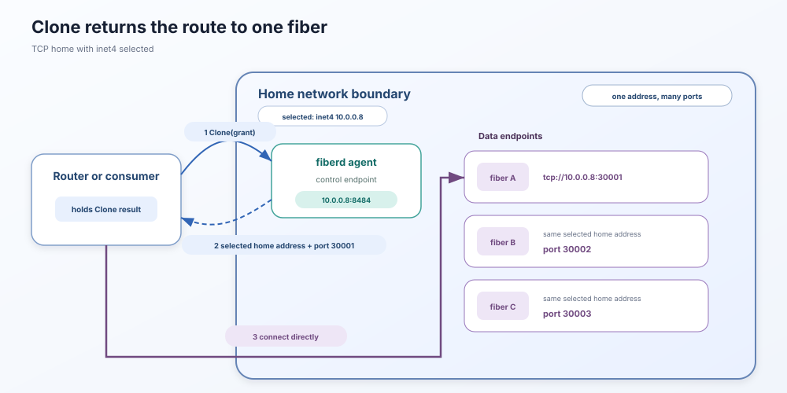

# Networking

fiberd gives every running fiber an endpoint. The surrounding home and
selected backend determine which endpoint families are available, what the
fiber can reach, and where callers can connect.



## Clone returns the data-plane route

The caller first connects to the fiberd agent and sends `Clone`. The agent
creates or resolves one fiber and returns its endpoint.

1. The caller sends `Clone` to the agent's control endpoint.
2. fiberd allocates the fiber's endpoint before starting the workload.
3. The successful response carries that exact endpoint.
4. The caller connects directly to the returned endpoint.

The control endpoint and the fiber endpoint serve different purposes. The
control endpoint accepts fiberd operations such as `Clone`, `Park`, and
`Release`. The fiber endpoint belongs to the workload created from the warm
template.

fiberd does not register individual fibers with a central discovery service.
The caller or router that requested the fiber must retain and use the endpoint
returned by `Clone`.

## Endpoint forms

The home selects one endpoint family when it starts.

- A `unix://` endpoint is a socket under the configured run directory. It is
  intended for callers that can access the same host path.
- A `tcp://` endpoint uses the address declared by the home and one allocated
  port. IPv6 literals are enclosed in brackets.

The default TCP port pool is `30000-32767` unless the home configures another
range. One live fiber holds one port. A parked session retains its port so its
listener can return on the same endpoint after resume. The port is released
when the fiber ends without being parked or when its parked state is
discarded.

Backend support is not uniform.

- **proc** and **runc** support Unix and TCP endpoints. Their TCP fibers use
  the home's network namespace.
- **gVisor** currently supports Unix endpoints only and runs with networking
  disabled in the reference backend.
- **Hyperlight** currently supports Unix endpoints only.

The runtime rejects a TCP configuration when the selected backend does not
advertise TCP support.

## IPv4 and IPv6

The endpoint family is an explicit deployment choice.

- `inet4` requires an IPv4 address and produces endpoints such as
  `tcp://10.244.0.8:30001`.
- `inet6` requires an IPv6 address and produces endpoints such as
  `tcp://[fd00::8]:30001`. The brackets separate the IPv6 literal from the
  port.

A dual-stack home does not advertise both families for the same runtime.
fiberd selects the address that matches the configured family, and every TCP
fiber uses that address with its own port.

IPv6 changes the endpoint format, but it does not change the isolation model.
The current implementation does not delegate an IPv6 prefix, allocate an
address to each fiber, or create a network namespace per fiber.

## Fibers share the home address

Under the TCP model, fibers share the home address and differ by port.

```text
tcp://10.244.0.8:30001  fiber A
tcp://10.244.0.8:30002  fiber B
tcp://10.244.0.8:30003  fiber C
```

fiberd does not create any of the following for an individual fiber:

- an IP address
- a network namespace
- a discovery record
- a network-policy object

The endpoint is a route to the fiber, not proof of the fiber's identity. The
workload protocol must provide authentication and encryption when callers
require them.

## Operator implications

- Keep the endpoint returned by `Clone` for as long as the incarnation is
  running.
- Make the home address and fiber port range reachable from the router.
- Apply network policy at the boundary supplied by the home.
- Do not treat an endpoint or port as authentication.

For grant authentication, fences, and workload credentials, see the
[identity model](identity.md). For the process and sandbox relationships, see
the [runtime model](runtime-model.md). For the exact endpoint wire fields, see
the [protocol reference](protocol.md). For Pod addresses, Services,
EndpointSlices, NetworkPolicy, and router reachability, see
[Kubernetes operations](operating-kubernetes.md#networking).
