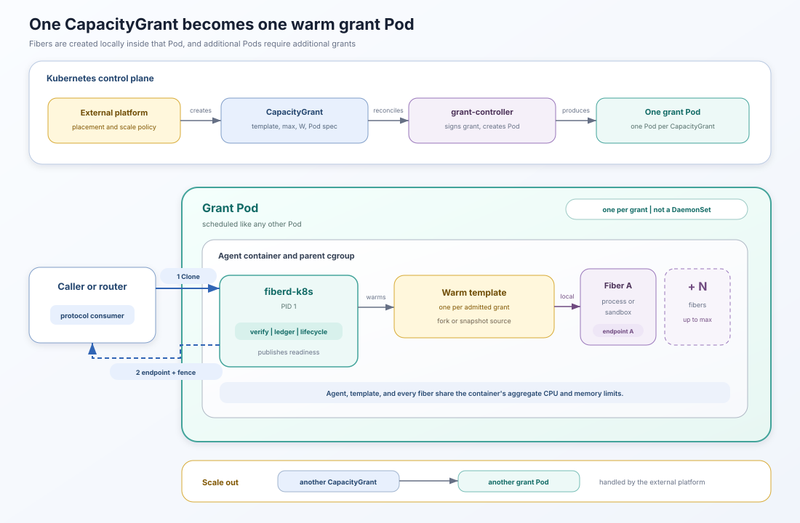

# Operating fiberd on Kubernetes

The repository includes a reference Kubernetes integration under
`examples/kubernetes`. It demonstrates the home interface and passes the
project's conformance and pressure tests. It is not a general-purpose
production operator. This page covers the CRD, controller, readiness,
configuration, and operational workflow. The [runtime model](runtime-model.md)
defines the platform-neutral relationship between a grant, home, warm
template, and fibers.

## Components

The reference integration has two control-plane components.

- The `CapacityGrant` CRD describes signed fiber capacity and the Pod that
  will hold it.
- The `grant-controller` polls and reconciles those resources, signs grants,
  creates grant Pods and Secrets, renews leases, and mirrors placement and
  readiness into resource status.

Each grant Pod runs `fiberd-k8s` as PID 1 of its only container. The
Kubernetes home around that agent provides:

- a projected Secret containing the signed grant
- the Pod's delegated cgroup subtree
- the selected Pod IP for TCP endpoints
- a readiness gate named `fiberd.io/zygote-ready`
- Kubernetes scope facts for audit and revocation
- optional ResourceClaims and device paths

The controller is a Deployment. The grant Pods are not a DaemonSet, and one
Pod is not created per fiber.

## From CapacityGrant to ready home



The reference lifecycle proceeds in this order.

1. A platform component creates a `CapacityGrant`.
2. The controller creates `<name>-grant`, which is the grant Pod.
3. The controller signs a grant whose UID is the resource UID and whose
   audience is the grant Pod name.
4. The signed JWT is stored in an owned Secret and projected into the Pod.
5. `fiberd-k8s` verifies and admits the grant, prepares the selected backend,
   and warms the template.
6. The agent sets the `fiberd.io/zygote-ready` gate to `True`.
7. The controller copies placement, readiness, grant expiry, and the agent
   endpoint into `CapacityGrant.status`.

The grant Secret volume is optional so the Pod can start before the controller
has created or renewed the Secret. The home polls the projected directory and
admits the grant when the JWT appears.

The default grant lease is ten minutes. The controller renews the JWT after
more than half of the lease has elapsed and writes the renewed token to the
same Secret.

## Readiness and status

Pod creation and scheduling do not mean the home can serve fibers.

- `status.placed` becomes true after the scheduler assigns the Pod to a node.
- `status.ready` mirrors the Pod Ready condition. That condition requires both
  the agent's TCP readiness probe and its warm-template readiness gate.
- `status.endpoint` is the agent's control endpoint. A successful `Clone`
  returns a separate data endpoint for the selected fiber.
- `status.expiresAt` shows the current signed grant's lease expiry.
- `status.message` carries the latest controller reconciliation error.

Route `Clone` requests only to grants whose status is ready. A workload may
still become unavailable later if the warm template exits, the Pod restarts,
the grant expires, or the home loses its scope.

The Pod also has a TCP readiness probe on the agent's port. Kubernetes marks
the Pod Ready only when that probe and the custom gate both pass.
The controller then mirrors the Pod Ready condition into `CapacityGrant.status.ready`.

The current controller writes `status.endpoint` from the Pod's primary
`status.podIP`. It does not inspect secondary addresses. On a dual-stack Pod,
verify the endpoint before relying on status for an `inet6` deployment.

## CapacityGrant fields

### Grant policy

- `spec.template` is the template digest presented to fiberd. The Pod image or
  additional agent arguments must make that digest resolvable.
- `spec.fibers.max` is the maximum number of live fibers. Set a positive value
  because zero means unlimited in the core.
- `spec.fibers.warm` is accepted and signed but unused by the current runtime.
  See the canonical [grant fields](protocol.md#grant-fields).
- `spec.wBudget` is the private working-set ceiling per fiber. Set it
  explicitly because zero means unlimited.
- `spec.minTier` is the minimum runtime capability. The home rejects a grant
  when the selected backend cannot meet it. It defaults to `FIBER_BASIC`.
- `spec.lease` controls the signed grant lifetime. It defaults to `10m`.
- `spec.durability` selects best-effort or synchronous audit semantics. The
  reference agent has no remote shipper, so synchronous records are fsynced to
  the Pod's local spool.
- `spec.sessionClass` is carried into the signed policy.
- `spec.deviceBudget` sets the per-fiber device-state budget when the template
  exposes a compatible engine.

### Grant Pod

- `spec.pod.image` is the image used for the agent container.
- `spec.pod.runtime` selects `proc`, `runc`, `gvisor`, or `hyperlight`. It
  defaults to `proc`.
- `spec.pod.args` appends fiberd flags. Use it to map template digests, select
  parity policy, or tune pressure settings.
- `spec.pod.resources` becomes the agent container's requests and limits.
- `spec.pod.serviceAccountName` selects the Pod ServiceAccount. It defaults to
  `fiberd-grant`.
- `spec.pod.endpointFamily` selects `inet4` or `inet6`. It defaults to
  `inet4`.
- `spec.pod.nodeSelector` and `spec.pod.nodeName` constrain placement.
- `spec.pod.resourceClaims` and `spec.pod.devices` describe the grant's device
  fabric.
- `spec.pod.privileged` defaults to true because the proc and checkpoint paths
  need cgroup and CRIU privileges.
- `spec.pod.labels` and `spec.pod.annotations` are added to the grant Pod.
- `spec.pod.unsafeAdmin` enables test-only controls and should remain false in
  normal deployments.

The current controller creates a missing Pod but does not update or recreate
an existing Pod when `spec.pod` changes. Recreate the `CapacityGrant` when a
Pod-level field must change. A future production operator would need an
explicit rollout policy instead.

## Example CapacityGrant

The following example is illustrative. Replace the image, digest, command,
and resource values with measurements from the workload.

```yaml
apiVersion: fiberd.io/v1alpha1
kind: CapacityGrant
metadata:
  name: web
  namespace: tenant-a
spec:
  template: sha256:0123456789abcdef
  fibers:
    max: 10
  wBudget: 64Mi
  minTier: FIBER_CHECKPOINT
  lease: 10m
  durability: best-effort
  pod:
    image: registry.example/fiberd-web:1.0.0
    runtime: proc
    serviceAccountName: fiberd-grant
    endpointFamily: inet4
    args:
      - -template
      - sha256:0123456789abcdef=/app/web-zygote
    resources:
      requests:
        cpu: "2"
        memory: 1Gi
      limits:
        cpu: "4"
        memory: 1536Mi
```

This resource creates one Pod named `web-grant`. It does not create ten Pods
or ten containers. The agent can create up to ten live fibers from the one
warm template inside the Pod.

## Resource configuration

`spec.pod.resources` sets the aggregate Kubernetes scheduling request and Pod
ceiling. `fibers.max` and `wBudget` apply inside that boundary and do not divide
its CPU or memory into equal shares. The values in the example are
illustrative. Use the measurement and sizing process in the
[resource model](resources.md) before choosing production limits.

Kubernetes uses the requests to place the grant Pod. The kubelet applies the
container limits to the cgroup that becomes the capacity home. The agent, warm
template, backend helpers, and every fiber consume resources inside that
aggregate boundary.

The Pod resources and signed grant answer different questions:

- Pod resources tell Kubernetes what to schedule and enforce in aggregate.
- `fibers.max` limits concurrent live fibers inside the Pod.
- `wBudget` limits the private working set of each fiber.

The CRD permits zero for both grant limits, while the protocol interprets zero
as unlimited at those layers. Set explicit positive values unless the parent
cgroup, ports, PIDs, and pressure handling are intentionally the only bounds.

## Networking

The agent has a control endpoint, while Clone returns the selected fiber's
data endpoint. The kind NodePort exists only for host-side acceptance and is
not created for each grant or fiber.

The Kubernetes home examines `status.podIPs` and selects an address matching
`spec.pod.endpointFamily`. The default is `inet4`. The home waits up to 90
seconds for the kubelet to publish a matching address. The controller differs
from the home here: it writes `CapacityGrant.status.endpoint` from the primary
`status.podIP` only.

TCP-capable fibers share the selected Pod IP and use distinct ports from the
configured fiber range. Kubernetes networking applies at the grant-Pod
boundary:

- A NetworkPolicy selects the grant Pod, not an individual fiber.
- fiberd does not create a Service, EndpointSlice, or NetworkPolicy per fiber.
- A router must reach the Pod IP and the configured fiber port range.
- Routing to a specific fiber requires the endpoint returned by `Clone`.

The [networking model](networking.md) defines endpoint families, port
allocation, and the direct data path.

## ServiceAccount, scope, and identity

The Kubernetes home uses the grant Pod's ServiceAccount to read scope facts
and publish readiness. Give it only the required permissions, especially when
using proc because mount-visible credentials can be available to fibers.

The home records available values for:

- namespace
- Pod name and Pod UID
- ServiceAccount name
- node name
- ServiceAccount token issuer
- bound ResourceClaims

Deleting the Pod or namespace, deleting a bound ResourceClaim, or changing
the ServiceAccount token issuer causes scope loss. The agent advances its
epoch and releases running fibers, which invalidates their old fences.

The proc backend shares the home's mount namespace. A proc fiber can therefore
open a mounted ServiceAccount token when filesystem permissions allow it.
runc, gVisor, and Hyperlight do not automatically receive the grant Pod's
ServiceAccount mount. These fibers still do not receive distinct workload
identities. Grant authority, fences, scope claims, and backend-specific
credential exposure are defined in [Identity](identity.md).

## Scaling out

The reference controller reconciles grants but does not decide when to add
them. Kubernetes scale-out follows this sequence:

1. An external platform component creates another `CapacityGrant`.
2. The controller creates another grant Pod and signed grant.
3. Kubernetes schedules the Pod.
4. fiberd warms its template and publishes readiness.
5. The platform adds the new control endpoint to Clone routing.

The controller does not implement an autoscaler. Grant Pods are not a
DaemonSet, and the scheduler may place zero, one, or several on a node under
ordinary Pod constraints. The
[runtime model](runtime-model.md#scaling-within-and-beyond-a-home) describes
the general distinction between local activation and adding a home.

Deleting a `CapacityGrant` allows Kubernetes garbage collection to remove its
owned Pod and Secret. The reference controller has no finalizer or graceful
scale-in workflow, so an external platform should drain work before deletion.

## Placement and devices

Use normal Kubernetes scheduling controls for the grant Pod.

- Resource requests participate in scheduling.
- `nodeSelector` and `nodeName` constrain placement.
- ResourceClaims describe Pod-level DRA allocation.
- `devices` tells the warm engine which device paths or identifiers the claim
  exposed.

The device claim belongs to the grant Pod. fiberd can enforce a logical
per-fiber `deviceBudget`, but it does not create a Kubernetes ResourceClaim per
fiber.

## Security boundary

The reference Pod defaults to privileged. This is appropriate for the
integration test because proc, cgroup delegation, and CRIU need host-facing
capabilities. It is not a minimal production security profile.

Before adapting the example:

- review whether the selected backend needs privileged mode
- reduce ServiceAccount permissions to the required namespace and resources
- apply Pod-level network policy
- protect the issuer signing-key Secret
- expose JWKS and discovery through trusted transport
- disable `unsafeAdmin`
- place untrusted workloads behind a sandbox boundary rather than proc

The reference issuer serves discovery and JWKS over HTTP inside the example
cluster. A production issuer should use the platform's authenticated and
encrypted service path.

For the concrete example files, see
[`examples/kubernetes`](../examples/kubernetes/README.md). For what runs inside
the Pod, see the [runtime model](runtime-model.md).
