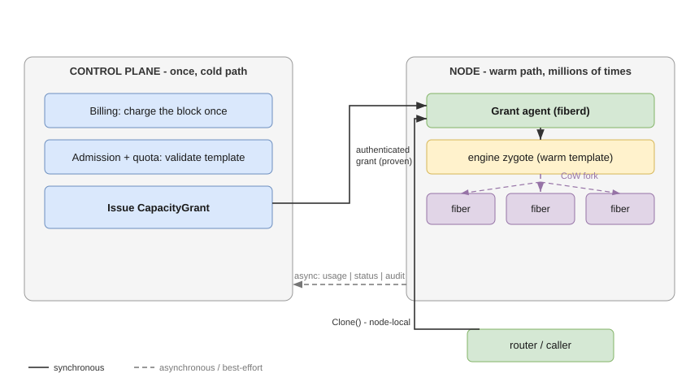

# fiberd

**A node-level execution fabric for serverless and agent platforms: charge capacity once as a block, mint instances locally in milliseconds, survive control-plane outages by construction.**

> **Instances that cost nothing to create but still count.**

fiberd lets a platform issue a *block* of capacity once, then create individual instances ("fibers") on the node itself — in milliseconds, with no control-plane call on the request path. One core runs in two homes: standalone platforms and Kubernetes.

---

## The problem

Serverless container instances fight a three-way tension. An instance must be:

- **cheap** — thousands per host, or the economics fail;
- **fast** — created inside the request path, or cold starts leak into latency SLOs;
- **billable** — attributed to a tenant with a hard ceiling, or capacity leaks into overcommit incidents.

Existing designs pick two:

| Approach | cheap | fast | billable |
|---|:---:|:---:|:---:|
| Per-instance control-plane records (e.g. a Pod) | no | yes | yes |
| Warm pools | no | yes | yes |
| Userspace multiplexers | yes | yes | no |

The reason per-instance records resist removal is that a single record (the Kubernetes Pod is the sharpest example) fuses **seven roles**: scheduling unit, accounting unit, isolation/failure domain, workload identity, lifecycle, ecosystem contract, and network identity. The per-instance cost lives in delivering all seven, every time.

## The core inversion

fiberd resolves the tension by inverting *who does what*: the control plane's involvement ends at **issuing capacity**; the node **exercises** it.

This is how two well-proven systems already work:

- **IP allocation** — a router is delegated a prefix once; hosts mint addresses from it with zero allocator involvement.
- **Android** — one warm *zygote* process; every app launch is a copy-on-write `fork()`.

fiberd applies the same two moves to container instances. The seven roles split cleanly:

- **Stay on a block-level object the control plane owns:** scheduling unit, accounting unit, ecosystem contract.
- **Delivered per instance by the node:** isolation/failure domain, workload identity, lifecycle, network identity.

## The three components

| Component | What it is |
|---|---|
| **CapacityGrant** | An authenticated artifact the control plane issues once per block of capacity (template reference, `fibers: {max, warm}`, policy, expiry). Billing charges it exactly once, at issue. |
| **Grant agent** (`fiberd`) | One daemon per node — the sole runtime client. Holds the ledger, the fence, the thrash budget, the audit spool, and the pressure ladder. |
| **Fibers** | Node-minted instances inside a grant: copy-on-write clones of a checkpointed engine zygote. Known to exactly two parties — the agent's ledger and the caller. |

The control plane sees the grant and its batched status — never individual fibers — the same way an IP allocator sees the prefix, never the addresses.

## What you get

- **Synchronous, node-local activation** — millisecond clones, no control-plane read/write/lease on the warm path.
- **Outage tolerance by construction** — a control-plane outage freezes new supply but never breaks binds against supply already on the node.
- **Accounting precedes activation** — the block is charged once; the node's authenticated copy of the grant is the proof at activation time.
- **One core, two homes** — the identical agent and semantics run standalone and under Kubernetes; only thin adapters differ.

## Reading guide

- **[architecture.md](architecture.md)** — the full design reference: the inversion, the three components and grant lifecycle, the `Clone`/`Park`/`Release` contract, CPU vs GPU, the two homes, and the cross-cutting model (fencing, accounting, identity/audit, network, pressure).
- **[concepts.md](concepts.md)** — a glossary: plain-language definitions of every term (fiber, grant, engine, agent, fence, epoch, ledger, session, lease, copy-on-write, thrash budget, park/resume, audit spool, pressure ladder, tiers, miss codes, homes), each with an analogy and a diagram.
