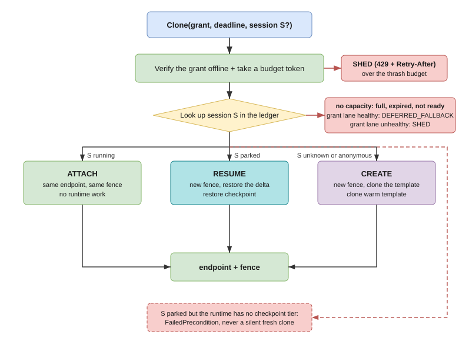

# Protocol reference

fiberd exposes a small grant protocol over gRPC. The protobuf schema in [`api/grant/v1/grant.proto`](../api/grant/v1/grant.proto) is the wire authority, and `tests/conform` is its executable contract.

The protocol answers four questions:

- what capacity has already been authorized.
- which named session should be attached, resumed, or created.
- how a caller reaches the resulting fiber.
- whether a miss should fall back or retry.

It does not accept an image, command, environment, mount, security context, or resource override at clone time. Those properties belong to the admitted template and grant.

## Signed CapacityGrant

Every Clone request carries a signed CapacityGrant as a JWT. Registered JWT claims mirror selected grant fields:

- `iss` matches `issuer`.
- the single `aud` value matches `audience`.
- `jti` matches `grant_uid`.
- `exp`, when present, matches `lease_expiry`.
- `grant` contains the complete CapacityGrant encoded as protobuf JSON.

The verifier accepts EdDSA and ES256. It requires exactly one signature and a
`kid`, selects the matching key from its JWKS cache, verifies the signature,
and cross-checks the mirrored claims. It also requires the configured audience
and, when configured, issuer.

Verification does not reject a token merely because `exp` is in the past. Lease expiry is a capacity event handled by admission and the lease reaper, so it produces a capacity miss rather than `Unauthenticated`. Stale or unavailable key material produces `SHED` when the verifier cannot safely decide.

### Grant fields

- `grant_uid` is the stable identifier used by the ledger, fences, and status stream.
- `issuer` identifies the authority that signed the grant.
- `audience` names the home allowed to exercise the grant.
- `template_digest` fixes the pre-admitted OCI template or artifact.
- `fibers.max` limits concurrent running fibers for the grant. Zero means no protocol-level count limit, while the enclosing resource boundary still applies.
- `fibers.warm` is carried through conversion but is not consumed by the current scheduler. It does not reserve or pre-create a warm fiber pool.
- `w_budget_bytes` is the per-fiber W ceiling. Zero means unlimited at this layer. Enforcement depends on the backend, as described in [Resources and limits](resources.md).
- `min_tier` is the minimum runtime tier the grant accepts.
- `lease_expiry` is the time after which the home no longer holds the grant.
- `policy.durability` selects best-effort or synchronous audit handling.
- `policy.session_class` and `policy.audit_class` are carried as policy labels.
- `policy.psi_some_avg10_shed` and `policy.psi_some_avg10_park` override pressure watermarks when non-zero.
- `device_budget.bytes` and `device_budget.class` describe the per-fiber device-state slice and required device class.

## Fibers service

The `Fibers` service has four RPCs.

### Clone

`Clone(CloneRequest) returns (CloneResponse)` resolves a session and returns a dialable fiber.

The request has exactly four fields:

- `grant_jwt` contains the signed grant.
- `session` is an optional stable name, while an empty value requests an anonymous fiber.
- `deadline` is an optional absolute timestamp for runtime work.
- `payload` is opaque input capped at 4096 bytes.

If `deadline` is absent, the runtime supplies a default. The core defaults are 50 milliseconds for CREATE and 2 seconds for RESUME. A deadline already in the past is invalid. The payload is data for the prepared template and is never interpreted as workload configuration by the core.

The response contains:

- `fiber_id`, which identifies the active incarnation for Park and Release.
- `endpoint`, which callers dial as returned.
- `fence`, which identifies the grant, agent epoch, and sequence.
- `kind`, which is `CREATE`, `ATTACH`, or `RESUME`.

The action depends on the session:

- an empty session produces `CREATE`.
- an unknown named session produces `CREATE`.
- a running named session produces `ATTACH`.
- a parked named session produces `RESUME`.

ATTACH returns the same fiber ID, endpoint, and fence. CREATE and RESUME mint a new fence.



### Park

`Park(ParkRequest) returns (Empty)` checkpoints the identified running fiber and frees its running slot. A named session retains the returned delta reference and can later RESUME. An anonymous fiber has no name through which its delta can be requested.

`sync=true` asks the runtime to complete its synchronous durability path before replying. The exact storage guarantee depends on the configured runtime and artifact store.

### Release

`Release(ReleaseRequest) returns (Empty)` terminates the identified running fiber and frees its slot and session name. `discard=true` also asks the runtime to remove retained checkpoint data associated with the release.

Calling Park or Release with an unknown or old-epoch fiber ID returns `NotFound`.

### Watch

`Watch(Empty) returns (stream Status)` emits an initial batch, every ledger change, and a periodic refresh. Each `Status` contains only:

- `grant_uid`.
- the number of running fibers.
- the number of parked sessions.
- aggregate measured `w_used_bytes` for running fibers.
- the latest fence value for the grant.

The stream does not advertise clone rate, desired replicas, warm-pool size, CPU usage, or autoscaling decisions.

## Admission completeness

The protobuf request is the complete clone-time authority. The gRPC interceptor rejects unknown protobuf fields, including unknown fields inside nested messages, with `InvalidArgument`. The JSON gateway uses strict protobuf JSON decoding and rejects unknown JSON fields as well.

This rule prevents a caller from smuggling workload-shaping fields that were not covered by the signed grant and admitted template.

## Fences and epochs

A fence has three fields:

```text
grant_uid / epoch / seq
```

- `grant_uid` binds the incarnation to one grant.
- `epoch` changes when the agent restarts or its home scope is revoked.
- `seq` advances for each new CREATE or RESUME under the grant.

ATTACH preserves the existing fence. RESUME creates a newer sequence in the same epoch unless an epoch change occurred. Restart and scope loss invalidate all earlier running fiber IDs and fences. A fence orders incarnations but does not authenticate a process, network connection, or end user.

## Endpoints

`endpoint` is a URL that callers use without discovering the address family:

```text
unix:///run/fiberd/<grant>/<epoch>-<seq>.sock
tcp://10.0.0.7:30012
tcp://[fd00::7]:30012
```

The supported forms are `unix://` with an absolute path and `tcp://` with a host and port. The configured home and backend determine which form can be issued. IPv4 and IPv6 use the same `tcp://` scheme, and IPv6 literals are bracketed.

The endpoint is a transport address, not a separate identity. Address allocation, shared Pod or node addresses, ports, and network policy are covered in [Networking](networking.md).

## Outcomes

The core returns transport-independent outcomes, and the gRPC layer maps them as follows:

- `SHED` becomes `ResourceExhausted`. It includes `Miss{code: SHED, retry_after_s, issuer}`.
- `DEFERRED_FALLBACK` becomes `Unavailable`. It includes `Miss{code: DEFERRED_FALLBACK, issuer, preferred_home}`. `preferred_home` is set when parked session state should remain on another home.
- a tier or device mismatch becomes `FailedPrecondition`.
- a malformed request becomes `InvalidArgument`.
- an invalid grant, signature, issuer, or audience becomes `Unauthenticated`.
- an unknown fiber becomes `NotFound`.
- runtime or audit failures become `Internal`.

Every capacity miss carries a `Miss` detail. `SHED` tells the caller to wait for `retry_after_s` and retry. `DEFERRED_FALLBACK` tells the caller to use its ordinary provisioning path or route to `preferred_home`.

A capacity miss is selected using grant-lane health:

- when the control plane is healthy, unavailable capacity becomes `DEFERRED_FALLBACK`.
- when the control plane is unavailable, it becomes `SHED`.
- local pressure and rate-budget refusal always become `SHED`.

## JSON gateway

Starting fiberd with an HTTP address exposes a JSON face over the same core:

- `POST /v1/clone`
- `POST /v1/park`
- `POST /v1/release`
- `GET /v1/status`
- `GET /healthz`

Requests and successful responses use protobuf JSON. Errors use `google.rpc.Status` JSON. The HTTP status follows the gRPC code:

- `InvalidArgument` becomes 400.
- `Unauthenticated` becomes 401.
- `NotFound` becomes 404.
- `FailedPrecondition` becomes 412.
- `ResourceExhausted` becomes 429 and includes `Retry-After` for `SHED`.
- `Unavailable` becomes 503.
- other failures become 500.

The HTTP status endpoint returns the current status snapshot. The streaming Watch RPC is available only over gRPC.

