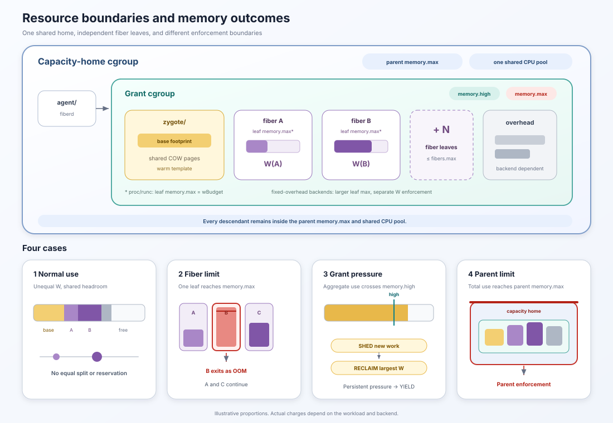

# Resource model

fiberd creates fibers inside capacity that has already been admitted. It does
not create CPU or memory beyond the capacity home that holds the grant. The
home forms the outer resource boundary around the agent, warm template,
backend helpers, and every fiber.



## The capacity home is the outer resource boundary

On the Linux host runtime, fiberd operates beneath a capacity-home cgroup and
delegates a subtree for each grant. Moving the agent and fibers into child
cgroups does not bypass the limits inherited from the home. The agent, warm
template, backend helpers, and all running fibers consume the same aggregate
capacity.

This produces two levels of policy.

- The capacity home controls the total resources available to fiberd.
- The signed grant controls how fiberd may use those resources.

If the home limit is lower than a limit fiberd sets inside its subtree, the
home limit wins because every child remains subject to its ancestors.

The environment that owns the home supplies this outer boundary. The
[Kubernetes guide](operating-kubernetes.md#resource-configuration) explains
how a grant Pod's container cgroup provides it in the reference integration.

## CPU is shared across the capacity home

The home's CPU controls apply to the aggregate workload. fiberd does not
currently configure a per-fiber `cpu.max`, CPU request, CPU weight, or
exclusive CPU set.

As a result, running fibers, the warm template, and the agent compete within
the home's CPU allocation. A four-CPU home does not give four CPUs to every
fiber, and it does not divide those CPUs equally. The host enforces the
aggregate limit while runnable processes compete for time.

Size the home's CPU capacity from expected concurrency and workload cost.
Choose `fibers.max` so the number of simultaneously runnable fibers does not
create unacceptable contention for that shared CPU pool.

## Memory is shared pages plus private working sets

The memory used by a fiber has more than one part.

- The **warm-template footprint** is the initialized code and data held by the
  zygote or warm snapshot.
- The **working set W** is the memory a fiber dirties or otherwise owns after
  creation.
- Some backends add a **fixed sandbox footprint** for a sentry, helper, or
  micro-VM.

On the proc and runc backends, fibers initially map the zygote's pages through
copy-on-write. Unchanged pages remain shared and are not copied for every
fiber. A page becomes private only when a fiber writes to it.

This means home memory is not split into equal shares. The signed grant gives
each fiber its own `w_budget_bytes` allowance, but that allowance is a ceiling,
not a reservation. One fiber may use very little while another approaches the
full budget. They still share the same capacity-home and grant-level
boundaries.

For example, eight fibers with a 64 MiB W budget do not immediately consume or
reserve 512 MiB. Their actual charge depends on the pages they dirty. However,
the operator must provision the home for the possibility that many fibers
approach their budgets at the same time.

## The cgroup hierarchy

The Linux host runtime creates the following hierarchy beneath the home.

```text
capacity home cgroup            aggregate CPU and memory limits
├── agent/                      fiberd process
└── fiberd/
    └── <grant UID>/            grant memory.high and memory.max
        ├── zygote/             warm-template footprint
        ├── f-<epoch>-<seq>/    one running fiber
        ├── f-<epoch>-<seq>/    another running fiber
        └── ...
```

For the default ceiling calculation, fiberd first computes a per-fiber leaf
allowance `L`. On proc and runc, `L` is the grant's W budget. Backends with a
fixed sandbox footprint use a larger leaf allowance so the sandbox itself does
not consume the workload's W budget.

The default grant limits are based on these values.

```text
block = warm-template footprint + fibers.max × L
memory.high = block + 25%
memory.max = memory.high + L
```

`memory.high` causes reclaim and stalls, which appear as memory pressure. The
pressure controller reacts before the hard limit where possible.
`memory.max` remains the grant's final cgroup stop. The `-grant-ceiling` flag
can replace the default `memory.high` calculation for a deployment.

The home's own `memory.max` still surrounds this hierarchy and may be lower
than the grant limit.

## What happens when a fiber exceeds its budget

Every running fiber has its own cgroup leaf.

On proc and runc, fiberd sets the leaf's `memory.max` to the W budget and sets
`memory.oom.group=1`. It also disables swap for the leaf. If the fiber crosses
the limit, the kernel kills the processes in that leaf as one unit.

Backends with a fixed footprint need more room in the leaf for the sandbox.
fiberd gives those leaves a larger gross `memory.max`, samples the workload's W
counter, and kills the fiber when W exceeds the signed budget. Sampling occurs
every 25 milliseconds in the current implementation.

Both paths produce the same protocol-visible result.

- the exit is classified and audited as `oom`.
- only that fiber is removed.
- its endpoint and runtime state are cleaned up.
- its live slot returns to the grant.

A fiber can also run out of memory while it is being created. The runtime
registers the child before waiting for backend readiness so it can observe a
racing exit and return the reserved slot instead of leaking capacity.

The per-fiber limit reduces the blast radius, but it cannot guarantee that the
home never reaches its parent limit. A sudden aggregate spike can still
trigger parent enforcement before the pressure controller reclaims enough
memory.

## Pressure handling at grant level

fiberd reads memory PSI from the grant cgroup. PSI measures the share of time
tasks are stalled by memory pressure rather than only counting allocated
bytes. The current default watermarks are 10 percent for shedding and 25
percent for reclaim.

The controller applies the following order.

1. **Shed** new creates and resumes while allowing an existing session to
   attach.
2. **Reclaim** the running fiber with the largest W. A named session is parked
   when possible, while an anonymous fiber is released.
3. **Yield** the grant after pressure remains above the park watermark for
   three checks and no fiber remains to reclaim.

Device occupancy can feed the same ladder when the backend reports it. The
higher of memory pressure and device pressure drives the response.


## What controls fiber count

The protocol calls the count fields `FiberLimits`.

- `fibers.max` limits the number of live fibers in a grant. Parked sessions do
  not occupy a live slot.
- `fibers.warm` is signed with the grant but is not consumed by the current
  runtime. It does not create a warm fiber pool. The
  [protocol reference](protocol.md#grant-fields) defines this wire field.

The ledger enforces `fibers.max` before calling the backend. A positive value
is a hard live-count limit. The protocol defines zero as unlimited at this
layer. Operators should therefore set an explicit positive maximum unless
they intentionally want resource pressure, ports, PIDs, and the parent cgroup
to become the only bounds.

The protocol also defines a zero `wBudget` as unlimited. Operators should set
an explicit working-set budget when they need per-fiber memory isolation and
bounded checkpoint mobility.

## Sizing a capacity home

Size a home from measured workload behavior rather than dividing its memory
limit by a desired instance count.

1. Measure the initialized template's resident footprint.
2. Measure the fiber working set after representative requests.
3. Set `wBudget` above the working set the platform intends to support.
4. Choose `fibers.max` from expected concurrency, shared CPU capacity, memory
   demand, and acceptable overcommit.
5. Give the home enough memory for the template, expected simultaneous working
   sets, backend overhead, agent overhead, and operational headroom.
6. Give the home enough CPU for the aggregate throughput the grant should
   provide.

If every fiber must be able to reach its W budget simultaneously, provision
for that worst case. If the platform deliberately overcommits, configure
enough operational headroom and expect the pressure ladder to shed and reclaim
under contention.

`device_budget` is separate from CPU and host memory. It limits each fiber's
logical share of grant-wide device state, such as KV cache, when the template
provides a compatible engine.

## Environment mapping

The environment that owns a home supplies its aggregate resource boundary.
The signed grant then controls how fiberd may use capacity inside that
boundary. See [Kubernetes operations](operating-kubernetes.md#resource-configuration)
for the mapping from Pod requests and limits to a Kubernetes capacity home.

For how these limits travel in the signed artifact, see the
[grant protocol](protocol.md). For the instance and backend boundaries, see
the [runtime model](runtime-model.md). For endpoint boundaries, see
[networking](networking.md). For grant and workload identity, see
[identity](identity.md).
