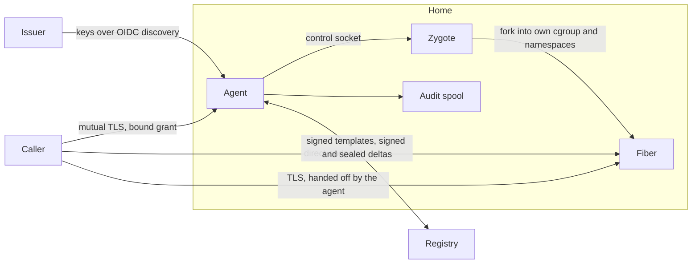

# Security

This page walks the trust boundaries of fiberd, one short section each, for operators and reviewers deciding what to expose and what to trust. Read [architecture.md](architecture.md) first. Each section gives the summary and links the design doc that owns the detail.

## Trust boundaries

- **Caller to [agent](glossary.md#agent).** Every control call is authenticated with mutual TLS (mTLS), and the [grant](glossary.md#grant) it presents is bound to the caller's certificate.
- **[Issuer](glossary.md#issuer) to agent.** The agent trusts only keys it finds through OpenID Connect (OIDC) discovery, the standard document in which the configured issuer lists its public keys.
- **Agent to [fiber](glossary.md#fiber).** Fibers are kept apart from the agent and from each other by [cgroups](glossary.md#cgroup), namespaces and a scrubbed process state, with inherited descriptors closed and a fresh environment.
- **Agent to registry.** Nothing is restored unless it is signed, and tenant memory never leaves the [home](glossary.md#home) in the clear.

## Control plane

Every control call, `Park`, `Release` and `Watch` included, runs over mutual TLS, and the caller is the identity in its client certificate. TLS terminates at the agent, so a router in front of fiberd is itself an mTLS client and grants are bound to the router's certificate. [Grant verification](design/grant.md) has the transport rules, the checks and the development switch that turns TLS off.

## Grants

The agent verifies a grant's JSON Web Token (JWT) offline against the issuer's published keys, refuses one for another home or with a lease longer than `-max-lease`, and checks that its `cnf` (confirmation) claim names the caller's certificate, so a copied token cannot be replayed by another caller. A grant removed from the home's [lane](glossary.md#lane) is revoked and its grant UID deny-listed until every token for it has expired. The verifier is in [grant.md](design/grant.md) and revocation in [core.md](design/core.md).

## Identities

| Layer | What it is | What it is not |
| --- | --- | --- |
| Grant | Capacity authority for one home, bound to one caller | A credential for the workload inside a fiber |
| [Fence](glossary.md#fence) | The name of one incarnation, ordered so a stale holder is detectable | A certificate, token or secret |
| [Scope](glossary.md#scope) claims | Facts about where the home runs, stamped on audit records | Authorization. Nothing checks them at [Clone](glossary.md#clone) time |
| Workload credential | None per fiber, except the [handoff](glossary.md#handoff) TLS identity | A per-fiber principal |

What a fiber can read of the home's credentials differs by [backend](glossary.md#backend) ([backends.md](design/backends.md)).

## Fiber connections

In the `DIRECT` [endpoint mode](glossary.md#endpoint-mode) an endpoint is a route, not an identity, and fiberd neither authenticates nor encrypts it. A `HANDOFF` fiber is reached only over TLS 1.3 that the fiber terminates itself. The fiber accepts only the certificate the grant is bound to, and the caller pins the grant's server key from the Clone response. The agent routes on the server name alone and never holds the [session](glossary.md#session) keys. [handoff.md](design/handoff.md) has the mechanism.

A `DIRECT` TCP fiber on runc, gVisor or Hyperlight is reached through the agent's [relay](glossary.md#relay), which copies bytes without reading them, so TLS in the workload keeps the agent blind. Its connections are capped per fiber and per home, and they cost the agent descriptors outside the fiber's cgroup ([networking.md](design/networking.md)).

## Admission and isolation

An `UNTRUSTED` grant, the default, is admitted only on a backend that isolates tenants, before any [template](glossary.md#template) is warmed ([grant fields](protocol.md#grant-fields)). The issuer marks a grant `TRUSTED` only when its code may share the host kernel.

| Backend | Isolates tenants | Why |
| --- | --- | --- |
| gVisor | yes | a fiber's syscalls are served by its sandbox's Sentry, gVisor's kernel in user space |
| Hyperlight | yes | a fiber is a micro-VM guest behind the hypervisor |
| runc | no | its own namespaces and root filesystem, on the host kernel |
| proc | no | a forked process on the host kernel |

[backends.md](design/backends.md) compares the four.

## Fiber isolation

- Every proc and runc fiber is born in its own cgroup leaf and pid namespace. A proc fiber also gets a private mount namespace with the agent's private paths covered and the run directory narrowed to its own grant's. Confinement fails closed ([zygote.md](design/zygote.md)).
- proc fibers run as uid 0 with every capability dropped under `no_new_privs`.
- runc fibers are an unprivileged host uid in a per-grant user namespace, whose ids come from a pool far above ordinary users', with a loopback-only network namespace and nested user namespaces denied ([user-namespaces.md](design/user-namespaces.md)).
- A template must reseed its random generators in every new incarnation, at the fork, after a restore and when its fence changes ([zygote.md](design/zygote.md), [zygote/README.md](../zygote/README.md)).

## Agent privileges

With proc or runc, the agent re-executes at start with only the capabilities that runtime needs. An agent that cannot drop the rest refuses to start, unless `-all-caps`. Nobody has measured what gVisor and Hyperlight need, so with them the agent keeps what it started with. [sys.md](design/sys.md) explains each capability, and [kubernetes.md](design/kubernetes.md) how the example Pod applies the set.

## Templates and deltas

A template is pulled by the digest the grant names and checked again on every [warm](glossary.md#warm). Every [delta](glossary.md#delta) a home publishes is signed with `-delta-key` and sealed with AES-256-GCM under a key derived for its [session class](glossary.md#session-class), and it expires 24 hours after the [park](glossary.md#park). A home takes only a delta signed by a key it trusts, for the session class and session it asked for. Import, which takes a session exported as files, needs the signed manifest of the checkpoint the delta builds on, and seals for the importing grant's session class, never the one the export names. [artifact.md](design/artifact.md) has the formats and the key derivation.

## Audit

Every state transition appends a hash-chained record to the agent's private spool, with an Ed25519 checkpoint every 256 records and at shutdown. A grant with sync durability gets its reply only after the record is flushed to disk with fsync. After the first failed fsync, every sync record fails until the agent restarts. `audit-verify` checks a spool. [audit.md](design/audit.md) has the chain and its limits.

## Known gaps

- proc and runc share the host kernel.
- proc fibers are uid 0 behind confinement alone.
- runc has no egress, and costs a rootfs copy per grant.
- `SYS_ADMIN` is broad.
- Unmeasured runtimes keep every capability.
- Every copy of a template carries its random state, and only the template can reseed it. A forked fiber learns it is new in `on_fiber`, a gVisor sandbox when its checkpoint read returns, and a resumed proc or runc fiber only by watching the fence file beside its unix endpoint, since CRIU keeps the pid. There is no uniform signal yet. A Hyperlight guest gets none (the reference guest owns no generator, so nothing there repeats today), and a template that does not watch the fence, or serves tcp or handoff connections where no fence file sits beside the socket, replays its parked sequence after a resume.
- Address-space layout randomisation (ASLR) is off for every [zygote](glossary.md#zygote) and its fibers, so the fibers of a template share one fixed memory layout on every home. A memory-corruption exploit inside a fiber is easier, because an address learned in one fiber holds in all of them.
- Whoever can write the grant lane's directory can deny a grant UID on that home ([home.md](design/home.md)).
- Running the agent itself inside a user namespace (a Pod with `hostUsers` set to false) is untested. runc's per-grant user namespace is a different thing and restores fine ([user-namespaces.md](design/user-namespaces.md)).
- A certificate rotation means re-minting the caller's grants, and an unbound JWT is a bearer token ([grant.md](design/grant.md)).
