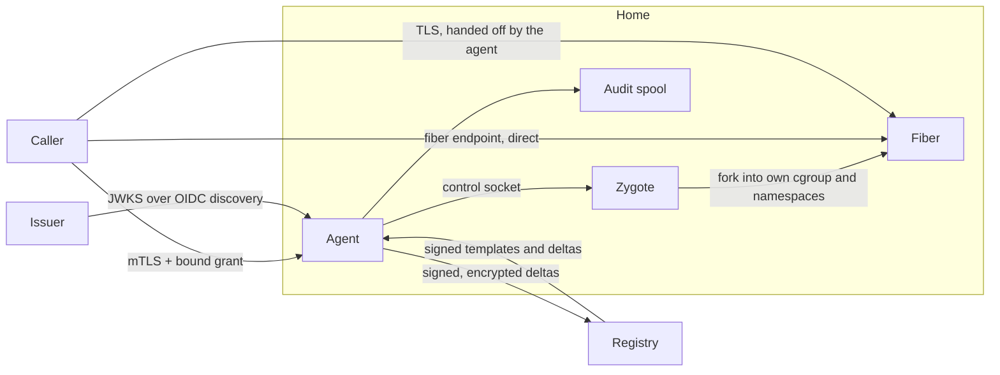

# Security

This page describes how fiberd protects its control plane, the fibers it runs,
and the state it stores.

## Trust boundaries

- **Caller to agent.** Every control call is authenticated with mTLS, and the
  grant it presents must be bound to the caller's certificate.
- **Issuer to agent.** The agent trusts only keys discovered from the
  configured issuer.
- **Agent to fiber.** Fibers are separated from the agent and from each other
  by cgroups, namespaces, and a scrubbed process state.
- **Agent to registry.** Nothing is restored from the registry unless it is
  signed, and tenant memory never leaves the home in the clear.

## Control plane

The gRPC API and the JSON gateway require TLS 1.3 with a client certificate
signed by the configured client CA (`-tls-cert`, `-tls-key`, `-client-ca`).
The certificate's subject is the caller's identity for every call, including
`Park`, `Release`, and `Watch`. Plaintext is available only together with the
development-only `insecure-json` verifier, and only when `-insecure-plaintext`
is set explicitly.

TLS must terminate at the agent. A router in front of fiberd connects to the
agent as an mTLS client itself, and grants are bound to the router's
certificate.

## Grants

A grant is a signed JWT that authorizes capacity on one home.
EdDSA and ES256 algorithms are accepted. The token's algorithm must match the algorithm 
declared by the key it names. `none` and symmetric algorithms are rejected.

- **Keys.** Keys come only from OIDC discovery of the configured issuer, and
  the discovered issuer must match it. Key URLs in the token header (`jku`,
  `x5u`) are never used.
- **Claims.** The audience must name this home, and the issuer must match the
  configured issuer. With `-max-lease` set, a grant whose signed lifetime
  (`exp` minus `iat`) is longer, or that has no lease at all, is refused.
- **Size.** Tokens larger than 8 KiB are rejected before they are parsed.
- **Caller binding.** A grant carries a `cnf` claim with the SHA-256
  thumbprint of the caller's certificate (`x5t#S256`). `grant-issuer mint
  -bind-cert` sets it. A grant presented over a connection with a different
  certificate, or over plaintext, is rejected, so a copied token cannot be
  replayed by another caller. A home serving mutual TLS refuses unbound
  grants. Because the thumbprint covers the whole certificate, rotating a
  caller's certificate means minting its grants again; keep leases short.
- **Rotation.** The key cache holds several key IDs at once, so issuers rotate
  by publishing the new key before signing with it. Verification fails closed
  once the cached key set is older than `-jwks-max-stale`.
- **Revocation.** Grants end when their lease is not renewed. A home can also
  revoke a grant early by removing it from its grant lane, for example by
  deleting the grant file:
  - Its running fibers are released immediately, each with an audit record.
  - Its UID goes on a deny-list in `<state>/private/revoked.json`, which survives
    restarts. If that file can't be read, the agent refuses to start.
  - A token for that UID is refused like an expired grant, including when it
    arrives in a Clone request. This holds until every token for the UID has
    expired: the entry lasts until the latest lease the home has seen for
    it, and at least `-max-lease` (24h without it) past the
    removal. A grant without a lease is denied for good. Without
    `-max-lease`, a token with a longer lease that this home has never seen
    can be admitted once the entry lapses.
  - The lane delivering the grant again lifts the denial.
  - Parked deltas are kept, but can't resume on this home while the UID is
    denied.

  Revocation is per home. Every home that holds the grant must remove it,
  and another home can still claim a delta the grant published.

## Fiber connections

A `DIRECT` fiber's endpoint is not authenticated or encrypted by fiberd. A
`HANDOFF` fiber is reached only over TLS 1.3 that the fiber terminates
itself (see [Networking](networking.md#handoff-endpoints)).

- **Caller.** The fiber accepts only the client certificate the grant is
  bound to, so a handoff grant must carry `cnf`. An unbound one is refused
  with `Unauthenticated`.
- **Fiber.** Each grant's fibers serve one Ed25519 key, derived from
  `-handoff-key` and the grant UID with HKDF-SHA256. The caller pins it with
  `server_key_sha256`. Without `-handoff-key`, the home generates
  `<state>/private/handoff-key.json`. Homes that move sessions between them share
  one.
- **No key files.** The agent sends the grant's key, certificate and caller
  thumbprint as the first message on each new fiber's private handoff
  socket. Nothing is written to disk, and the key is never part of a
  template checkpoint. A parked fiber's key is in its delta, which is sealed.
- **The agent.** It reads only the ClientHello, to route on the server
  name, and never holds the session keys. A connection with an unknown
  name, or no ClientHello within 1 second, is closed without a reply.
  At most 1024 connections wait for a ClientHello at once, and at most 32
  from one source address.
- **No resumption.** TLS session resumption is off, so every connection
  presents the caller's certificate.

What this does not protect against:

- **Fibers of one grant.** They share the grant's key, so one can stand in
  for another to that grant's caller. They belong to the same tenant.
- **Other grants on proc.** Every `proc` fiber runs as the agent's user, so
  file permissions alone don't separate grants. Mount namespaces do. A fiber
  sees only its own grant's run directory, and no grant's key is on disk.

## Sessions and fences

Sessions and fibers belong to the caller whose certificate their grant is
bound to. Only that caller can present the grant, so only it can create or
attach to a session. `Park` and `Release` from any other certificate answer
not-found, the same as for a fiber that does not exist, so a fiber ID reveals
nothing about who holds it. `Watch` and the gateway's `/v1/status` report only
the caller's own grants.

Every fiber incarnation has a fence (grant UID, agent epoch, sequence). The
fence orders incarnations so a stale holder is detectable. It is a routing and
revocation handle, not a credential.

## Admission

A grant whose tier or device budget this home cannot meet is refused with 
`FailedPrecondition`.

Each grant declares an isolation level in `policy.isolation`, `UNTRUSTED` or
`TRUSTED`, and an unset level is `UNTRUSTED`. Each backend declares whether it
isolates tenants from the host kernel:

| Backend | Isolates tenants | Why |
| --- | --- | --- |
| `gvisor` | yes | a fiber's syscalls are served by its sandbox's Sentry |
| `hyperlight` | yes | a fiber is a micro-VM guest behind the hypervisor |
| `runc` | no | namespaces and a root filesystem of its own, on the host kernel |
| `proc` | no | a forked process on the host kernel |

An untrusted grant reaching a home that does not isolate tenants is refused
with `FailedPrecondition` at admission, before any template is warmed. The
issuer marks a grant `TRUSTED` only when its code may share the host kernel:
`grant-issuer mint -isolation TRUSTED`, or `isolation: TRUSTED` on a
Kubernetes `CapacityGrant`.

## Fiber isolation

- **Cgroups.** Every fiber is born into its own cgroup leaf with `memory.max`
  set to the grant's working-set budget and `pids.max` set to 256. The
  grant's cgroup is capped at
  `(fibers.max + 1)` times that, so a fork bomb in one fiber stays inside its
  grant. A fiber that hits its own limit only fails its own forks. A clone or
  resume refused because the grant is at its limit is answered with `SHED`,
  never sent to another home.
- **Template protection.** The zygote's cgroup, its grant's cgroup and the
  agent's delegated root carry `memory.min` for the warm template's footprint,
  so the pages every fiber shares are not reclaimed. The kernel caps a
  protection at the parent's, so above the delegated root it holds only when
  the home protects the agent's cgroup too (on Kubernetes, the kubelet's
  memory QoS).
- **Parked state.** A grant's parked deltas on a home are capped at four
  times `fibers.max` times `w_budget_bytes` (1 GiB when either is
  unlimited). A park that would exceed
  the quota is refused with `SHED` before the checkpoint, and the fiber keeps
  running.
- **Namespaces.** Every fiber gets its own PID namespace, with a `/proc` that
  shows only that namespace. A `proc` fiber also gets its own mount
  namespace with private propagation. In the fiber's mount namespace, the agent's private paths are
  covered by empty read-only tmpfs mounts: the Kubernetes service-account
  token directory, `<state>/private`, `<state>/deltas`, `-grants-dir`, and every
  `-fiber-hide` directory. A path that holds `-run-dir` is never hidden,
  because fiber endpoints live there. Instead, the fiber sees `-run-dir`
  itself covered by an empty read-only tmpfs with only its own grant's
  directory bound back in place, so another grant's endpoint sockets and
  fence files do not exist for it. A resumed fiber keeps that view, with
  its directory bound to the run directory of the grant resuming it.
  `runc` fibers already run in their
  container's mount namespace and keep the container's capability set, which
  comes from the `-runc-rootfs` bundle.
- **Private state.** The agent's keys, the ledger snapshot, the deny-list,
  the epoch, the audit spool and the admin socket live in `<state>/private`
  (mode 0700). Fibers run as the agent's uid and would pass the owner checks
  on those files, so the directory is hidden from every fiber rather than
  relying on file modes. The ledger snapshot is not trusted on its own
  either. Each entry carries the grant's signed token, which is verified
  again at boot before the grant is re-admitted, and an entry without a
  token or with one that fails is dropped.
- **Fail closed.** A confinement failure refuses the clone.
- **Process state.** Before the workload runs, the child closes every
  inherited file descriptor above stdio and its control channel, clears its
  environment, and starts a new session. A `proc` fiber then sets `no_new_privs` and
  drops every capability from its effective, permitted, inheritable and
  ambient sets, so an `exec` cannot regain them. It also empties the bounding
  set when it holds `CAP_SETPCAP`. The fiber still runs as
  uid 0, so files outside the hidden paths are protected only by their
  owners' permissions.
- **Park and resume.** A checkpoint keeps the fiber's mount table. The
  tmpfs mounts the fiber created are saved with their contents, which are
  empty for the hidden paths. Mounts inherited from the agent, such as `/tmp`,
  are saved as references, never their contents. Single-file mounts, such as
  `/etc/resolv.conf`, are recorded by name beside the images. A resume
  rebuilds the namespace on a bind mount of the host's `/`, and every fiber
  born afterwards unmounts that bind from its own namespace. A resumed fiber
  keeps its namespaces and its dropped privileges.
- **Entropy.** libc's random generator is reseeded from `getrandom` in every
  fiber. Workloads that seed their own generators during warm-up, such as a TLS
  library, reseed them in the `on_fiber` callback, which runs in the child.
  Fibers restored from the same checkpoint also start with the same state,
  so a generator used for keys is best reseeded before each use. The
  reference template does that before every TLS handshake. The guidance
  for template authors is beside `fz_on_fiber` in
  `zygote/libfiberzygote.h`.

## Templates and deltas

- **Templates.** A template is pulled by the digest the issuer signed into
  the grant. The registry transfer checks every layer against that digest,
  and the zygote is checked against the hash in its config. A cached
  template is checked again on every warm: it must still pack to the
  grant's digest, its zygote must still match its config, and its images
  are unpacked afresh from the verified archive. A cache entry that fails
  is pulled again.
- **Signed deltas.** Every delta and parent checkpoint a home publishes to
  `-delta-registry` is signed with the Ed25519 key in `-delta-key`, a
  private JWK as `grant-issuer keygen -alg EdDSA` writes it. Without
  `-delta-key`, the home generates one in `<state>/private/delta-key.json` and logs
  a warning. The signature covers the artifact type, every annotation, and
  each file's name, digest and size. It travels in the
  `io.fiberd.signature` and `io.fiberd.signer` (key ID) annotations, so it
  works on OCI and `file://` registries alike.
- **Trust.** A home claims, exports or imports a delta, and pulls a parent
  checkpoint, only when the delta's signer is its own key or a key in
  `-delta-trust`, a JWKS of public keys. Homes that move sessions between
  them share one key or trust each other's. A delta that is unsigned, or
  signed by an unknown key, or altered after signing, is found but not
  taken: the clone answers `DEFERRED_FALLBACK` with no preferred home, and
  the delta stays published. Its size, origin and platform annotations are
  not used before its signature is checked.
- **Sealed deltas.** Every file of a delta is encrypted before it leaves
  the home, with AES-256-GCM under the 32-byte key in `-delta-seal-key`, a
  symmetric JWK as `grant-issuer keygen -alg A256GCM` writes it. Without
  `-delta-seal-key`, the home generates one in `<state>/private/delta-seal-key.json`
  and logs a warning. Homes that move sessions between them share one. Each
  session domain gets its own key, derived from the master key with
  HKDF-SHA256, and each file a subkey of its own, bound to its name and a
  random salt. Files are sealed in 1 MiB chunks numbered in order, with
  the last one marked, so a chunk cannot be changed, reordered, dropped or
  moved to another file. Parent checkpoints are template state, not tenant
  memory, and are signed but not sealed.
- **Session binding and expiry.** A sealed file's header names its
  domain, session, fence and expiry, and every chunk authenticates it. The
  signed manifest carries the same domain, session and expiry in
  `io.fiberd.domain`, `io.fiberd.session` and `io.fiberd.expires`. A home
  refuses a delta that names another domain or session than the one it
  was asked for, such as a signed manifest copied onto another session's
  tag, and one past its expiry: the clone answers `DEFERRED_FALLBACK` with
  no preferred home. The expiry is the time of the park plus 24 hours.
- **Rollback.** Within the expiry, someone who can write the registry can
  put back an older park of the same session, signed and sealed as it was.
  A claiming home has no way to tell that it was superseded.
- **Import.** `ImportDelta` checks the exporter's signature against the
  exported files and opens them with its seal key for the session they
  were exported as, before sealing them for the new session and signing
  them with the importing home's key. The import gets a fresh expiry. The
  exported parent checkpoint carries no signature of its own. A claim
  accepts it only if it hashes to the parent the signed delta names.
- **File registries.** A `file://` registry refuses a manifest that does
  not hash to its digest, and a pulled file that does not match its
  manifest, as an OCI registry's content addressing would.
- **Local deltas.** Deltas parked under `<state>/deltas` are neither signed
  nor sealed. They never leave the home except through the delta registry,
  and fibers cannot see them.

## Agent privileges

With the proc runtime, the agent re-executes at startup with only
`SYS_ADMIN`, `SYS_PTRACE`, `SYS_RESOURCE`, `SYS_TIME`, `SYS_CHROOT`,
`NET_ADMIN` and `SETPCAP` in its capability bounding set, so neither it nor any `criu` or zygote it starts
can hold anything else. Its inheritable set is narrowed to the same seven and
its ambient set emptied, so a binary with file capabilities cannot carry
anything else through the exec either. An agent that holds more but lacks
`SETPCAP` to drop it refuses to start. `-all-caps` keeps every capability it started with.
`hack/test/caps.sh` measured the set: namespaces, mounts and cgroups need
`SYS_ADMIN`, CRIU needs `SYS_TIME` and `SYS_CHROOT` to restore a fiber's time
and mount namespaces and `NET_ADMIN` for TCP repair, and `SETPCAP` lets the
zygote empty each fiber's bounding set. CRIU also needs `SYS_PTRACE` to attach
to fibers it did not start, which hosts with Yama's default `ptrace_scope` of 1
require, and `SYS_RESOURCE` to raise its open-file limit. The other runtimes keep what they
start with. Their needs are not measured. Its cgroup authority is limited to
the delegated subtree under `-cgroup-root`.

The Kubernetes example runs a proc agent without `privileged`. It drops
every capability and adds back only those five. It runs without a seccomp
profile (`Unconfined`). To dump a fiber, CRIU suspends the fiber's seccomp
filter through ptrace, and the kernel refuses that to a process that is
itself under a filter. The runtime mounts such a container's `/sys/fs/cgroup`
read-only, so the agent remounts it read-write. The mount is the
container's own, in its own cgroup namespace. `/proc/sys` is read-only
too, and `criu check` needs to write four files under it: `ns_last_pid`,
which belongs to the PID namespace, and `sem_next_id`, `msg_next_id` and
`shm_next_id`, which belong to the IPC namespace. The agent bind-mounts
only those four read-write, and the rest of `/proc/sys`, including the
host-wide sysctls, stays read-only. On a node whose containerd applies its
default AppArmor profile, these mounts are denied, and the Pod also needs
`appArmorProfile: Unconfined`, which the example does not set.
`spec.pod.privileged: true` asks for a privileged Pod.
Grants with other runtimes run privileged unless it is set to false. The Pod
shares the host's user namespace (`hostUsers` is not set): restoring a
checkpoint inside a user namespace needs CRIU's `--unprivileged` mode, which
is not yet tested with sockets on Kubernetes.

The measured set assumes fibers run as the agent's user. A template that
switches to another user is likely to need more, such as `SETUID`,
`SETGID`, `KILL`, `SYS_PTRACE` and `DAC_OVERRIDE`.

## Audit

Audit records are appended to `<state>/private/audit.jsonl`, one JSON line per state
transition:

- **Chain.** Each record carries the SHA-256 hash of itself (`hash`) and of
  the record before it (`prev_hash`). Editing, removing, or reordering a
  record breaks the chain.
- **Checkpoints.** Every 256 records, and when
  the agent shuts down, the spool appends a `checkpoint` record. It holds an
  Ed25519 signature over the previous record's sequence number and hash,
  made with `-audit-key`. Without that flag, the agent generates
  `<state>/private/audit-key.json` and logs a warning. Re-chaining an edited spool
  without the key breaks every checkpoint after the edit.
- **Gaps.** A write that fails is reported to the caller, and the next
  record written is a `gap` naming the sequence numbers that were lost. A
  torn last line, from a crash mid-write, gets a `gap` when the spool is next
  opened. Nothing disappears without a record.
- **Fsync failure.** A synchronous record is acked only after an `fsync`
  that covered it succeeded. Once an `fsync` fails, the spool refuses every
  synchronous record until the agent restarts, so a record the kernel
  silently dropped is never acked on the strength of a later `fsync`.
  Best-effort records keep being written.
- **Verification.** `audit-verify -spool <state>/private/audit.jsonl -trust
  <key.json>` checks the hashes, sequence numbers, gaps, and checkpoint
  signatures. It reports how far the last checkpoint reaches, and exits 1
  when the spool does not verify. Records written before chaining are
  reported as not covered.

What this does not protect against:

- **Root on the home.** The key has to be readable by the agent, so someone
  who can rewrite the spool can usually read the key, rebuild the chain, and
  re-sign it. The chain detects tampering by anyone who can change the spool
  but not read the key, such as in a backup or in a log collector's copy.
- **Truncation after a checkpoint.** Records cut off after the last
  checkpoint can't be detected from the spool alone, and neither can a whole
  spool replaced with a shorter valid one. Only a copy held elsewhere shows
  that. A copy of the spool kept off the host carries the hashes, so it
  can be compared.
