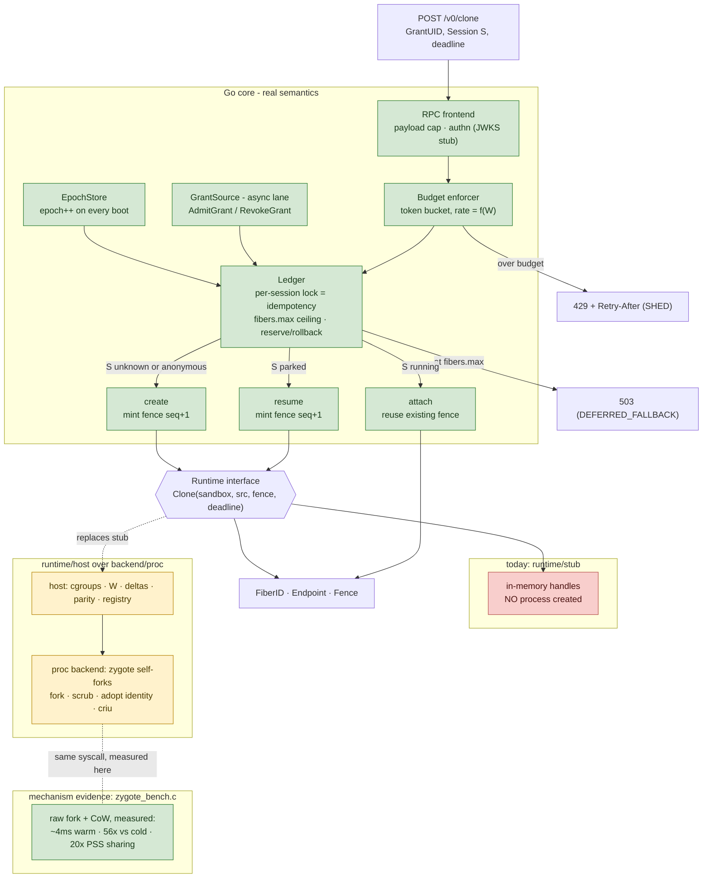

# fiberd Implementation Status and Evidence

This page tracks what the prototype actually does today versus what the design specifies, plus the measurements and semantic checks that back the design's claims. For how to reproduce these locally, see [quickstart.md](quickstart.md). For the design itself, see [architecture.md](architecture.md).

The prototype is deliberately split into two pieces along the design's own seam: a C bench that measures the raw `fork()`/CoW **mechanism** (prior art, see below), and a Go agent that exercises the warm-path **semantics** (where the contribution lives).

## What is novel

The contribution is the protocol, not the daemon. Three properties are claimed as new, and each maps to specific code that will carry it. Status is stated in the same terms as the tables below: **live** means exercised today, **unit** means proven by a unit test, **planned** means specified and not yet built.

| Property | What it means | Carried by | Status |
| --- | --- | --- | --- |
| Signed capability grant | Authorization travels with the work; the home verifies offline; revocation is lease non-renewal | `pkg/grant` (JWT + JWKS cache + issuer), `core.Verifier`, ledger lease expiry + reaper | live: signed JWT in every `Clone`, verified offline against cached JWKS, self-admitted on first sight; lease expiry is a health-keyed miss; the lease reaper for running fibers is Phase 3.5 |
| `SHED` vs `DEFERRED_FALLBACK` | Two miss codes keyed on control-plane health; `DEFERRED` sends the caller to its home's ordinary path | `core.SourceHealth`, `Agent.missCode`, `pkg/rpc` `Miss` error detail | live: every miss carries `Miss` (`pkg/rpc/server_test.go`); `preferred_home` names the publishing home when a parked session is too large to move (`pkg/core/mobility_test.go`) |
| W-priced cost model | Activation rate, park cost and reclaim priced in dirtied working set W; W is the mobility budget | `core.Budget` (`rate(W)`), `Runtime.Stats` -> `Status.w_used_bytes`, per-fiber cgroup `memory.max = w_budget_bytes`, delta over the zygote's checkpoint (`pkg/sys/criu/images.go`) | live: W measured as the leaf's `memory.current`, enforced by the kernel, priced into the budget, reclaimed largest-W first, and a park writes exactly the pages that differ from the zygote (8 MiB dirtied -> 8 MiB + 12 pages); the same size gates whether a peer home may pull the session (`make mobility`) |

## Mechanism (prior art): fork/CoW bench

The fork-from-zygote mechanism is established (SOCK, SAND, Android's zygote). The C bench exists to confirm the numbers on the hardware at hand, not to claim the mechanism.

| Measurement (1-CPU sandbox, Aug 2026) | Result | Design claim validated |
| --- | --- | --- |
| Warm clone: fork from 128MB zygote + dirty 4MB | ~4 ms | ms-scale activation |
| Cold start: full init per instance | ~225 ms | clone-not-create is the only path (56x) |
| 50-way pure-fork storm, p99 | 33 ms | fork survives concurrency |
| Storm throughput W=1MB vs W=4MB | ~110/s vs ~32/s | thrash budget is genuinely f(W) |
| 51 procs x 128MB heap, total PSS | 180-330 MB (vs 6.5 GB naive) | CoW density basis for ~1000/node |

The same shapes through the real implementation (agent, control socket, `clone3` into a cgroup leaf, scrub, endpoint bound, readiness pipe), measured in the Docker Desktop dev container on an M-series Mac with a 32 MB zygote and 4 MB dirtied per fiber, `FIBERD_BENCH=1 make linux-test` (`TestStormNumbers`); the old C bench re-run in the same container is the baseline. Run-to-run variance on this VM is large (the C bench's own storm p50 swung between 12 and 66 ms).

| Measurement | C bench, same container | New implementation |
| --- | --- | --- |
| single clone, fork to ready | not measured | 0.20-0.23 ms p50 |
| 50-way storm, per-clone p50 / p99 | 12-66 ms / 13-71 ms | 21-34 ms / 37-95 ms |
| 50-way storm, wall clock | not reported | 40-100 ms (500-1250 clones/s) |
| zygote + 50 fibers, memory | 234 MB PSS | 242 MiB charged to the grant cgroup (naive: 1632 MB) |
| sustained clone+release, W=1 / 4 MiB | old page: 110/s vs 32/s | 720-920/s at both (the fiber dirties W after it reports ready) |
| cold start per instance | 120 ms | unchanged |

## PoC data flow

## PoC component map (real vs planned)

## Semantic checks

`make conform-stub` runs the conformance suite (`cmd/grant-conform`, cases C1-C7 from [protocol.md](protocol.md)) against a stub-runtime agent with every hook wired (restart, lane health, audit spool); `make conform-signed` runs it again with a live `grant-issuer` and real signed JWTs verified through the JWKS cache; `make conform-proc` runs it inside the Linux dev container against the fork runtime with real cgroups, where C6's kill is the kernel's OOM killer. All pass; against a `FIBER_WARM` target (the fork runtime until CRIU lands), C2 skips and C7 covers the refusal. The same binary is the acceptance test for every later home and runtime.

| Check | Status | Output / state | Design invariant |
| --- | --- | --- | --- |
| `Clone(S)` twice | live | 2nd returns `ATTACH`, same endpoint/fence (`pkg/rpc/server_test.go`) | idempotency on the request path |
| budget burst | live | `ResourceExhausted` + `Miss{SHED, retry_after_s}` | thrash budget backpressure |
| agent restart | live | epoch 1 -> 2; `Park` on a prior-epoch fiber id is `NotFound` | fence rotation = revocation, node-local |
| `{"image": "evil"}` on Clone | live | `InvalidArgument` on gRPC (unknown-field interceptor) and on the JSON gateway | admission completeness |
| `fibers.max` ceiling | live | reserve / rollback / free in `pkg/core/ledger_test.go`; full grant -> `Unavailable` + `Miss{DEFERRED_FALLBACK}` while the lane is healthy, `ResourceExhausted` + `Miss{SHED}` while it is stale | the node never mints past the charged block |
| hit, Park, `Clone(S)` -> resume | live | `RESUME` with fence `seq+1`, same epoch, over gRPC | identity != incarnation; continuity contract |
| tier floor | live | `min_tier` above the target, or a parked session on a `FIBER_WARM` target: `FailedPrecondition` | never a fresh fork for a session that needs its delta |
| lease expiry | unit | expired grant is a capacity miss keyed on lane health (`pkg/core/agent_test.go`) | revocation is lease non-renewal |
| W budget | live (stub) | payload `dirty_bytes` over `w_budget_bytes`: stub emits an OOM exit, slot freed, `oom` audit record, `Watch` shows `running` drop | W-priced enforcement (real cgroup enforcement is Phase 3) |
| signed-grant verify | live | `-verifier=jwks`: EdDSA/ES256 JWT verified against the issuer's JWKS (OIDC discovery, cached by kid, offline once warm); `make conform-signed` runs C1-C7 over real tokens | accounting precedes activation; offline proof |
| stale keys vs bad token | unit | unknown kid on a fresh key set is `Unauthenticated`; never-loaded or older-than-lease key set is `SHED` (`pkg/grant`) | a reachability problem is a miss, not a refusal |
| audit record per op | live | `<state>/audit.jsonl`, sequence-numbered; `SYNC` ships before ack (no remote sink configured yet: local fsync) | audit spool, async-shippable |

## What is real vs planned

| Component | Prototype today | In the full design |
| --- | --- | --- |
| Clone mechanism | `-runtime=proc` (Linux): one zygote process per grant (an app linked with `hack/zygote/libfiberzygote`), asked to fork over an inherited socketpair; the child is born inside its cgroup leaf via `clone3`, scrubbed (descriptors, environment, session, entropy), given its fence, and acknowledged only when it reports ready under the deadline. Measured fork-to-ready ~0.4 ms in the dev container. `-runtime=stub` remains for tests. | same, plus CRIU park/resume (3.4) and the snapshot tier (4b) |
| Capacity ceiling | ledger enforces `fibers.max`: reserve at `Resolve`, roll back on abandon, free on `Park`/`Release`; `ErrGrantFull` -> 503 (DEFERRED_FALLBACK); unit-tested in `pkg/core/ledger_test.go` | same, plus the cgroup slice hard ceiling and per-fiber `memory.max` + `oom.group` |
| Isolation | per-fiber cgroup v2 leaf under `<root>/<grant>/f-<epoch>-<seq>` with `memory.max = w_budget_bytes`, `memory.swap.max = 0`, `memory.oom.group = 1`; the leaf's `memory.current` is W; an over-budget fiber is killed by the kernel and reported as `oom` (`tests/proc`, conformance C6 under `make conform-proc`) | same, plus the grant-level ceiling and the pressure ladder (3.3) |
| Park delta | `proc` offers `FIBER_CHECKPOINT` when `criu check` passes: Park dumps the fiber's tree into `<state>/deltas/<grant>/<epoch>-<seq>/` with a manifest (fence, endpoint, W, parent hash); `sync` keeps the fiber running until the images are fsynced, then ends it; Clone(S) on the parked session restores under a new fence into a fresh leaf, with `criu restore` staying as the tree's parent so its exit is the fiber's exit. Since 6.2 the checkpoint is a **delta**: every page equal to the zygote's page at the same address (the artifact's images, or a self-checkpoint the home takes after READY) is dropped and marked `PE_PARENT` in the pagemap, so a fiber that dirtied 8 MiB parks as 8 MiB + 12 pages instead of 33 MB; resume merges delta and parent (found by hash in `<state>/templates/parents/`) before `criu restore`. Parents are memory-mapped and the computation streams, so parking under memory pressure costs no memory. Each fiber is the init of its own pid namespace, so a delta restores on another home without pid collisions (`tests/proc`, `TestResumeOnAnotherRuntimeFromSameArtifact`). Measured in the dev container: sync park ~120 ms, resume ~70 ms for a 32 MB heap. The in-process fence is stale after resume; the new one is published at `<endpoint>.fence` | snapshot layer diff for the snapshot tier; a restored fiber charges its whole merged image to the leaf (no CoW sharing with the zygote after restore), so its `memory.current` overstates W until it parks again |
| Session mobility | a parked session lives in a **session domain** (`policy.session_class`, else `template_digest`), not under its grant. After a park the `proc` runtime publishes the delta to `-delta-registry` as an OCI artifact (`<registry>/<domain>-<sha8>:s-<session hash>`, parent checkpoint beside it as `p-<hash>`, manifest annotations `w_bytes`, parent, home, fence) and records the tag digest in the delta's `remote.json`. `Clone(S)` on a home that lacks S resolves the tag, pulls the delta and the parent if it is within `w_budget_bytes` (or `Agent.MobilityBudget`), claims it by deleting the tag, and resumes under its own grant's fence; over budget is `DEFERRED_FALLBACK{preferred_home}`. A home holding a parked copy verifies the tag still carries its digest before resuming; a claimed-away copy is forgotten (`migrate-out` audit) rather than served stale. Proven with a fake registry in `pkg/core/mobility_test.go`, with registry:2 in `tests/proc` (`TestSessionMovesThroughRegistry`) and end to end by `make mobility`: two agents on one host, count to three on A, park, `Clone(S)` on B resumes with 3, A refuses its stale copy, B parks, A resumes with 4 | Kubernetes <-> Slurm run of the same script (Track B) |
| Backend seam | one host runtime (`pkg/runtime/host`) implements `core.Runtime` over a `backend.Backend` (`pkg/backend`): the backend only warms a template instance, forks or restores a fiber into a given cgroup, checkpoints one to a directory and reports exits; the host owns cgroup leaves and ceilings, W, the delta parent store and manifests, the delta registry, parity and orphan adoption. Optional backend interfaces: `SelfCheckpointer` (a parent for deltas when the template has no images) and `DeltaCodec` (strip and merge parent pages in the backend's image format). `pkg/backend/proc` is the fork zygote + CRIU backend and passes everything the old fork runtime did (`make conform-proc`, `make mobility`, `make overcommit`). The backend name is a parity fact (`io.fiberd.backend`, manifest `backend`): a delta is never offered to another mechanism | gVisor (`runsc` checkpoint/restore per fiber), runc (the zygote in an OCI bundle), Hyperlight (micro-VM snapshots through a Rust helper speaking the zygote line protocol) on the same interface |
| runc backend | `pkg/backend/runc`, `fiberd -runtime runc -runc-rootfs <dir>`: the proc backend with a launcher (`proc.Launcher`). `runc run --preserve-fds 1` starts the zygote as an OCI container's init with the control socketpair as fd 3, the grant's run directory bind-mounted at `/host`, the zygote's cgroup as the container's `cgroupsPath`, and pid/mount/ipc/uts namespaces but no cgroup namespace, so the zygote's `clone3` into a fiber leaf works as it does for plain processes. Fibers are forked by the zygote (0-3 ms), each the init of its own pid namespace inside the container; the backend maps the zygote's reported pid to the host's through the leaf's `cgroup.procs` and `NSpid`. Park and resume are criu from outside with the container's mount namespace as external mounts (`--external mnt[/host]`, restore with `--root <rootfs>`), so a park is the same W-sized delta over the zygote's self-checkpoint as proc's (4 MiB dirtied -> 4.1 MiB delta) and W is the leaf's `memory.current`. The zygote reopens its stdio inside the container (`refzygote --log /host/zygote.log`): a descriptor of a host file would be one criu cannot map. Tier `FIBER_CHECKPOINT`. Measured: warm 108 ms, park 102 ms, resume 37 ms. `make conform-runc` passes C1-C7; `tests/runc` covers forks in the container (pid 1, scrubbed environment, W) and park/resume across the container boundary | rootfs from a template artifact; network namespace per container with TCP endpoints (Track B, Kubernetes home) |
| Hyperlight backend | `pkg/backend/hyperlight`, `fiberd -runtime hyperlight -hyperlight-helper <bin> -hyperlight-guest <bin>`: every fiber is a Hyperlight micro-VM built from a snapshot of the warm guest, held by a **helper process** fiberd starts per grant in the grant's cgroup and drives over the line protocol in `hack/hyperlight/PROTOCOL.md` (the zygote protocol plus `PARK`/`RESUME`, fibers named by fence). The helper is Rust (`hack/hyperlight/helper`, `hyperlight_host` 0.17: `SandboxBuilder`, `snapshot()`, `MultiUseSandbox::from_snapshot`, `Snapshot::save`/`load` as OCI image layouts) with the reference workload as a guest (`hack/hyperlight/guest`, `cargo hyperlight build`, Rust 1.94.0 pinned). Fibers are threads of the helper, so W is what the helper reports the guest dirtied (`backend.WReporter`) and the host enforces the budget itself; tier `FIBER_SNAPSHOT`. `hack/hyperlight/fakehelper` (Go) speaks the same protocol without a hypervisor: `tests/hyperlight` and `make conform-hyperlight-fake` (C1-C7 green) run against it in the dev container, which is where the fiberd side is proven. The Rust helper and guest compile in the dev container (`make hyperlight-helper`) but need KVM or MSHV to run: `make linux-hyperlight-check` (the helper's self-test: warm, clone from snapshot, park to disk, resume) and `make conform-hyperlight` pass `/dev/kvm` into the container, and CI runs them on a KVM-enabled Ubuntu runner (`conform-hyperlight`), uploading the helper's logs and park images | first run under KVM (CI, or a Lima VM with nested virtualisation): timings and any snapshot-format surprises; W from Hyperlight's dirty-page tracking instead of the helper's tally; the Python/JS guests of `hyperlight-sandbox` as templates |
| gVisor backend | `pkg/backend/gvisor`, `fiberd -runtime gvisor -gvisor-rootfs <dir>`: every fiber is its own `runsc` sandbox (systrap platform, no KVM), tier `FIBER_SNAPSHOT`. Warm runs the template rootfs with the workload as init; the workload initialises, drops a marker and blocks reading `/proc/gvisor/checkpoint` (gVisor's sync point: the read answers `resume` in the original, `restore` in every sandbox restored from the image); the backend takes the template image with `runsc checkpoint --leave-running --direct` and measures one fiber's footprint by restoring a probe into an empty cgroup. Clone is `runsc restore` of that image with the fence, endpoint and payload in the restore spec's environment (`/proc/gvisor/spec_environ`); park is SIGUSR1 (the workload closes its endpoint, a listening host socket cannot be checkpointed) then `runsc checkpoint --direct`, which ends the sandbox; resume restores under the new fence. W is the leaf's `shmem` (the sentry's memfd holds the guest's memory, exact to the page) above the probed footprint, while the sentry's own heap (anon, tens of MiB, different in every sandbox) is excluded; the leaf's `memory.max` covers the whole footprint with slack and the host enforces the budget itself on the W counter (`enforceW`), reporting `oom`. Restore validates args and mounts against the checkpoint, so every sandbox of a grant shares the run directory as `/host`. Measured in the dev container (64 MiB heap template): warm 230 ms incl. probe, clone (restore + serve) 60-75 ms, park 60-80 ms, resume 60-70 ms, park image 67 MB (no delta codec). `make conform-gvisor` passes C1-C7; `tests/gvisor` covers per-fiber isolation, W growth, park/resume state, deadline and OOM | a delta codec over gVisor's `pages.img` (a park is the full image today); CPU-feature pinning (`dev.gvisor.internal.cpufeatures`) as a parity fact; template artifacts for rootfs + image |
| Platform parity | the artifact config records the build host's arch, kernel release and libc; every published delta and parent carries the same as manifest annotations (`io.fiberd.{arch,kernel,libc}`). `proc` compares them with its host before warming from an artifact's images (mismatch: the template is refused, `proc.ErrParity`) and before taking a session from the registry (mismatch: `DEFERRED_FALLBACK` with `preferred_home` = the parking home, the session stays published). Arch always exact; `fiberd -parity strict|off|kernel=exact\|series\|off,libc=exact\|off` sets the rest, strict by default. `zygotectl inspect -parity` prints the verdict for the current host. Proven in `tests/proc` (`TestTemplateParityGate`, `TestMobilityParityGate`) by running homes that believe they are on another kernel or libc | cross-host proof on two real kernels (Track B, Kubernetes <-> Slurm). Risk gate from the plan stands: if restore fails across hosts of the same series there, mobility is re-scoped to node-local and `kernel=exact` becomes the only supported level |
| Grant source | signed JWT inside every `Clone` (self-admission on first sight), or pre-warmed from `-grants-dir`; the standalone home's liveness is the issuer's key-set refresh | same, plus Kubernetes projected file/CRD watch and Slurm prolog delivery |
| Lease enforcement | the reaper (`Agent.Sweep`, every 5 s) yields every grant whose lease lapsed: fibers released with a `yield` audit record each, grant revoked, parked deltas kept; an expired grant presented again is a capacity miss and is not re-admitted (`pkg/core/snapshot_test.go`) | same, plus per-fiber credential expiry once per-fiber identities exist |
| Identity | none | grant capability -> per-fiber delegation |
| Pressure ladder | `core.PressureController` on PSI `memory.pressure` (some avg10) of the grant cgroup: shed (Clone answers `SHED` for new fibers, attach still served) -> park the largest-W named session -> release the largest-W anonymous fiber -> yield the grant after three ticks with nothing left; watermarks from the grant policy, defaults 10% / 25%; the `proc` runtime applies a block ceiling as `memory.high` (throttle, so PSI rises before any kill) with `memory.max` one W budget above. Ladder proven with a fake source (`pkg/core/pressure_test.go`) and measured under a real 2x overcommit storm (`make overcommit`: 8 fibers driven to 320 MiB against a 160 MiB grant ceiling inside a 384 MiB container): the grant held at 160-169 MiB, PSI rose from 0 to 20% in ~4 s, the ladder parked five sessions largest-W first, and the container's OOM counter stayed at 0. Lesson recorded in the script: checkpoint images must land on disk, not tmpfs, or parking consumes memory instead of freeing it | same, plus the device-ledger input for GPU; incremental deltas (phase 6) make each park write W instead of the whole heap, so parks complete faster under pressure |
| Orphan adoption on boot | `Agent.Reconcile` before the warm path opens: the ledger snapshot (`<state>/ledger.json`, written after every transition) says which grants to re-admit (templates warmed again; expired ones dropped) and which parked sessions to remember (only if the runtime still has the delta); everything the runtime reports running is from a prior epoch and is killed through its cgroup leaf, fences read from leaf names. A session parked before a restart resumes after it under the new epoch (conformance C3 on `make conform-proc`) | same; running sessions could be parked rather than killed at shutdown |
| Wire protocol | gRPC `Fibers` service from `api/grant/v1/grant.proto` (`Clone`, `Park`, `Release`, `Watch`); misses carry a `Miss` error detail; JSON gateway behind `-http` | same |
| Template distribution | `template_digest` names an OCI artifact (`zygotectl build/push/pull`, `pkg/artifact`): the zygote executable, a config with argv and the build host's arch, kernel and libc, and CRIU images of the zygote taken right after READY. `fiberd -registry host/repo` pulls unknown digests into `<state>/templates/<digest>` and warms from there; `-template digest=cmd` still maps a digest to a local command. The zygote disables address-space randomisation at startup (`fz_init`) so its pages sit at the same addresses on every home warmed from the same artifact; deltas are computed against the artifact's images and travel through the same registry (`-delta-registry`); the recorded kernel and libc gate where the images may be warmed (`-parity`) | same |
| Grant verification | `-verifier=jwks`: JWT (EdDSA/ES256) against the issuer's cached JWKS; `-verifier=insecure-json` for development | same |
