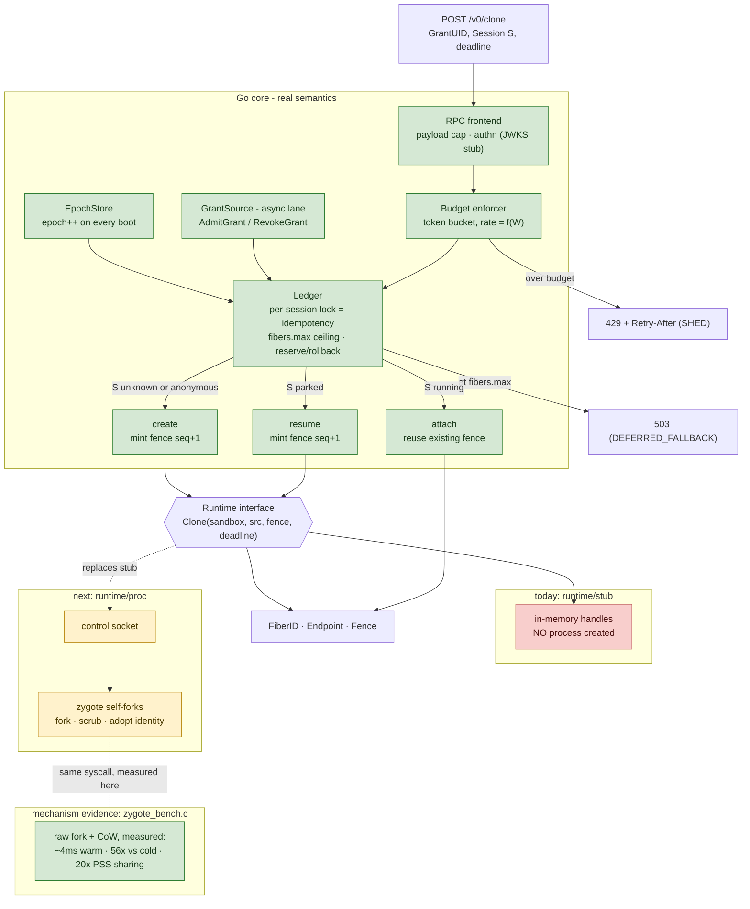

# fiberd Implementation Status and Evidence

This page tracks what the prototype actually does today versus what the design specifies, plus the measurements and semantic checks that back the design's claims. For how to reproduce these locally, see [quickstart.md](quickstart.md). For the design itself, see [architecture.md](architecture.md).

The prototype is deliberately split into two pieces along the design's own seam: a C bench that measures the raw `fork()`/CoW **mechanism**, and a Go agent that exercises the warm-path **semantics**.

## PoC data flow

## PoC component map (real vs planned)

## Measured results (1-CPU sandbox, Aug 2026)

| Measurement | Result | Design claim validated |
| --- | --- | --- |
| Warm clone: fork from 128MB zygote + dirty 4MB | ~4 ms | ms-scale activation |
| Cold start: full init per instance | ~225 ms | clone-not-create is the only path (56x) |
| 50-way pure-fork storm, p99 | 33 ms | fork survives concurrency |
| Storm throughput W=1MB vs W=4MB | ~110/s vs ~32/s | thrash budget is genuinely f(W) |
| 51 procs x 128MB heap, total PSS | 180-330 MB (vs 6.5 GB naive) | CoW density basis for ~1000/node |

## Semantic proofs (exercised live in the prototype)

The Go core reproduces the attach, shed, and epoch rows today; the park/resume, signed-grant, and audit rows are next-step items. The `fibers.max` capacity ceiling is enforced in the ledger.

| Demo | Output observed | Design invariant |
| --- | --- | --- |
| Grant signature verified before boot | boot refuses on bad sig | accounting precedes activation; offline proof |
| `Clone(S)` twice | 2nd returns `attach`, same endpoint/fence | idempotency on the request path |
| hit x4, Park, `Clone(S)` | `resume`, count continues 4 -> 5, new pid, new seq | identity != incarnation; continuity contract |
| `{"image": "evil"}` on Clone | rejected: un-admitted fields | admission completeness (structural, not policy) |
| 12-clone burst at 5/s limit | accepted=5 shed=7, `code: SHED` | thrash budget backpressure |
| agent restart | epoch 1 -> 2 in status | fence rotation = revocation, node-local |
| `state/audit.jsonl` | one record per op with fence | audit spool, async-shippable |

## What is real vs planned

| Component | Prototype today | In the full design |
| --- | --- | --- |
| Clone mechanism | prestarted process pool in the agent; true CoW fork only in the C bench | CRI CloneFiber against a zygote checkpoint (containerd >= 2.0 restore path) |
| Capacity ceiling | ledger enforces `fibers.max`: reserve at `Resolve`, roll back on abandon, free on `Park`/`Release`; `ErrGrantFull` -> 503 (DEFERRED_FALLBACK); unit-tested in `pkg/core/ledger_test.go` | same, plus the cgroup slice hard ceiling and per-fiber `memory.max` + `oom.group` |
| Isolation | none - plain processes | runtime tiers; leaf cgroups + oom.group |
| Park delta | worker serializes its own state | CRIU incremental / snapshot layer diff |
| Grant source | local signed JSON | k8s adapter (watch) or platform adapter (signed) |
| Identity | none | grant capability -> per-fiber delegation |
| Pressure ladder | HTTP-triggered demo ordering | PSI-driven, racing kubelet eviction (measure!) |
| Orphan adoption on boot | missing (running fibers lost on restart) | ledger reconcile from CRI ListFibers |
