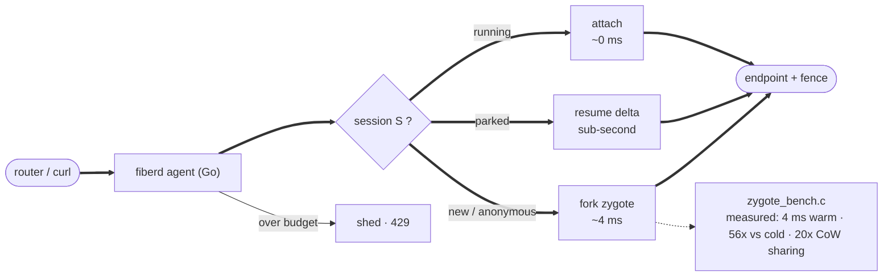
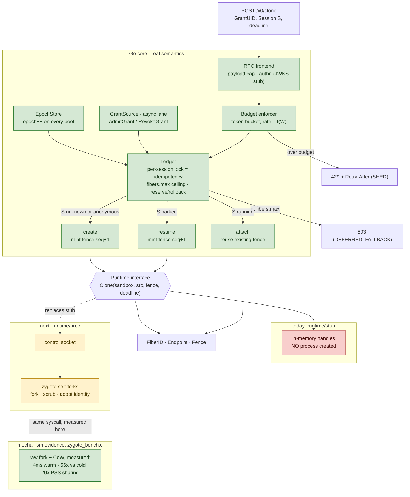

# fiberd Implementation Status and Evidence

This page tracks what the prototype actually does today versus what the design specifies, plus the measurements and semantic checks that back the design's claims. For how to reproduce these locally, see [quickstart.md](quickstart.md). For the design itself, see [architecture.md](architecture.md).

The prototype is deliberately split into two pieces along the design's own seam: a C bench that measures the raw `fork()`/CoW **mechanism**, and a Go agent that exercises the warm-path **semantics**.

## PoC data flow

## PoC component map (real vs planned)

## Measured results (1-CPU sandbox, Aug 2026)

| Measurement | Result | Design claim validated |
| --- | --- | --- |
| Warm clone: fork from 128MB zygote + dirty 4MB | ~4 ms | ms-scale activation |
| Cold start: full init per instance | ~225 ms | clone-not-create is the only path (56x) |
| 50-way pure-fork storm, p99 | 33 ms | fork survives concurrency |
| Storm throughput W=1MB vs W=4MB | ~110/s vs ~32/s | thrash budget is genuinely f(W) |
| 51 procs x 128MB heap, total PSS | 180-330 MB (vs 6.5 GB naive) | CoW density basis for ~1000/node |

## Semantic checks

The default agent wires the no-op `JWKSVerifier` (accepts every token) and `nopAudit` (writes nothing), so the signed-grant and audit rows are not exercised as shipped.

| Check | Status | Output / state | Design invariant |
| --- | --- | --- | --- |
| `Clone(S)` twice | live | 2nd returns `attach`, same endpoint/fence | idempotency on the request path |
| 12-clone burst at 5/s limit | live | accepted=5 shed=7, `code: SHED` | thrash budget backpressure |
| agent restart | live | epoch 1 -> 2 in status | fence rotation = revocation, node-local |
| `{"image": "evil"}` on Clone | live | clone succeeds; the unknown `image` key is silently ignored (the request struct has no field to bind it to) | admission completeness |
| `fibers.max` ceiling | unit | reserve / rollback / free proven in `pkg/core/ledger_test.go`; `ErrGrantFull` -> 503 | the node never mints past the charged block |
| hit, Park, `Clone(S)` -> resume | unit | resume action + fence seq+1 in `pkg/core/ledger_test.go`; no HTTP Park endpoint in the agent yet | identity != incarnation; continuity contract |
| signed-grant verify | next-step | ed25519 verify (sig, UID, expiry) implemented in `pkg/standalone` but NOT wired — the agent injects the JWKS stub, and verification is per-`Clone`, not a boot gate | accounting precedes activation; offline proof |
| audit record per op | next-step | none — the agent wires `nopAudit`; no `state/audit.jsonl` is written | audit spool, async-shippable |

## What is real vs planned

| Component | Prototype today | In the full design |
| --- | --- | --- |
| Clone mechanism | in-memory fiber handles (`runtime/stub`) — NO process created, deadline ignored; true CoW fork only in the C bench | CRI CloneFiber against a zygote checkpoint (containerd >= 2.0 restore path) |
| Capacity ceiling | ledger enforces `fibers.max`: reserve at `Resolve`, roll back on abandon, free on `Park`/`Release`; `ErrGrantFull` -> 503 (DEFERRED_FALLBACK); unit-tested in `pkg/core/ledger_test.go` | same, plus the cgroup slice hard ceiling and per-fiber `memory.max` + `oom.group` |
| Isolation | none - plain processes | runtime tiers; leaf cgroups + oom.group |
| Park delta | stub stores an empty placeholder — no real checkpoint (`sync` ignored) | CRIU incremental / snapshot layer diff |
| Grant source | local signed JSON | k8s adapter (watch) or platform adapter (signed) |
| Lease enforcement | none — revocation is map-delete only; running fibers and their credentials are unbounded after `RevokeGrant` | lease TTL bounds fiber + credential lifetime (`min(lease TTL, fence)`); reaper drains on non-renewal, bounded even during a control-plane outage |
| Identity | none | grant capability -> per-fiber delegation |
| Pressure ladder | none — only the Budget token-bucket rate limit; no PSI/device inputs, no park/yield rungs | PSI-driven, racing kubelet eviction (measure!) |
| Orphan adoption on boot | missing (running fibers lost on restart) | ledger reconcile from CRI ListFibers |
