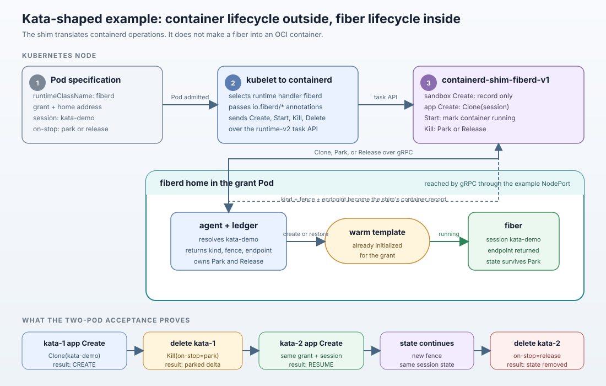

# A Kata-shaped shim: Pod containers that are fibers

This directory is an example of a **consumer** of fiberd's protocol, not
part of fiberd. It is its own Go module (containerd's dependency tree
stays here) and builds against the checkout it sits in.



The fiber lifecycle and request semantics are defined in
[Runtime model](../../docs/runtime-model.md) and
[Protocol](../../docs/protocol.md). This page covers the containerd mapping.

## The idea

Kata Containers plugs into Kubernetes as a containerd **shim**: where the
default shim starts a process with runc, Kata's boots a micro-VM and runs
the container inside it. `containerd-shim-fiberd-v1` has the same shape
with fiberd's protocol behind it: where a process would be started, a
**fiber is cloned**. A Pod that selects the `fiberd` RuntimeClass gets,
for each of its containers, a clone (or a resume) of the session its
annotations name, on the home they name, under the grant they carry.

| containerd asks the shim | the shim does |
| --- | --- |
| Create (sandbox container) | records the Pod; nothing runs, fibers are the workload |
| Create (app container) | `Clone(session)` on the Pod's home with the Pod's grant; writes one line to the container's stdout naming the fiber |
| Start | marks the container running |
| Kill | `Park` (state kept) or `Release`, as `io.fiberd/on-stop` says; the container exits |
| Delete | releases if still running; forgets the container |
| Wait | returns when the container exits |
| a shim that died | the manager's Stop releases the fiber from the bundle's record |

Exec, ptys, pause, checkpoint and cgroup stats are not the shim's: a
fiber is addressed through its endpoint, parked through its home, and
priced by its home's ledger.

## Annotations

Set on the Pod; containerd passes `io.fiberd/*` into the OCI spec
through the runtime handler's `pod_annotations`.

| annotation | meaning |
| --- | --- |
| `io.fiberd/grant` | the signed grant (required for every non-sandbox container) |
| `io.fiberd/home` | the home's gRPC address (default `127.0.0.1:8484`) |
| `io.fiberd/session` | the session name (default `<pod>/<container>`) |
| `io.fiberd/on-stop` | `park` or `release` (default) |
| `io.fiberd/payload` | data the fiber receives at clone |

## Running it

On top of the Kubernetes example's kind cluster (its issuer controller
mints the grant, its `conform` grant Pod is the home, reached from the
node at the NodePort):

```bash
make example-kata
```

The run installs the shim and the runtime handler into the kind node,
creates the RuntimeClass, runs a Pod whose container becomes a fresh
fiber (`kubectl logs` shows `fiber <id> CREATE session=kata-demo ...`),
deletes it with `on-stop=park`, runs a second Pod on the same session and
shows `RESUME`, then deletes it and sees the release on the home. Tests
that need no cluster:

```bash
cd examples/kata && go test ./...
```

## What this is not

It is not a fork of Kata: Kata's own shim keeps booting VMs. The point
is the shape: a RuntimeClass whose sandboxes come from `Clone`, so a
Kubernetes workload gets fiberd's clone-not-create, park and resume
without any change to Kubernetes or to the Pod beyond the fiberd annotations.
A Kata deployment that wanted this would add fiberd's calls where its
shim creates the sandbox; the containerd config, the RuntimeClass and the
annotations would be the same.
