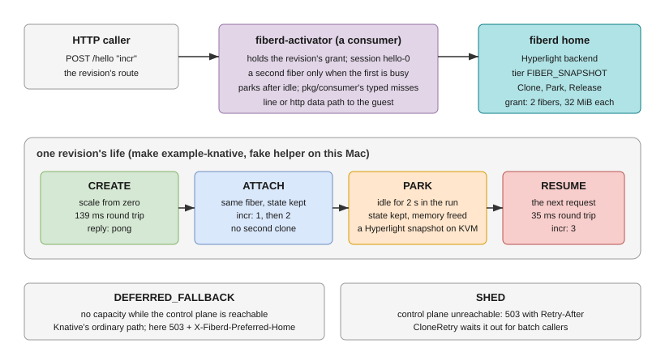

# Knative over Hyperlight: scale-from-zero with fibers

This directory is an example of a **consumer** of fiberd's protocol, not
part of fiberd. It is its own Go module and builds against the checkout
it sits in. Nothing under it is imported by fiberd.



## The idea

In Knative Serving, a revision scaled to zero has no Pods. The
**activator** takes the request, asks the autoscaler for a Pod, waits for
it to become ready (seconds, a cold start), then proxies. Here the same
role is played with fibers:

| Knative | this example |
| --- | --- |
| a revision | a session on a fiberd home whose backend is a Hyperlight sandbox |
| scale from zero | `Clone(session)`: a micro-VM restored from the warm snapshot, milliseconds |
| a warm Pod | an attached fiber; requests go to it while it lives |
| scale to zero | `Park`: the sandbox's state is kept, its memory freed |
| the next request after zero | `Clone(session)` again: `RESUME`, state intact |
| the Pod cannot be scheduled | `DEFERRED_FALLBACK`: take the ordinary path (here: 503 naming the home that holds the session) |
| the control plane is unreachable | `SHED`: 503 with `Retry-After` |

The layers, as the user set them: Knative above, the function inside a
Hyperlight sandbox, fiberd beneath the sandbox owning its capacity and
its parked state.

## What is here

- `activator/`: the activator. Holds each revision's grant, routes by
  path or host, keeps up to `concurrency` fibers per revision (a second
  is cloned only when the first is busy), parks a fiber after `idle`
  without requests. Two data paths: `line` sends the request body as one
  line of the reference guest's protocol and returns the reply (what the
  fake and Rust guests speak), `http` proxies the HTTP request to a guest
  that serves HTTP. The reply headers `X-Fiberd-Clone`, `X-Fiberd-Fence`
  and `X-Fiberd-Session` say how the request was served.
- `cmd/fiberd-activator`: the binary. `-revision name=@grant.jwt[,concurrency=N][,mode=line|http]`, repeatable.
- `run.sh`, `make example-knative`, `make example-knative-kvm`: the
  acceptance in fiberd's dev container: a Hyperlight home with the fake
  helper (or the Rust helper under KVM), the reference issuer minting the
  revision's grant, the activator, and four requests proving CREATE,
  ATTACH with state, park when idle, RESUME with the state intact.

The consumer side of the protocol itself is fiberd's `pkg/consumer`: a
client for Clone, Park, Release and Watch whose errors are typed
(`*Shed`, `*Deferred`, `*TierGap`) so a consumer branches on them, plus
`CloneRetry`, which waits out SHED by `retry_after`.

## Running it

```bash
make example-knative          # fake helper, no hypervisor
make hyperlight-helper && make example-knative-kvm   # the Rust helper, needs /dev/kvm
cd examples/knative && go test ./...                 # no cluster, no container
```

## Fitting it into a Knative install

Deploy `fiberd-activator` as a Deployment beside a fiberd home that runs
the Hyperlight backend (a grant Pod from the Kubernetes example with
`runtime: hyperlight` and `/dev/kvm` from the node), give it the
revision's grant, and point the revision's route at the activator's
Service. Knative's own activator and autoscaler stay out of the path for
that revision; the activator here is the scale-from-zero. This example
stops at the standalone run; the Kubernetes manifests are a follow-up.
