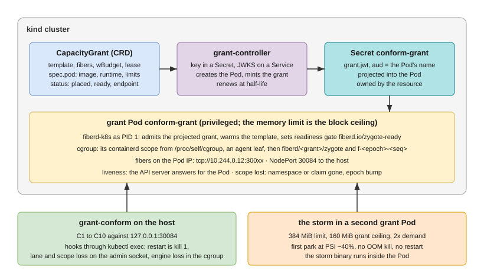

# fiberd on Kubernetes: the integration, worked

This directory is an example of integrating fiberd with an environment,
not part of fiberd. It is its own Go module, and it builds against the
checkout it sits in (`replace github.com/helayoty/fiberd => ../..`).
Nothing under it is imported by fiberd.



## What fiberd asks of an environment

An environment holds grants and runs fibers under them. fiberd calls it a
**home**, and everything it needs from one is an interface:

- `pkg/home.Home`: how signed grants arrive (`Grants`), how control-plane
  liveness is observed (`Health`), which cgroup subtree the agent owns
  (`CgroupRoot`), how readiness is published (`PublishReady`), where
  callers reach the agent (`AdvertisedEndpoint`), what the home asserts
  about where it runs (`Scope`) and how it provisions a grant's devices
  (`Fabric`).
- the optional interfaces `pkg/agent` looks for: `LaneSetter` (a
  test-only lane override), `ScopeLoser` (the home can lose its scope
  while running and wants the agent to revoke every fence), and
  `EndpointHoster` (the one address the home's fibers share).

The agent itself is `pkg/agent`: every flag, the wiring, the fixed
startup order. A binary for a home is a `main` of a few lines that binds
the flags and calls `agent.Run` with a factory for the home. `cmd/fiberd`
does that with the standalone home; `cmd/fiberd-k8s` here does it with the
Kubernetes one.

## What this example is

| Piece | What it does |
| --- | --- |
| `home/` | The Kubernetes home. The agent is PID 1 of a grant Pod: grants are `*.jwt` files in a projected volume; liveness is the API server answering for the Pod; readiness is the Pod readiness gate `fiberd.io/zygote-ready`; the cgroup subtree is the Pod's own (found through `/proc/self/cgroup`, delegated after moving PID 1 into a leaf), so the kubelet's memory limit is the block ceiling; endpoints are the Pod IP; the fabric channel is the Pod's DRA claim; scope claims are namespace, pod, service account, node, token issuer and claim. The namespace terminating, the claim gone or the token's issuer changing is scope loss, and the agent bumps its epoch. |
| `kube/` | The slice of the Kubernetes API this needs, as plain HTTPS requests with the projected token. No client-go: the agent stays a small static binary. `kube/kubetest` is an in-memory API server for the tests. |
| `controller/`, `cmd/grant-controller` | fiberd's reference issuer as a controller: the key in a Secret, discovery and JWKS on a Service, and every `CapacityGrant` resource (`kind/manifests/10-crd.yaml`) reconciled into one grant Pod running `fiberd-k8s` and one signed grant addressed to it, projected through a Secret and renewed at half-life. The resource's status mirrors placement, the gate and the endpoint. |
| `cmd/fiberd-k8s` | The agent binary for grant Pods. |
| `kind/` | The acceptance: an image with both binaries, the reference zygote and criu; a one-node kind cluster; manifests for the controller, its RBAC, the grant Pods' service account and two `CapacityGrant`s; and `conform.sh`, which waits for the grant Pod's readiness gate, runs fiberd's conformance suite (C1 to C10) from the host against the Pod, and runs the overcommit storm inside a second Pod under a 384 MiB limit. |

## Running it

From the repository root, with Docker, kind, kubectl and Go:

```bash
make conform-kind
```

`make kind-up`, `make kind-image` and `make kind-down` are the pieces.
Tests that need no cluster:

```bash
cd examples/kubernetes && go test ./...
```

## Writing another one

Copy the shape, not the code: a package implementing `home.Home` for
your environment, a `main` that hands it to `agent.Run`, whatever your
control plane needs to mint grants with `pkg/grant` and start the agent,
and fiberd's `grant-conform` against the result. A home is conformant if
and only if the suite passes with fiberd unmodified.
