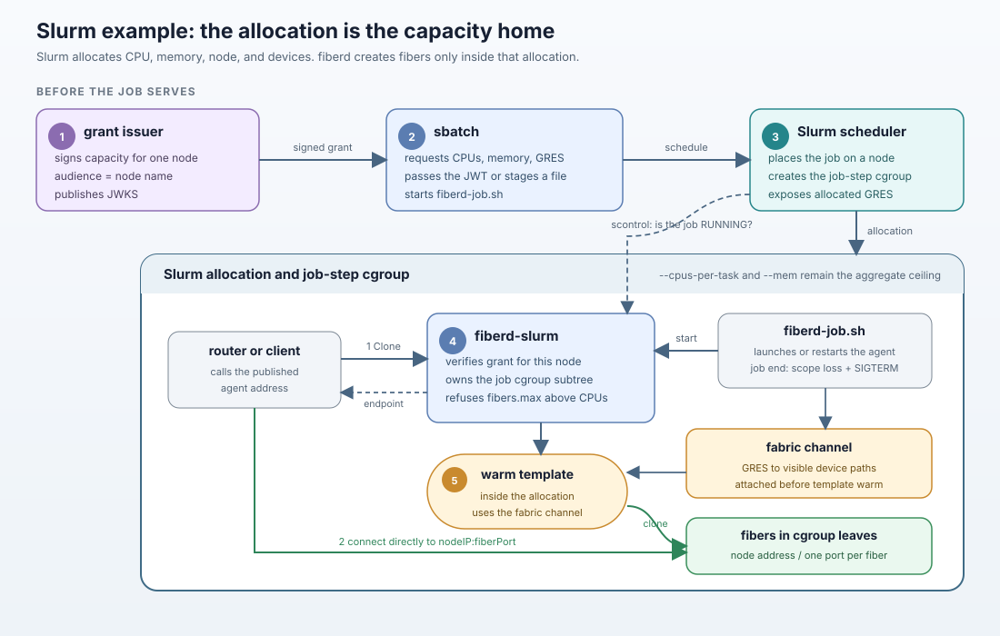

# fiberd on Slurm: the integration, worked

This directory is an example of integrating fiberd with Slurm, not part of
fiberd. It is its own Go module and builds against the checkout it sits
in (`replace github.com/helayoty/fiberd => ../..`). Nothing under it is
imported by fiberd, and nothing in `pkg/core` changed for it.



## The shape

fiberd asks an environment for a **home** (`pkg/home.Home`, plus the
optional interfaces `pkg/agent` looks for) and builds a binary from
`pkg/agent` plus that home. Under Slurm the environment is an
allocation:

| fiberd asks | Slurm answers (`home/`) |
| --- | --- |
| how grants arrive | `*.jwt` files in `/run/fiberd/job-<id>/grants`, put there by `fiberd-slurm -grant` after verifying the grant offline against the issuer's keys, or by the prolog from the node's spool |
| control-plane liveness | `scontrol show job <id>` answering with the job RUNNING, every half stale-TTL |
| readiness | the allocation's own state plus the `Watch` stream; nothing to publish |
| the cgroup subtree | the job step's cgroup (`/proc/self/cgroup`), which `task/cgroup` bounds with the job's memory limit: that limit is fiberd's block ceiling |
| endpoints | the node's address of the declared family, a port per fiber |
| fabric | the allocation's GRES, the GPUs Slurm exposed as devices |
| scope | job id and name, user, account, partition, node, nodelist, GRES, CPUs, stamped on every audit record |
| capacity bound | a grant asking for more fibers than the allocation has CPUs is refused before its template is warmed |
| scope loss | the job leaving RUNNING while the agent lives: the agent bumps its epoch |

`cmd/fiberd-slurm` is the binary: every fiberd flag, plus `-grant` (a JWT
or `@file`, default `$FIBERD_GRANT`) and `-slurm-probe`.

## The job

`prolog/fiberd-job.sh` is the job script: it runs `fiberd-slurm` for as
long as the allocation lasts and restarts it in place if it exits (the
epoch bumps; the allocation, its cgroup and the state directory stay).
`prolog/fiberd-prolog.sh` is an optional Slurm prolog (`PrologFlags=Alloc`)
that stages grants an issuer left in `/var/spool/fiberd/grants/<job id>/`
or `<user>/` into the job's grants directory.

```bash
tok=$(grant-issuer mint -key key.json -issuer http://issuer:8686 -aud "$(hostname -s)" \
      -template sha256:app -max 4 -warm 1 -w-budget 32Mi -min-tier FIBER_CHECKPOINT -ttl 2h)
sbatch --ntasks=1 --cpus-per-task=4 --mem=1G --export=ALL,FIBERD_GRANT="$tok" fiberd-job.sh \
    -verifier jwks -issuer http://issuer:8686 -runtime proc \
    -template "default=/usr/local/bin/refzygote --heap-mb 32" -endpoint-family inet4
```

The grant's audience is the node name; `fiberd-slurm` refuses to start
on a grant it cannot verify for its node.

## Slurm in Docker and the acceptance

`docker/` builds a one-node cluster (Debian's `slurm-wlm`, munge,
`cgroup/v2` with `task/cgroup`, criu, fiberd's binaries) that runs
privileged with a private cgroup namespace. `conform.sh` (from the
repository root) brings it up, runs the issuer inside as the cluster's
control plane, submits the agent as a job, runs fiberd's conformance suite
C1 to C10 from the host against the published port with every hook through
`docker exec`, and runs the overcommit storm inside a second allocation
with a 384 MiB job memory limit.

```bash
make conform-slurm
```

`make slurm-up` and `make slurm-down` are the pieces; tests that need no
cluster:

```bash
cd examples/slurm && go test ./...
```

Measured on this Mac (Docker Desktop, arm64): C1 to C10 in 13 s; the storm's
first park at 13 s with PSI 50%, no OOM kill.

Two things Slurm taught the example: slurmstepd signals the job script and
the cgroups it made, not the ones fiberd carves beneath the step, so
`fiberd-job.sh` forwards SIGTERM to the agent and the agent leaves with
the allocation (an agent that lingers gets the node drained with "Kill
task failed"); and a job allowed to swap lets the zygote's pages slip out
under the grant ceiling instead of stalling, which hides the pressure the
ladder acts on, so fiberd closes swap on the grant cgroup and `cgroup.conf`
gives jobs none.

Two things about running slurmd without systemd: the entrypoint enables
the controllers on `system.slice` by hand, since slurmd's `cgroup/v2`
plugin builds its hierarchy there, and a job step's cgroup offers cpuset,
cpu and memory but no pids controller, which fiberd tolerates (memory is
what it needs). At step end slurmstepd logs that it cannot move itself to
the root cgroup; that root holds controllers and so no processes, and the
message is harmless.
