# fiberd under Agent Substrate

This example is a worker image for [Agent Substrate](https://github.com/agent-substrate/substrate) whose actors are [fibers](../../docs/glossary.md#fiber), each one a gVisor sandbox. Substrate's control plane creates, suspends and resumes them, unchanged. It is for anyone who wants Substrate actors that are fibers. It is a consumer of fiberd's protocol, in its own Go module, and is not imported by fiberd.



## What it proves

Substrate installs into a cluster of its own, made with kind (Kubernetes in Docker, which runs a test cluster on one machine). It has a pool of two fiberd workers declared as its `gvisor` class, which is what they run. An actor driven through Substrate's router shows four things.

- The first request resumes a new actor from the [template](../../docs/glossary.md#template)'s golden snapshot, which Substrate took of the template's first actor, onto a free worker.
- Three POST requests raise the actor's counter to 3.
- `kubectl ate suspend` [parks](../../docs/glossary.md#park) the actor, a checkpoint of its whole sandbox, and exports it.
- The next request resumes it on whichever worker is free, with the count intact.

This example runs the [agent](../../docs/glossary.md#agent) with `-insecure-plaintext`, on the worker's loopback.

## Run it

Run it from the repository root. It needs Docker, kubectl, Go and jq, and takes about ten minutes the first time.

```bash
make example-substrate
```

The latest result is in [benchmarks](../../docs/benchmarks.md).

## Design

How Substrate's calls, the sandboxes, the ingress and the shared delta keys work is in [the Substrate design](../../docs/design/substrate.md).
